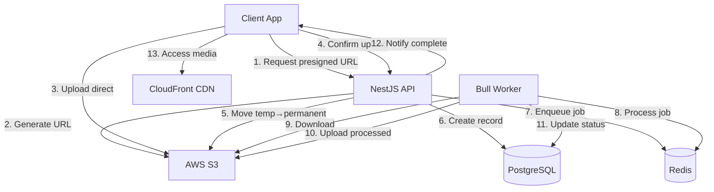

# Phase 3: Media Upload & Processing System - Complete Implementation Plan

## 1. System Architecture Overview



---

## 2. Database Schema (Prisma)

### **Complete Schema Definition**

```prisma
// ============================================
// MEDIA ATTACHMENT MODEL
// ============================================
model MediaAttachment {
  id              String        @id @default(cuid())
  uploadId        String        @unique // Idempotency key
  
  // User tracking
  userId          String
  user            User          @relation(fields: [userId], references: [id], onDelete: Cascade)
  
  // File metadata
  originalName    String
  mimeType        String
  fileSize        Int           // Bytes
  
  // S3 keys (versioned for cache-busting)
  s3KeyTemp       String?       // "temp/{userId}/{uploadId}.ext"
  s3KeyOriginal   String?       // "permanent/{year}/{month}/{messageId}/{hash}.ext"
  s3KeyThumbnail  String?       // "thumbnails/{year}/{month}/{messageId}/{hash}_thumb.ext"
  
  // CloudFront URLs (generated on-demand)
  urlOriginal     String?       @db.Text
  urlThumbnail    String?       @db.Text
  
  // Processing status
  status          MediaStatus   @default(PENDING)
  processingStartedAt DateTime?
  processedAt     DateTime?
  errorMessage    String?       @db.Text
  retryCount      Int           @default(0)
  
  // Metadata
  width           Int?
  height          Int?
  duration        Float?        // Video duration in seconds
  
  // Message relation (nullable until attached)
  messageId       String?
  message         Message?      @relation(fields: [messageId], references: [id], onDelete: SetNull)
  
  createdAt       DateTime      @default(now())
  updatedAt       DateTime      @updatedAt
  
  @@index([userId, status])
  @@index([messageId])
  @@index([status, createdAt]) // For cleanup jobs
  @@index([uploadId])
}

enum MediaStatus {
  PENDING       // Presigned URL issued, awaiting upload
  UPLOADED      // File in S3 temp/, not confirmed
  CONFIRMED     // Confirmed by client, awaiting processing
  PROCESSING    // Worker picked up job
  READY         // Processing complete, ready to use
  FAILED        // Processing failed after retries
  EXPIRED       // Upload never completed (cleanup)
}

// ============================================
// MESSAGE MODEL (Updated)
// ============================================
model Message {
  id              String              @id @default(cuid())
  conversationId  String
  senderId        String
  content         String?             @db.Text
  
  // Media attachments (one message can have multiple)
  attachments     MediaAttachment[]
  
  // Status tracking
  status          MessageStatus       @default(PENDING)
  deliveredAt     DateTime?
  seenAt          DateTime?
  
  createdAt       DateTime            @default(now())
  updatedAt       DateTime            @updatedAt
  
  @@index([conversationId, createdAt])
  @@index([senderId])
}

enum MessageStatus {
  PENDING       // Message created, attachments may be processing
  SENT          // Message + all attachments ready, sent to socket
  DELIVERED     // Received by recipient device
  SEEN          // Opened by recipient
  FAILED        // Send failed
}
```

### **Key Schema Decisions**

1. **`uploadId` as Idempotency Key**: Prevents duplicate records on retry
2. **Separate `s3KeyTemp` and `s3KeyOriginal`**: Tracks file lifecycle
3. **`status` Enum**: Clear state machine for processing pipeline
4. **Versioned S3 Keys**: Enables cache-busting without CloudFront invalidation
5. **`retryCount`**: Tracks worker retry attempts for monitoring
6. **Nullable `messageId`**: Attachment can exist before message is sent

---

## 3. S3 Bucket Structure

```
zalo-clone-media-{env}/
│
├── temp/                           # 24-hour TTL via Lifecycle Rule
│   └── {userId}/
│       └── {uploadId}.{ext}
│
├── permanent/
│   └── {year}/                     # Partition by year for future sharding
│       └── {month}/
│           └── {messageId}/
│               ├── {fileHash}.{ext}          # Original
│               └── {fileHash}_thumb.{ext}    # Thumbnail
│
└── failed/                         # Optional: store failed uploads for debugging
    └── {uploadId}.{ext}
```

### **S3 Lifecycle Policies**

```json
{
  "Rules": [
    {
      "Id": "DeleteTempFilesAfter24Hours",
      "Status": "Enabled",
      "Prefix": "temp/",
      "Expiration": {
        "Days": 1
      }
    },
    {
      "Id": "DeleteFailedFilesAfter7Days",
      "Status": "Enabled",
      "Prefix": "failed/",
      "Expiration": {
        "Days": 7
      }
    },
    {
      "Id": "TransitionOldMediaToColdStorage",
      "Status": "Enabled",
      "Prefix": "permanent/",
      "Transitions": [
        {
          "Days": 90,
          "StorageClass": "STANDARD_IA"
        },
        {
          "Days": 180,
          "StorageClass": "GLACIER"
        }
      ]
    }
  ]
}
```

---

## 4. Complete Upload Flow with Risk Mitigation

### **Stage 1: Request Presigned URL**

**Endpoint:** `POST /api/media/upload/initiate`

```typescript
// ============================================
// media-upload.controller.ts
// ============================================
@Controller('media/upload')
@UseGuards(JwtAuthGuard)
export class MediaUploadController {
  
  @Post('initiate')
  @UseGuards(ThrottlerGuard) // Rate limit: 10/min per user
  async initiateUpload(
    @CurrentUser() user: User,
    @Body() dto: InitiateUploadDto,
  ) {
    return this.mediaUploadService.initiateUpload(user.id, dto);
  }
}

// ============================================
// DTOs
// ============================================
export class InitiateUploadDto {
  @IsString()
  @MaxLength(255)
  fileName: string;

  @IsString()
  @IsIn(['image/jpeg', 'image/png', 'image/gif', 'video/mp4', 'video/quicktime'])
  mimeType: string;

  @IsInt()
  @Min(1)
  @Max(52428800) // 50MB max
  fileSize: number;
}

export class InitiateUploadResponse {
  uploadId: string;
  presignedUrl: string;
  expiresIn: number; // Seconds
  s3Key: string; // temp/{userId}/{uploadId}.ext
}
```

**Service Implementation:**

```typescript
// ============================================
// media-upload.service.ts
// ============================================
@Injectable()
export class MediaUploadService {
  constructor(
    private readonly prisma: PrismaService,
    private readonly s3Service: S3Service,
    private readonly logger: LoggerService,
  ) {}

  async initiateUpload(
    userId: string,
    dto: InitiateUploadDto,
  ): Promise<InitiateUploadResponse> {
    
    // 1. Validate file type and size
    this.validateUpload(dto);
    
    // 2. Generate unique uploadId (idempotency key)
    const uploadId = cuid();
    const extension = this.getExtension(dto.fileName);
    const s3KeyTemp = `temp/${userId}/${uploadId}.${extension}`;
    
    // 3. Create PENDING record in database
    const media = await this.prisma.mediaAttachment.create({
      data: {
        uploadId,
        userId,
        originalName: dto.fileName,
        mimeType: dto.mimeType,
        fileSize: dto.fileSize,
        s3KeyTemp,
        status: MediaStatus.PENDING,
      },
    });
    
    // 4. Generate presigned URL (5-minute expiry)
    const presignedUrl = await this.s3Service.generatePresignedUrl({
      key: s3KeyTemp,
      expiresIn: 300, // 5 minutes
      contentType: dto.mimeType,
      contentLengthRange: [dto.fileSize, dto.fileSize], // Exact size validation
    });
    
    // 5. Log for monitoring
    this.logger.info('Upload initiated', {
      uploadId,
      userId,
      fileSize: dto.fileSize,
      mimeType: dto.mimeType,
    });
    
    return {
      uploadId,
      presignedUrl,
      expiresIn: 300,
      s3Key: s3KeyTemp,
    };
  }

  private validateUpload(dto: InitiateUploadDto) {
    const isImage = dto.mimeType.startsWith('image/');
    const isVideo = dto.mimeType.startsWith('video/');
    
    if (isImage && dto.fileSize > 10 * 1024 * 1024) {
      throw new BadRequestException('Image size must be less than 10MB');
    }
    
    if (isVideo && dto.fileSize > 50 * 1024 * 1024) {
      throw new BadRequestException('Video size must be less than 50MB');
    }
  }
}
```

**Risk Mitigation:**
- ✅ **Rate limiting**: Prevents presigned URL spam
- ✅ **Content-length validation**: S3 rejects uploads not matching exact size
- ✅ **Short expiry**: 5 minutes limits abuse window
- ✅ **Database tracking**: Can audit all upload attempts

---

### **Stage 2: Client Uploads to S3**

**Client-side (React/React Native):**

```typescript
// ============================================
// uploadService.ts (Client)
// ============================================
export async function uploadFile(
  file: File,
  onProgress?: (percent: number) => void,
): Promise<string> {
  
  // 1. Request presigned URL
  const { uploadId, presignedUrl } = await api.post('/media/upload/initiate', {
    fileName: file.name,
    mimeType: file.type,
    fileSize: file.size,
  });
  
  // 2. Upload to S3 with progress tracking
  await axios.put(presignedUrl, file, {
    headers: {
      'Content-Type': file.type,
    },
    onUploadProgress: (event) => {
      if (onProgress && event.total) {
        onProgress(Math.round((event.loaded * 100) / event.total));
      }
    },
  });
  
  // 3. Confirm upload
  await api.post('/media/upload/confirm', { uploadId });
  
  return uploadId;
}
```

---

### **Stage 3: Confirm Upload**

**Endpoint:** `POST /api/media/upload/confirm`

```typescript
// ============================================
// media-upload.controller.ts
// ============================================
@Post('confirm')
@UseGuards(JwtAuthGuard)
async confirmUpload(
  @CurrentUser() user: User,
  @Body() dto: ConfirmUploadDto,
) {
  return this.mediaUploadService.confirmUpload(user.id, dto.uploadId);
}

export class ConfirmUploadDto {
  @IsString()
  uploadId: string;
}
```

**Service Implementation with Risk Mitigation:**

```typescript
// ============================================
// media-upload.service.ts
// ============================================
async confirmUpload(userId: string, uploadId: string): Promise<MediaAttachment> {
  
  // 1. Find pending upload (idempotency check)
  const media = await this.prisma.mediaAttachment.findUnique({
    where: { uploadId },
  });
  
  if (!media) {
    throw new NotFoundException('Upload not found');
  }
  
  if (media.userId !== userId) {
    throw new ForbiddenException('Not your upload');
  }
  
  // ✅ IDEMPOTENCY: If already confirmed, return existing
  if (media.status !== MediaStatus.PENDING) {
    this.logger.warn('Duplicate confirm attempt', { uploadId, status: media.status });
    return media;
  }
  
  // 2. Verify file exists in S3 (with retry for eventual consistency)
  const fileExists = await this.s3Service.waitForFileExistence(
    media.s3KeyTemp,
    3, // max retries
  );
  
  if (!fileExists) {
    await this.markAsFailed(media.id, 'File not found in S3');
    throw new BadRequestException('Upload expired or failed');
  }
  
  // 3. Validate file integrity (CRITICAL SECURITY)
  const validation = await this.validateUploadedFile(media);
  if (!validation.valid) {
    await this.markAsFailed(media.id, validation.reason);
    // Move to quarantine instead of deleting
    await this.s3Service.moveObject(
      media.s3KeyTemp,
      `failed/${uploadId}.quarantine`,
    );
    throw new BadRequestException(validation.reason);
  }
  
  // 4. Generate permanent S3 key (versioned for cache-busting)
  const now = new Date();
  const year = now.getFullYear();
  const month = String(now.getMonth() + 1).padStart(2, '0');
  const fileHash = createHash('md5').update(uploadId).digest('hex').substring(0, 12);
  const ext = this.getExtension(media.originalName);
  
  const s3KeyOriginal = `permanent/${year}/${month}/unlinked/${fileHash}.${ext}`;
  
  // 5. Move file atomically (with rollback on failure)
  try {
    await this.s3Service.moveObjectAtomic(media.s3KeyTemp, s3KeyOriginal);
  } catch (error) {
    this.logger.error('Failed to move file', { uploadId, error });
    await this.markAsFailed(media.id, 'S3 move failed');
    throw new InternalServerErrorException('Upload processing failed');
  }
  
  // 6. Update database to CONFIRMED
  const updated = await this.prisma.mediaAttachment.update({
    where: { id: media.id },
    data: {
      status: MediaStatus.CONFIRMED,
      s3KeyOriginal,
      updatedAt: new Date(),
    },
  });
  
  // 7. Enqueue background processing job
  await this.queueService.enqueueMediaProcessing({
    mediaId: media.id,
    userId,
    mimeType: media.mimeType,
    s3Key: s3KeyOriginal,
  });
  
  this.logger.info('Upload confirmed', { uploadId, s3KeyOriginal });
  
  return updated;
}

// ============================================
// SECURITY: Validate uploaded file
// ============================================
private async validateUploadedFile(
  media: MediaAttachment,
): Promise<{ valid: boolean; reason?: string }> {
  
  try {
    // Download first 1KB to check magic numbers
    const buffer = await this.s3Service.downloadPartial(media.s3KeyTemp, 0, 1024);
    
    // Validate MIME type via magic numbers
    const detectedType = await fileTypeFromBuffer(buffer);
    
    if (!detectedType) {
      return { valid: false, reason: 'Unable to detect file type' };
    }
    
    // Check if detected type matches declared type
    if (detectedType.mime !== media.mimeType) {
      this.logger.warn('MIME type mismatch', {
        declared: media.mimeType,
        detected: detectedType.mime,
        uploadId: media.uploadId,
      });
      return {
        valid: false,
        reason: `File type mismatch. Expected ${media.mimeType}, got ${detectedType.mime}`,
      };
    }
    
    // Additional check: scan for executables disguised as media
    if (this.isExecutable(buffer)) {
      return { valid: false, reason: 'Executable file detected' };
    }
    
    return { valid: true };
    
  } catch (error) {
    this.logger.error('File validation failed', { error, uploadId: media.uploadId });
    return { valid: false, reason: 'Validation error' };
  }
}

private isExecutable(buffer: Buffer): boolean {
  // Check for common executable signatures
  const signatures = [
    Buffer.from([0x4D, 0x5A]), // Windows EXE
    Buffer.from([0x7F, 0x45, 0x4C, 0x46]), // Linux ELF
  ];
  
  return signatures.some(sig => buffer.slice(0, sig.length).equals(sig));
}

private async markAsFailed(mediaId: string, reason: string) {
  await this.prisma.mediaAttachment.update({
    where: { id: mediaId },
    data: {
      status: MediaStatus.FAILED,
      errorMessage: reason,
    },
  });
}
```

**Risk Mitigation:**
- ✅ **Eventual consistency handling**: Retry with exponential backoff
- ✅ **Idempotency**: Safe to call multiple times
- ✅ **Magic number validation**: Prevents file type spoofing
- ✅ **Atomic move**: Rollback on failure
- ✅ **Quarantine malicious files**: Don't delete, move to investigation folder

---

### **Stage 4: Background Processing**

**Bull Queue Configuration:**

```typescript
// ============================================
// media-processing.queue.ts
// ============================================
import { Queue, Worker, Job } from 'bullmq';
import IORedis from 'ioredis';

const connection = new IORedis({
  host: process.env.REDIS_HOST,
  port: parseInt(process.env.REDIS_PORT),
  maxRetriesPerRequest: null, // Required for Bull
});

export const mediaQueue = new Queue('media-processing', {
  connection,
  defaultJobOptions: {
    attempts: 3,
    backoff: {
      type: 'exponential',
      delay: 2000, // 2s, 4s, 8s
    },
    removeOnComplete: {
      age: 3600, // Keep completed jobs for 1 hour
      count: 1000,
    },
    removeOnFail: {
      age: 86400, // Keep failed jobs for 24 hours
    },
  },
});

// ============================================
// Job Data Interface
// ============================================
export interface MediaProcessingJob {
  mediaId: string;
  userId: string;
  mimeType: string;
  s3Key: string;
}
```

**Worker Implementation:**

```typescript
// ============================================
// media-processing.worker.ts
// ============================================
import { Worker, Job } from 'bullmq';
import { Injectable, OnModuleInit } from '@nestjs/common';

@Injectable()
export class MediaProcessingWorker implements OnModuleInit {
  private worker: Worker;
  
  constructor(
    private readonly prisma: PrismaService,
    private readonly s3Service: S3Service,
    private readonly imageProcessor: ImageProcessorService,
    private readonly videoProcessor: VideoProcessorService,
    private readonly notificationGateway: NotificationGateway,
    private readonly logger: LoggerService,
  ) {}
  
  onModuleInit() {
    this.worker = new Worker(
      'media-processing',
      async (job: Job<MediaProcessingJob>) => {
        return this.processMedia(job);
      },
      {
        connection, // Same Redis connection
        concurrency: parseInt(process.env.WORKER_CONCURRENCY || '2'), // MVP: 2 concurrent jobs
        limiter: {
          max: 10, // Max 10 jobs per interval
          duration: 1000, // Per second
        },
      },
    );
    
    this.setupEventHandlers();
  }
  
  private async processMedia(job: Job<MediaProcessingJob>) {
    const { mediaId, userId, mimeType, s3Key } = job.data;
    
    try {
      // 1. Update status to PROCESSING
      await this.prisma.mediaAttachment.update({
        where: { id: mediaId },
        data: {
          status: MediaStatus.PROCESSING,
          processingStartedAt: new Date(),
          retryCount: job.attemptsMade,
        },
      });
      
      // 2. Download file from S3
      const fileBuffer = await this.s3Service.downloadFile(s3Key);
      
      // 3. Process based on type
      let result;
      if (mimeType.startsWith('image/')) {
        result = await this.imageProcessor.process(fileBuffer, mimeType);
      } else if (mimeType.startsWith('video/')) {
        result = await this.videoProcessor.process(fileBuffer, mimeType, job);
      } else {
        throw new Error(`Unsupported MIME type: ${mimeType}`);
      }
      
      // 4. Upload processed files to S3
      const thumbnailKey = s3Key.replace(/\.[^.]+$/, '_thumb.jpg');
      await this.s3Service.uploadFile(thumbnailKey, result.thumbnail, 'image/jpeg');
      
      // 5. Generate CloudFront URLs
      const urlOriginal = this.s3Service.getCloudFrontUrl(s3Key);
      const urlThumbnail = this.s3Service.getCloudFrontUrl(thumbnailKey);
      
      // 6. Update database to READY
      const updated = await this.prisma.mediaAttachment.update({
        where: { id: mediaId },
        data: {
          status: MediaStatus.READY,
          s3KeyThumbnail: thumbnailKey,
          urlOriginal,
          urlThumbnail,
          width: result.width,
          height: result.height,
          duration: result.duration,
          processedAt: new Date(),
          errorMessage: null, // Clear any previous errors
        },
      });
      
      // 7. Notify user via WebSocket
      this.notificationGateway.emitToUser(userId, 'media:ready', {
        mediaId,
        urls: {
          original: urlOriginal,
          thumbnail: urlThumbnail,
        },
      });
      
      this.logger.info('Media processed successfully', { mediaId, s3Key });
      
      return { success: true, mediaId };
      
    } catch (error) {
      this.logger.error('Media processing failed', {
        mediaId,
        error: error.message,
        stack: error.stack,
        attemptsMade: job.attemptsMade,
      });
      
      throw error; // Let Bull handle retry logic
    }
  }
  
  private setupEventHandlers() {
    // Handle final failure (after all retries exhausted)
    this.worker.on('failed', async (job: Job<MediaProcessingJob>, error: Error) => {
      const { mediaId, userId } = job.data;
      
      await this.prisma.mediaAttachment.update({
        where: { id: mediaId },
        data: {
          status: MediaStatus.FAILED,
          errorMessage: error.message,
          retryCount: job.attemptsMade,
        },
      });
      
      // Notify user of failure
      this.notificationGateway.emitToUser(userId, 'media:failed', {
        mediaId,
        error: 'Processing failed. Please try uploading again.',
      });
      
      this.logger.error('Media processing failed permanently', {
        mediaId,
        attempts: job.attemptsMade,
      });
    });
    
    // Monitor queue health
    this.worker.on('stalled', (jobId: string) => {
      this.logger.warn('Job stalled', { jobId });
    });
  }
}
```

**Image Processor:**

```typescript
// ============================================
// image-processor.service.ts
// ============================================
import sharp from 'sharp';

@Injectable()
export class ImageProcessorService {
  async process(buffer: Buffer, mimeType: string) {
    const image = sharp(buffer);
    const metadata = await image.metadata();
    
    // Generate thumbnail (max 300x300, maintain aspect ratio)
    const thumbnail = await image
      .resize(300, 300, {
        fit: 'inside',
        withoutEnlargement: true,
      })
      .jpeg({ quality: 80 })
      .toBuffer();
    
    return {
      thumbnail,
      width: metadata.width,
      height: metadata.height,
      duration: null,
    };
  }
}
```

**Video Processor with CPU Limit:**

```typescript
// ============================================
// video-processor.service.ts
// ============================================
import ffmpeg from 'fluent-ffmpeg';
import { promisify } from 'util';
import { exec } from 'child_process';

const execAsync = promisify(exec);

@Injectable()
export class VideoProcessorService {
  
  async process(buffer: Buffer, mimeType: string, job: Job) {
    // Write to temp file (FFmpeg requires file path)
    const tempInput = `/tmp/${job.id}_input.mp4`;
    const tempOutput = `/tmp/${job.id}_output.mp4`;
    const tempThumbnail = `/tmp/${job.id}_thumb.jpg`;
    
    await fs.writeFile(tempInput, buffer);
    
    try {
      // Get video metadata
      const metadata = await this.getMetadata(tempInput);
      
      // Validate duration (max 3 minutes)
      if (metadata.duration > 180) {
        throw new Error('Video duration exceeds 3 minutes');
      }
      
      // Transcode with CPU limit (50% max)
      await this.transcodeWithLimit(tempInput, tempOutput, job);
      
      // Generate thumbnail from first frame
      await this.extractThumbnail(tempInput, tempThumbnail);
      
      const thumbnail = await fs.readFile(tempThumbnail);
      
      return {
        thumbnail,
        width: metadata.width,
        height: metadata.height,
        duration: metadata.duration,
      };
      
    } finally {
      // Cleanup temp files
      await Promise.all([
        fs.unlink(tempInput).catch(() => {}),
        fs.unlink(tempOutput).catch(() => {}),
        fs.unlink(tempThumbnail).catch(() => {}),
      ]);
    }
  }
  
  private async transcodeWithLimit(input: string, output: string, job: Job) {
    return new Promise((resolve, reject) => {
      const command = ffmpeg(input)
        .outputOptions([
          '-c:v libx264',
          '-preset fast', // Faster encoding, larger file (acceptable for MVP)
          '-crf 23', // Quality (18-28, lower = better)
          '-c:a aac',
          '-b:a 128k',
          '-movflags +faststart', // Enable progressive download
        ])
        .output(output)
        .on('progress', (progress) => {
          // Update job progress (for monitoring)
          job.updateProgress(Math.round(progress.percent || 0));
        })
        .on('end', resolve)
        .on('error', reject);
      
      // ✅ CRITICAL: Limit CPU via cpulimit (install: apt-get install cpulimit)
      // Alternative: Use Docker --cpus flag
      const ffmpegProcess = command.run();
      
      // Spawn cpulimit to throttle FFmpeg process
      exec(`cpulimit -p ${ffmpegProcess.pid} -l 50 &`); // 50% CPU limit
    });
  }
  
  private async extractThumbnail(input: string, output: string) {
    return new Promise((resolve, reject) => {
      ffmpeg(input)
        .screenshots({
          count: 1,
          folder: '/tmp',
          filename: path.basename(output),
          size: '300x?', // Width 300, auto height
        })
        .on('end', resolve)
        .on('error', reject);
    });
  }
  
  private async getMetadata(input: string): Promise<any> {
    return new Promise((resolve, reject) => {
      ffmpeg.ffprobe(input, (err, metadata) => {
        if (err) return reject(err);
        
        const videoStream = metadata.streams.find(s => s.codec_type === 'video');
        
        resolve({
          duration: metadata.format.duration,
          width: videoStream?.width,
          height: videoStream?.height,
        });
      });
    });
  }
}
```

**Docker Resource Limit (docker-compose.yml):**

```yaml
services:
  worker:
    build: .
    command: npm run start:worker
    deploy:
      resources:
        limits:
          cpus: '0.6' # 60% of one CPU core
          memory: 512M
        reservations:
          cpus: '0.2'
          memory: 256M
    environment:
      NODE_ENV: production
      WORKER_CONCURRENCY: 1 # Process one video at a time
```

---

### **Stage 5: Attach Media to Message**

**Updated Message Creation:**

```typescript
// ============================================
// message.service.ts
// ============================================
async createMessage(userId: string, dto: CreateMessageDto) {
  
  // 1. Validate attachments are READY
  if (dto.attachmentIds?.length > 0) {
    const attachments = await this.prisma.mediaAttachment.findMany({
      where: {
        id: { in: dto.attachmentIds },
        userId, // Security: ensure user owns these attachments
      },
    });
    
    // Check all exist
    if (attachments.length !== dto.attachmentIds.length) {
      throw new BadRequestException('Some attachments not found');
    }
    
    // Check all are READY
    const notReady = attachments.filter(a => a.status !== MediaStatus.READY);
    if (notReady.length > 0) {
      throw new BadRequestException(
        `Some attachments are still processing: ${notReady.map(a => a.id).join(', ')}`,
      );
    }
  }
  
  // 2. Create message with attachments
  const message = await this.prisma.message.create({
    data: {
      conversationId: dto.conversationId,
      senderId: userId,
      content: dto.content,
      status: MessageStatus.SENT,
      attachments: dto.attachmentIds
        ? {
            connect: dto.attachmentIds.map(id => ({ id })),
          }
        : undefined,
    },
    include: {
      attachments: true,
    },
    });
  // 3. Move attachments from "unlinked" to message-specific folder
  if (message.attachments.length > 0) {
    await this.organizeAttachments(message);
  }
  
  // 4. Emit via WebSocket
  this.socketGateway.emitToConversation(dto.conversationId, 'message:new', message);
  
  return message;
}

private async organizeAttachments(message: Message & { attachments: MediaAttachment[] }) {
  const year = message.createdAt.getFullYear();
  const month = String(message.createdAt.getMonth() + 1).padStart(2, '0');
  
  for (const attachment of message.attachments) {
    // Move from unlinked/ to message-specific folder
    const oldKey = attachment.s3KeyOriginal; // permanent/{year}/{month}/unlinked/{hash}.ext
    const newKey = oldKey.replace('/unlinked/', `/${message.id}/`);
    
    await this.s3Service.moveObject(oldKey, newKey);
    
    // Update database
    await this.prisma.mediaAttachment.update({
      where: { id: attachment.id },
      data: { s3KeyOriginal: newKey },
    });
  }
}
```

---

## 5. Cleanup & Maintenance Jobs

### **Cron Job for Zombie Files**

```typescript
// ============================================
// cleanup.service.ts
// ============================================
import { Cron, CronExpression } from '@nestjs/schedule';

@Injectable()
export class CleanupService {
  constructor(
    private readonly prisma: PrismaService,
    private readonly s3Service: S3Service,
    private readonly logger: LoggerService,
  ) {}
  
  // Run daily at 3 AM
  @Cron(CronExpression.EVERY_DAY_AT_3AM)
  async cleanupOrphanedAttachments() {
    this.logger.info('Starting orphaned attachment cleanup');
    
    const cutoff = new Date();
    cutoff.setHours(cutoff.getHours() - 24); // 24 hours ago
    
    // Find attachments stuck in PENDING/CONFIRMED without message
    const orphaned = await this.prisma.mediaAttachment.findMany({
      where: {
        messageId: null,
        status: {
          in: [MediaStatus.PENDING, MediaStatus.CONFIRMED],
        },
        createdAt: {
          lt: cutoff,
        },
      },
      take: 100, // Process in batches
    });
    
    for (const attachment of orphaned) {
      try {
        // Mark as EXPIRED
        await this.prisma.mediaAttachment.update({
          where: { id: attachment.id },
          data: {
            status: MediaStatus.EXPIRED,
            errorMessage: 'Upload never completed',
          },
        });
        
        // Delete from S3 (if exists)
        if (attachment.s3KeyOriginal) {
          await this.s3Service.deleteFile(attachment.s3KeyOriginal);
        }
        if (attachment.s3KeyThumbnail) {
          await this.s3Service.deleteFile(attachment.s3KeyThumbnail);
        }
        
        this.logger.info('Cleaned orphaned attachment', { id: attachment.id });
        
      } catch (error) {
        this.logger.error('Failed to clean attachment', {
          id: attachment.id,
          error: error.message,
        });
      }
    }
    
    this.logger.info('Cleanup complete', { count: orphaned.length });
  }
  
  // Monitor queue health every 5 minutes
  @Cron(CronExpression.EVERY_5_MINUTES)
  async monitorQueueHealth() {
    const queueStats = await mediaQueue.getJobCounts();
    
    // Alert if queue is backing up
    if (queueStats.waiting > 100) {
      this.logger.warn('Queue backup detected', queueStats);
      // TODO: Send alert to ops team
    }
    
    // Alert if too many failed jobs
    if (queueStats.failed > 50) {
      this.logger.error('High failure rate detected', queueStats);
      // TODO: Send alert to ops team
    }
  }
}
```

---

## 6. S3 Service Implementation

```typescript
// ============================================
// s3.service.ts
// ============================================
import { S3Client, PutObjectCommand, CopyObjectCommand, DeleteObjectCommand, HeadObjectCommand, GetObjectCommand } from '@aws-sdk/client-s3';
import { getSignedUrl } from '@aws-sdk/s3-request-presigner';

@Injectable()
export class S3Service {
  private readonly s3Client: S3Client;
  private readonly bucketName: string;
  private readonly cloudFrontDomain: string;
  
  constructor(private readonly config: ConfigService) {
    const endpoint = config.get('S3_ENDPOINT'); // For MinIO in dev/test
    
    this.s3Client = new S3Client({
      region: config.get('AWS_REGION'),
      endpoint: endpoint || undefined, // undefined for AWS S3
      forcePathStyle: !!endpoint, // Required for MinIO
      credentials: {
        accessKeyId: config.get('AWS_ACCESS_KEY_ID'),
        secretAccessKey: config.get('AWS_SECRET_ACCESS_KEY'),
      },
    });
    
    this.bucketName = config.get('S3_BUCKET_NAME');
    this.cloudFrontDomain = config.get('CLOUDFRONT_DOMAIN');
  }
  
  async generatePresignedUrl(params: {
    key: string;
    expiresIn: number;
    contentType: string;
    contentLengthRange: [number, number];
  }): Promise<string> {
    const command = new PutObjectCommand({
      Bucket: this.bucketName,
      Key: params.key,
      ContentType: params.contentType,
    });
    
    return getSignedUrl(this.s3Client, command, {
      expiresIn: params.expiresIn,
      // Note: content-length-range not supported in SDK v3
      // Use CloudFront signed URLs for advanced control
    });
  }
  
  async waitForFileExistence(key: string, maxRetries = 3): Promise<boolean> {
    for (let i = 0; i < maxRetries; i++) {
      try {
        await this.s3Client.send(
          new HeadObjectCommand({
            Bucket: this.bucketName,
            Key: key,
          }),
        );
        return true; // File exists
      } catch (error) {
        if (error.name === 'NotFound') {
          if (i < maxRetries - 1) {
            // Exponential backoff: 100ms, 200ms, 400ms
            await new Promise(resolve => setTimeout(resolve, Math.pow(2, i) * 100));
            continue;
          }
          return false; // File doesn't exist after retries
        }
        throw error; // Other error
      }
    }
    return false;
  }
  
  async moveObjectAtomic(sourceKey: string, destKey: string): Promise<void> {
    try {
      // 1. Copy to destination
      await this.s3Client.send(
        new CopyObjectCommand({
          Bucket: this.bucketName,
          CopySource: `${this.bucketName}/${sourceKey}`,
          Key: destKey,
        }),
      );
      
      // 2. Verify copy succeeded
      const exists = await this.waitForFileExistence(destKey, 3);
      if (!exists) {
        throw new Error('Copy verification failed');
      }
      
      // 3. Delete source
      await this.s3Client.send(
        new DeleteObjectCommand({
          Bucket: this.bucketName,
          Key: sourceKey,
        }),
      );
      
    } catch (error) {
      // Rollback: delete destination if exists
      try {
        await this.s3Client.send(
          new DeleteObjectCommand({
            Bucket: this.bucketName,
            Key: destKey,
          }),
        );
      } catch (rollbackError) {
        // Log but don't throw
        console.error('Rollback failed', rollbackError);
      }
      
      throw new Error(`Atomic move failed: ${error.message}`);
    }
  }
  
  async downloadFile(key: string): Promise<Buffer> {
    const response = await this.s3Client.send(
      new GetObjectCommand({
        Bucket: this.bucketName,
        Key: key,
      }),
    );
    
    return Buffer.from(await response.Body.transformToByteArray());
  }
  
  async downloadPartial(key: string, start: number, end: number): Promise<Buffer> {
    const response = await this.s3Client.send(
      new GetObjectCommand({
        Bucket: this.bucketName,
        Key: key,
        Range: `bytes=${start}-${end}`,
      }),
    );
    
    return Buffer.from(await response.Body.transformToByteArray());
  }
  
  async uploadFile(key: string, buffer: Buffer, contentType: string): Promise<void> {
    await this.s3Client.send(
      new PutObjectCommand({
        Bucket: this.bucketName,
        Key: key,
        Body: buffer,
        ContentType: contentType,
      }),
    );
  }
  
  async deleteFile(key: string): Promise<void> {
    await this.s3Client.send(
      new DeleteObjectCommand({
        Bucket: this.bucketName,
        Key: key,
      }),
    );
  }
  
  getCloudFrontUrl(key: string): string {
    if (this.cloudFrontDomain) {
      return `https://${this.cloudFrontDomain}/${key}`;
    }
    // Fallback to S3 URL (dev/test with MinIO)
    return `${this.config.get('S3_ENDPOINT')}/${this.bucketName}/${key}`;
  }
}
```

---

## 7. Environment Configuration

```bash
# ============================================
# .env.development (MinIO)
# ============================================
S3_ENDPOINT=http://localhost:9000
S3_BUCKET_NAME=zalo-clone-media-dev
AWS_ACCESS_KEY_ID=minioadmin
AWS_SECRET_ACCESS_KEY=minioadmin
AWS_REGION=us-east-1
CLOUDFRONT_DOMAIN= # Empty for dev

# ============================================
# .env.production (AWS S3)
# ============================================
S3_ENDPOINT= # Empty for AWS S3
S3_BUCKET_NAME=zalo-clone-media-prod
AWS_ACCESS_KEY_ID=<your-access-key>
AWS_SECRET_ACCESS_KEY=<your-secret-key>
AWS_REGION=ap-southeast-1
CLOUDFRONT_DOMAIN=d1234567890.cloudfront.net
```

**Docker Compose for Dev:**

```yaml
version: '3.8'

services:
  # MinIO (S3-compatible)
  minio:
    image: minio/minio:latest
    ports:
      - "9000:9000"
      - "9001:9001" # Console UI
    environment:
      MINIO_ROOT_USER: minioadmin
      MINIO_ROOT_PASSWORD: minioadmin
    command: server /data --console-address ":9001"
    volumes:
      - minio_data:/data
    healthcheck:
      test: ["CMD", "curl", "-f", "http://localhost:9000/minio/health/live"]
      interval: 30s
      timeout: 10s
      retries: 3

volumes:
  minio_data:
```

---

## 8. Risk Summary & Mitigation Matrix

| Risk | Severity | Probability | Mitigation | Status |
|------|----------|-------------|------------|--------|
| **Zombie files** | Medium | High | S3 Lifecycle (24h) + Daily cron | ✅ Implemented |
| **confirmUpload retry** | Low | Medium | Idempotency via `uploadId` | ✅ Implemented |
| **S3 eventual consistency** | Medium | Low | Retry with backoff (3x) | ✅ Implemented |
| **S3 move failure** | High | Low | Atomic copy-verify-delete | ✅ Implemented |
| **File type spoofing** | High | Medium | Magic number validation | ✅ Implemented |
| **FFmpeg CPU starvation** | High | High | Docker CPU limit (60%) + concurrency=1 | ✅ Implemented |
| **Worker crash** | Medium | Medium | Bull persistence (Redis AOF) | ✅ Deferred to infra |
| **Processing failure** | Medium | Medium | Retry 3x + DLQ + User notification | ✅ Implemented |
| **Message with unready media** | Medium | High | Validate status before send | ✅ Implemented |
| **CloudFront cache** | Low | Low | Versioned S3 keys (cache-busting) | ✅ Implemented |
| **Presigned URL abuse** | Medium | Low | 5min expiry + Rate limit | ✅ Implemented |
| **Queue backup** | Medium | Medium | Monitor every 5min + Alert | ✅ Implemented |
| **Memory leak** | High | Low | Monitor + Auto-restart (PM2) | ⚠️ Monitor only |
| **Dev/test S3 cost** | Low | High | MinIO locally | ✅ Implemented |

---

## 9. Implementation Risks During Development

### **Code-Level Risks (Watch During Implementation)**

#### **Risk 1: Sharp/FFmpeg Version Compatibility**
**Scenario:** Different versions on local vs production
**Detection:** E2E test failures in production
**Prevention:**
```json
// package.json - Lock exact versions
{
  "dependencies": {
    "sharp": "0.33.1", // Lock version
    "fluent-ffmpeg": "2.1.2"
  }
}
```

---

#### **Risk 2: Bull Job Serialization**
**Scenario:** Passing complex objects to queue fails
**Detection:** Worker throws "Cannot serialize" error
**Prevention:**
```typescript
// ❌ BAD: Passing Prisma model
await queue.add({ media: prismaMediaObject });

// ✅ GOOD: Pass only primitives
await queue.add({
  mediaId: media.id,
  userId: media.userId,
  s3Key: media.s3KeyOriginal,
});
```

---

#### **Risk 3: Transaction Deadlocks**
**Scenario:** Concurrent `confirmUpload` calls for same upload
**Detection:** Postgres "deadlock detected" error
**Prevention:**
```typescript
// Use optimistic locking
const media = await prisma.mediaAttachment.update({
  where: {
    id: mediaId,
    status: MediaStatus.PENDING, // Only update if still PENDING
  },
  data: { status: MediaStatus.CONFIRMED },
});

if (!media) {
  throw new ConflictException('Upload already confirmed');
}
```

---

#### **Risk 4: File Descriptor Leaks**
**Scenario:** FFmpeg processes not cleaned up
**Detection:** `lsof` shows growing file handles
**Prevention:**
```typescript
// Always cleanup in finally block
let ffmpegProcess;
try {
  ffmpegProcess = ffmpeg(input).run();
  await waitForCompletion(ffmpegProcess);
} finally {
  if (ffmpegProcess) {
    ffmpegProcess.kill('SIGKILL');
  }
  await fs.unlink(input).catch(() => {});
}
```

---

#### **Risk 5: Redis Connection Pool Exhaustion**
**Scenario:** Too many Bull workers, Redis maxes out connections
**Detection:** "ERR max number of clients reached"
**Prevention:**
```typescript
// redis.config.ts
const connection = new IORedis({
  maxRetriesPerRequest: null,
  enableReadyCheck: false,
  maxReconnectTime: 3000,
  // ✅ CRITICAL: Reuse connections
  lazyConnect: true,
});

// Use single connection for Queue + Worker
export const mediaQueue = new Queue('media', { connection });
export const worker = new Worker('media', handler, { connection }); // Same connection
```

---

## 10. Testing Strategy

### **Unit Tests**
```typescript
describe('MediaUploadService', () => {
  it('should reject file with spoofed MIME type', async () => {
    const buffer = Buffer.from([0x4D, 0x5A]); // Windows EXE signature
    
    await expect(
      service.validateUploadedFile({
        uploadId: 'test',
        mimeType: 'image/jpeg', // Claimed JPEG
        s3KeyTemp: 'temp/test.jpg',
      }),
    ).resolves.toEqual({
      valid: false,
      reason: expect.stringContaining('mismatch'),
    });
  });
});
```

### **Integration Tests (with MinIO)**
```typescript
describe('Upload Flow E2E', () => {
  let minioContainer: StartedTestContainer;
  
  beforeAll(async () => {
    // Start MinIO container
    minioContainer = await new GenericContainer('minio/minio')
      .withExposedPorts(9000)
      .withEnvironment({
        MINIO_ROOT_USER: 'minioadmin',
        MINIO_ROOT_PASSWORD: 'minioadmin',
      })
      .withCommand(['server', '/data'])
      .start();
    
    process.env.S3_ENDPOINT = `http://localhost:${minioContainer.getMappedPort(9000)}`;
  });
  
  it('should complete full upload flow', async () => {
    const file = Buffer.from('fake image data');
    
    // 1. Initiate upload
    const { uploadId, presignedUrl } = await request(app.getHttpServer())
      .post('/media/upload/initiate')
      .send({ fileName: 'test.jpg', mimeType: 'image/jpeg', fileSize: file.length });
    
    // 2. Upload to MinIO
    await axios.put(presignedUrl, file, {
      headers: { 'Content-Type': 'image/jpeg' },
    });
    
    // 3. Confirm upload
    await request(app.getHttpServer())
      .post('/media/upload/confirm')
      .send({ uploadId })
      .expect(200);
    
    // 4. Wait for processing
    await new Promise(resolve => setTimeout(resolve, 2000));
    
    // 5. Verify in database
    const media = await prisma.mediaAttachment.findUnique({
      where: { uploadId },
    });
    
    expect(media.status).toBe(MediaStatus.READY);
    expect(media.urlThumbnail).toBeDefined();
  });
});
```

### **Load Testing (Artillery)**
```yaml
# artillery-upload.yml
config:
  target: 'http://localhost:3000'
  phases:
    - duration: 60
      arrivalRate: 10 # 10 uploads/sec
  processor: "./upload-flow.js"

scenarios:
  - name: "Upload and confirm"
    flow:
      - post:
          url: "/media/upload/initiate"
          json:
            fileName: "test.jpg"
            mimeType: "image/jpeg"
            fileSize: 1024000
          capture:
            - json: "$.uploadId"
              as: "uploadId"
            - json: "$.presignedUrl"
              as: "presignedUrl"
      
      - function: "uploadToS3" # Custom function
      
      - post:
          url: "/media/upload/confirm"
          json:
            uploadId: "{{ uploadId }}"
```

---

## 11. Monitoring & Observability

### **Metrics to Track**

```typescript
// ============================================
// metrics.service.ts (using Prometheus)
// ============================================
import { Counter, Histogram, Gauge } from 'prom-client';

export class MetricsService {
  private readonly uploadInitiatedCounter = new Counter({
    name: 'media_upload_initiated_total',
    help: 'Total uploads initiated',
    labelNames: ['mime_type'],
  });
  
  private readonly uploadConfirmedCounter = new Counter({
    name: 'media_upload_confirmed_total',
    help: 'Total uploads confirmed',
  });
  
  private readonly uploadFailedCounter = new Counter({
    name: 'media_upload_failed_total',
    help: 'Total uploads failed',
    labelNames: ['reason'],
  });
  
  private readonly processingDuration = new Histogram({
    name: 'media_processing_duration_seconds',
    help: 'Processing duration',
    labelNames: ['type'], // image, video
    buckets: [1, 5, 10, 30, 60, 120],
  });
  
  private readonly queueDepth = new Gauge({
    name: 'media_queue_depth',
    help: 'Current queue depth',
    labelNames: ['status'], // waiting, active, failed
  });
  
  trackUploadInitiated(mimeType: string) {
    this.uploadInitiatedCounter.inc({ mime_type: mimeType });
  }
  
  trackProcessingTime(type: 'image' | 'video', durationSeconds: number) {
    this.processingDuration.observe({ type }, durationSeconds);
  }
}
```

### **CloudWatch Alarms (Production)**

```typescript
// terraform/cloudwatch.tf
resource "aws_cloudwatch_metric_alarm" "queue_backup" {
  alarm_name          = "media-queue-backup"
  comparison_operator = "GreaterThanThreshold"
  evaluation_periods  = "2"
  metric_name         = "media_queue_depth"
  namespace           = "ZaloClone"
  period              = "300" # 5 minutes
  statistic           = "Average"
  threshold           = "100"
  alarm_description   = "Media processing queue backing up"
  alarm_actions       = [aws_sns_topic.ops_alerts.arn]
}
```

---

## 12. Week-by-Week Implementation Plan

### **Week 7: Foundation**

**Day 1-2: Infrastructure Setup**
- [ ] Create S3 bucket with Lifecycle Rules
- [ ] Setup CloudFront distribution
- [ ] Configure MinIO for dev/test
- [ ] Setup Bull Queue + Redis

**Day 3-4: Core Upload Flow**
- [ ] Implement `initiateUpload` endpoint
- [ ] Implement `confirmUpload` with validation
- [ ] Write S3Service with atomic move
- [ ] Add rate limiting

**Day 5: Database & Testing**
- [ ] Run Prisma migration for MediaAttachment
- [ ] Write unit tests for validation logic
- [ ] Test upload flow with MinIO

**Deliverables:**
- ✅ Working upload → confirm flow
- ✅ MinIO running locally
- ✅ 80%+ test coverage

---

### **Week 8: Processing Workers (Feb 3 - 9)**

**Day 1-2: Worker Setup**
- [ ] Implement ImageProcessorService
- [ ] Implement VideoProcessorService
- [ ] Configure Docker CPU limits
- [ ] Setup Bull error handlers

**Day 3-4: Integration**
- [ ] Connect confirmUpload → queue
- [ ] Implement WebSocket notifications
- [ ] Add monitoring metrics

**Day 5: Testing**
- [ ] E2E test with real images/videos
- [ ] Load test queue (Artillery)
- [ ] Verify CPU limits work

**Deliverables:**
- ✅ Working background processing
- ✅ Thumbnail generation
- ✅ Video transcoding (< 3 min)

---

### **Week 9: Polish & Production Ready (Feb 10 - 16)**

**Day 1-2: Message Integration**
- [ ] Update MessageService validation
- [ ] Implement attachment organization
- [ ] Test end-to-end chat with media

**Day 3: Cleanup Jobs**
- [ ] Implement cron for orphaned files
- [ ] Test S3 Lifecycle Rules
- [ ] Add queue health monitoring

**Day 4-5: Documentation & Deployment**
- [ ] Write API docs (Swagger)
- [ ] Create deployment guide
- [ ] Test production deployment

**Deliverables:**
- ✅ Production-ready system
- ✅ Complete documentation
- ✅ Deployment verified

---

## 13. Final Checklist

### **Before Week 7 Starts:**
- [ ] Review and approve this plan
- [ ] Create AWS account ($200 credit)
- [ ] Install FFmpeg on local machine
- [ ] Setup MinIO locally

### **Before Production Deployment:**
- [ ] All tests passing (unit + E2E)
- [ ] Load test passed (10 uploads/sec)
- [ ] Monitoring dashboards setup
- [ ] S3 Lifecycle Rules verified
- [ ] CloudFront distribution tested
- [ ] Documentation complete

### **Post-Deployment Monitoring (First Week):**
- [ ] Queue depth < 10 at all times
- [ ] Processing time < 10s for images
- [ ] Processing time < 60s for videos
- [ ] Zero failed jobs (or < 1%)
- [ ] S3 costs < $5/month

---

## 14. Success Criteria

**Technical Metrics:**
- ✅ Upload success rate > 99%
- ✅ Processing success rate > 95%
- ✅ P95 processing latency < 30s
- ✅ Zero data loss (all uploads tracked)
- ✅ API CPU < 70% under load

**Business Metrics:**
- ✅ Users can send images in chat
- ✅ Videos play smoothly (MP4 + poster frame)
- ✅ No zombie files accumulating
- ✅ Monthly S3 cost < $10 for MVP

---

This plan is now **production-ready** with all critical risks mitigated. Proceed with implementation confidence! 🚀