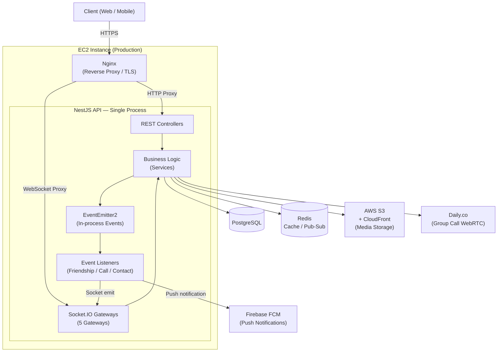
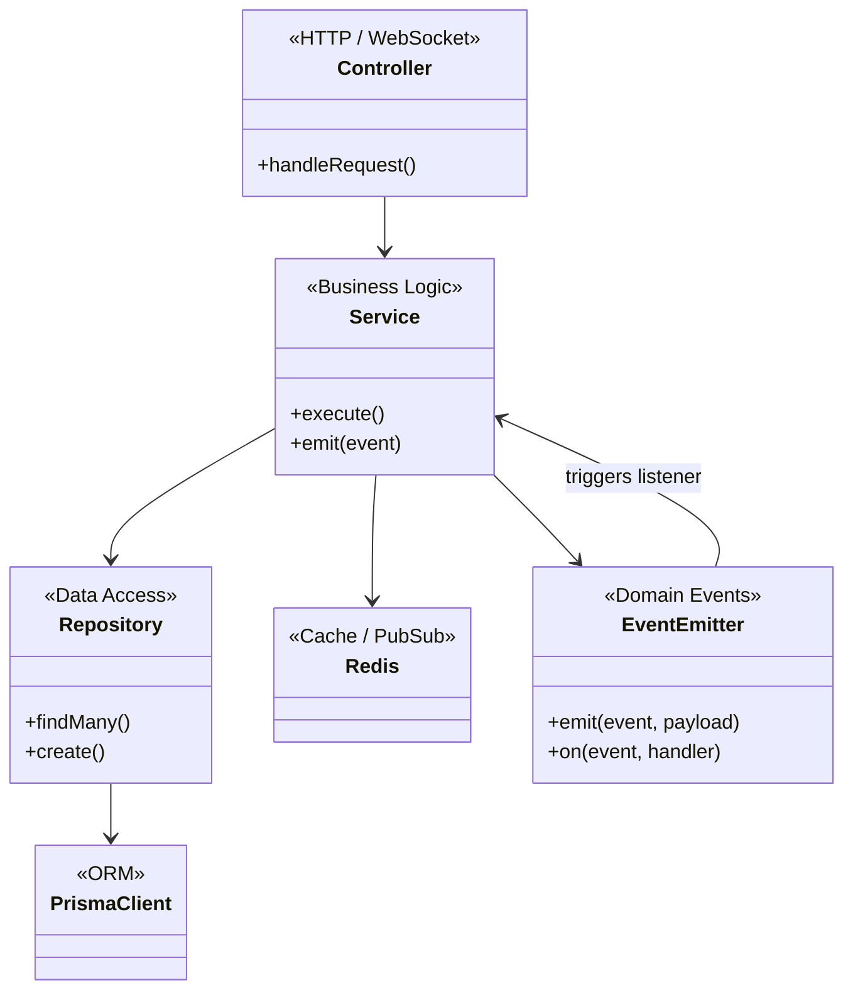

# Kế hoạch viết tài liệu Backend — Zalo Clone

> **Trạng thái:** Đã xác nhận — Sẵn sàng thực thi
> **Cập nhật lần cuối:** 12/03/2026
> **Công cụ viết sơ đồ:** Mermaid.js (Docs as Code — hiển thị trực tiếp trên GitHub)

---

## Tổng quan codebase

| Thành phần | Chi tiết |
|---|---|
| Framework | NestJS (TypeScript) |
| Database | PostgreSQL + Prisma ORM (22 models) |
| Realtime | Socket.IO + Redis Pub/Sub |
| Storage | Dev: MinIO + Bull/Redis (in-process); **Production: AWS S3 + CloudFront** (không có worker container riêng) |
| Call | WebRTC P2P + Daily.co (group call) |
| Gateways (WebSocket) | 5 gateways: `socket`, `message`, `conversation`, `call-signaling`, `search` |
| REST Controllers | 19+ controllers (14 đã có `@ApiTags`, **3 nhóm chưa có**) |
| DB Models | 22 models: User, Message, Conversation, Friendship, Block, Call, Media... |

### Swagger coverage hiện tại

| Module | Controller | @ApiTags | Ghi chú |
|---|---|:---:|---|
| auth | auth.controller.ts | ✅ | |
| users | users.controller.ts | ✅ | |
| conversation | conversation.controller.ts | ✅ | |
| message | message.controller.ts | ✅ | |
| friendship | friendships.controller.ts | ✅ | |
| friendship | friendRequest.controller.ts | ✅ | |
| contact | contact.controller.ts | ✅ | |
| block | block.controller.ts | ✅ | |
| call | call-history.controller.ts | ✅ | |
| search_engine | search_engine.controller.ts | ✅ | |
| notifications | device-token.controller.ts | ✅ | |
| privacy | privacy.controller.ts | ✅ | |
| permissions | permissions.controller.ts | ✅ | |
| roles | roles.controller.ts | ✅ | |
| **media** | **media.controller.ts** | **❌** | Cần bổ sung |
| **reminder** | **reminder.controller.ts** | **❌** | Cần bổ sung |
| **admin** | **admin-users/system/stats/calls/activity** | **❌** | Cần bổ sung (5 files) |

> **✅ Quyết định:** Thêm Swagger decorators cho toàn bộ controllers *trước khi* viết tài liệu. Swagger UI là nguồn tham chiếu chính xác cho Request/Response DTOs.

---

## Giai đoạn 0: Chuẩn bị (Ước tính: 0.5 ngày) *(Bổ sung so với kế hoạch gốc)*

Đây là bước tiền đề giúp các giai đoạn sau chạy mượt hơn.

### Bước 0.1 — Bổ sung Swagger cho các module còn thiếu

Thêm `@ApiTags`, `@ApiOperation`, `@ApiBearerAuth` cho:
- `media.controller.ts`
- `reminder.controller.ts`
- `admin-users.controller.ts`, `admin-system.controller.ts`, `admin-stats.controller.ts`, `admin-calls.controller.ts`, `admin-activity.controller.ts`

> **Lý do:** Swagger UI sẽ là tài liệu sống (living documentation) cho Request/Response. Tài liệu Markdown chỉ cần tham chiếu đến Swagger thay vì copy lại DTOs.

### Bước 0.2 — Thiết lập cấu trúc thư mục tài liệu

```
doc/
├── DOCUMENTATION-PLAN.md          ← File này
├── architecture/
│   ├── 01-erd.md                  ← ERD (auto-gen từ Prisma)
│   ├── 02-high-level-architecture.md
│   ├── 03-event-catalog.md        ← Event Catalog (bảng tra cứu toàn bộ in-process domain events)
│   └── 04-class-diagram-layers.md ← Cấu trúc layer tổng thể
├── modules/
│   ├── auth/
│   ├── user/
│   ├── conversation-message/
│   ├── friendship-contact/
│   ├── call/
│   ├── media/
│   ├── search/
│   ├── notification/
│   ├── privacy-block/
│   ├── reminder/
│   └── admin/
└── infrastructure/
    ├── redis-patterns.md
    └── worker-jobs.md
```

> **✅ Quyết định:** Markdown files trong `doc/` của repo — commit trực tiếp vào codebase, render trên GitHub.

---

## Giai đoạn 1: Xây dựng bộ khung (Ước tính: 1 ngày)

### Bước 1.1 — Sơ đồ ERD (Database Diagram)

**Công cụ gợi nghị:**

| Cách | Công cụ | Ưu điểm | Khi nào dùng |
|---|---|---|---|
| **Auto-gen từ Prisma** | `prisma-erd-generator` | Mermaid tự cập nhật khi schema thay đổi, commit được vào repo | **Ưu tiên — phù hợp nhất** |
| Kết nối DB trực tiếp | DataGrip / DBeaver / pgAdmin | Nhìn bao quát nhanh | Dùng để tham khảo thêm chi tiết |

**Setup `prisma-erd-generator`:**
```bash
npm install prisma-erd-generator @mermaid-js/mermaid-es --save-dev
```

Thêm vào `schema.prisma`:
```prisma
generator erd {
  provider = "prisma-erd-generator"
  output   = "../../doc/architecture/01-erd.md"
  theme    = "forest"
}
```

Chạy: `npx prisma generate`

**Các nhóm entity chính cần chú thích:**
- Identity: `User`, `UserToken`, `UserDevice`
- Social Graph: `Friendship`, `Block`, `UserContact`, `PrivacySettings`
- RBAC: `Role`, `Permission`, `RolePermission`
- Messaging: `Conversation`, `ConversationMember`, `GroupJoinRequest`, `Message`, `MediaAttachment`
- Call: `CallHistory`, `CallParticipant`
- Infrastructure: `DomainEvent`, `ProcessedEvent`, `SearchQuery`, `Reminder`, `DailyStats`

---

### Bước 1.2 — Sơ đồ kiến trúc tổng thể (High-Level Architecture)

Vẽ diagram dạng Mermaid `graph TD` phản ánh đúng **môi trường production** (`docker-compose.prod.yml`):

> ⚠️ **Lưu ý:** Media processing worker (Bull Queue / SQS consumer) **chưa được deploy** — code tồn tại nhưng không có container riêng. Không thể hiện worker trong diagram production.



**File output:** `doc/architecture/02-high-level-architecture.md`

---

### Bước 1.3 — Event Catalog (Bảng tra cứu Domain Events)

> **Quyết định thiết kế:** Thay vì vẽ một flow diagram riêng cho toàn bộ event-driven architecture, phase này tạo một **bảng tra cứu** (`03-event-catalog.md`) liệt kê tất cả in-process domain events. Giá trị tra cứu cao hơn cho lập trình viên so với một diagram đơn lẻ. Chi tiết flow của từng event được nhúng vào Sequence Diagram của module tương ứng.

> ⚠️ **Phạm vi production:** Chỉ có **in-process EventEmitter2 events** đang hoạt động. Media worker jobs (Bull Queue / SQS) đã có code nhưng **chưa được deploy** — không có worker container.

**Format bảng Event Catalog** (hoàn thiện dần khi đọc code từng module):

| Event Name | Emitter (Module) | Listener | Action thực hiện |
|---|---|---|---|
| `call.ended` | Call | `call-ended.listener` | Clean up active call session, notify participants |
| `contact.alias.updated` | Contact | `contact-notification.listener` | Broadcast alias update qua Socket |
| `friendship.request.sent` | Friendship | `friendship-notification.listener` | Socket notify người nhận lời mời |
| `friendship.accepted` | Friendship | `friendship-notification.listener` | Socket notify cả 2 bên |
| `friendship.request.cancelled` | Friendship | `friendship-notification.listener` | Socket notify người nhận |
| `friendship.request.declined` | Friendship | `friendship-notification.listener` | Socket notify người gửi |
| `friendship.unfriended` | Friendship | `friendship-notification.listener` | Socket notify cả 2 bên |
| `user.socket.connected` | Socket Gateway | *(presence tracking — internal)* | Track trạng thái online |
| `user.socket.disconnected` | Socket Gateway | *(presence tracking — internal)* | Cập nhật trạng thái offline |
| *(Bổ sung khi đọc code các module còn lại)* | | | |

**File output:** `doc/architecture/03-event-catalog.md`

---

## Giai đoạn 2: Lập bản đồ Use Case (Ước tính: 0.5 ngày)

### Bảng Use Case tổng hợp theo module

#### Module: Authentication & User

| Use Case | REST / Socket | Endpoint / Event |
|---|---|---|
| Đăng ký tài khoản | REST POST | `/auth/register` |
| Đăng nhập (Email/Phone) | REST POST | `/auth/login` |
| Đăng nhập QR code | REST | `/auth/qr/*` |
| Refresh access token | REST POST | `/auth/refresh` |
| Đăng xuất | REST POST | `/auth/logout` |
| Xem/Sửa hồ sơ cá nhân | REST GET/PATCH | `/users/profile` |
| Đổi mật khẩu | REST PATCH | `/users/password` |
| Upload avatar | REST POST | `/media/upload/*` |

#### Module: Conversation & Message

| Use Case | REST / Socket | Endpoint / Event |
|---|---|---|
| Gửi tin nhắn văn bản | Socket | `message:send` |
| Gửi tin nhắn có media | Socket | `message:send` |
| Xem tin nhắn đã nhận | Socket | `message:delivered_ack` |
| Đọc tin nhắn | Socket | `message:seen` |
| Đang gõ tin nhắn | Socket | `typing:start` / `typing:stop` |
| Lấy danh sách conversations | REST GET | `/conversations` |
| Tạo nhóm chat | Socket | `group:create` |
| Thêm/Xoá thành viên nhóm | Socket | `group:add_members` / `group:remove_member` |
| Ghim/Bỏ ghim tin nhắn | Socket | `conversation:pin_message` / `conversation:unpin_message` |
| Xoá tin nhắn | REST DELETE | `/messages/:id` |
| Xoá conversation | REST DELETE | `/conversations/:id` |

#### Module: Friendship & Contact

| Use Case | REST / Socket | Endpoint / Event |
|---|---|---|
| Gửi lời mời kết bạn | REST POST | `/friend-requests` |
| Chấp nhận / Từ chối lời mời | REST PATCH | `/friend-requests/:id` |
| Hủy kết bạn | REST DELETE | `/friendships/:id` |
| Xem danh sách bạn bè | REST GET | `/friendships` |
| Thêm/Xem danh bạ | REST | `/contacts` |
| Chặn người dùng | REST POST | `/block` |
| Bỏ chặn | REST DELETE | `/block/:id` |

#### Module: Call

| Use Case | REST / Socket | Endpoint / Event |
|---|---|---|
| Bắt đầu cuộc gọi | Socket | `call:initiate` |
| Chấp nhận cuộc gọi | Socket | `call:accept` |
| Từ chối cuộc gọi | Socket | `call:reject` |
| Kết thúc cuộc gọi | Socket | `call:hangup` |
| Signaling (ICE/SDP) | Socket | `call:offer`, `call:answer`, `call:ice_candidate` |
| Chuyển sang Daily.co | Socket | `call:switch_to_daily` |
| Xem lịch sử cuộc gọi | REST GET | `/calls/history` |
| Xem cuộc gọi nhỡ | REST GET | `/calls/missed` |

#### Module: Media

| Use Case | REST | Endpoint |
|---|---|---|
| Khởi tạo upload (presigned URL) | POST | `/media/upload/initiate` |
| Xác nhận upload hoàn tất | POST | `/media/upload/confirm` |
| Xem metadata file | GET | `/media/:id` |
| Xoá file | DELETE | `/media/:id` |

#### Module: Search

| Use Case | REST / Socket | Endpoint / Event |
|---|---|---|
| Tìm kiếm toàn cục | REST GET | `/search` |
| Tìm tin nhắn trong conversation | REST GET | `/search/messages` |
| Real-time search subscription | Socket | `search:subscribe` / `search:unsubscribe` |

#### Module: Notification

| Use Case | REST | Endpoint |
|---|---|---|
| Đăng ký device token (FCM/APNs) | POST | `/devices/token` |
| Xoá device token | DELETE | `/devices/token` |

#### Module: Privacy & Settings

| Use Case | REST | Endpoint |
|---|---|---|
| Cài đặt quyền riêng tư | GET/PATCH | `/privacy` |

#### Module: Reminder

| Use Case | REST | Endpoint |
|---|---|---|
| Tạo / Sửa / Xoá nhắc nhở | CRUD | `/reminders` |

#### Module: Admin *(Section tài liệu riêng — xem Giai đoạn 3 ưu tiên số 9)*

| Use Case | REST | Controller |
|---|---|---|
| Danh sách / Tìm kiếm user | GET | admin-users |
| Suspend / Activate user | PATCH | admin-users |
| Force logout user | POST | admin-users |
| System metrics & health | GET | admin-system |
| Thống kê (DailyStats) | GET | admin-stats |
| Lịch sử cuộc gọi (admin view) | GET | admin-calls |
| Activity log | GET | admin-activity |

> **✅ Quyết định:** Module Admin có section tài liệu riêng (ưu tiên số 9 trong Phase 3).

---

## Giai đoạn 3: Phân tích sâu từng module (Ước tính: 5-7 ngày)

### Thứ tự ưu tiên

| Ưu tiên | Module | Lý do | Công sức ước tính |
|:---:|---|---|:---:|
| 1 | **Authentication & User** | Nền tảng — mọi module đều phụ thuộc | 1.5 ngày |
| 2 | **Conversation & Message** | Chức năng cốt lõi nhất | 2 ngày |
| 3 | **Friendship & Contact & Block** | Kết nối người dùng, ảnh hưởng permission logic | 1 ngày |
| 4 | **Media** | Upload pipeline + async worker phức tạp | 0.5 ngày |
| 5 | **Call** | Phức tạp nhất (WebRTC + Daily.co + signaling) | 1.5 ngày |
| 6 | **Search** | Real-time search + caching layers | 0.5 ngày |
| 7 | **Notification & Reminder** | Add-on, tương đối độc lập | 0.5 ngày |
| 8 | **Privacy & Roles/Permissions** | Cross-cutting concerns | 0.5 ngày |
| 9 | **Admin** | Back-office, ít user-facing | 0.5 ngày |

---

### Template chuẩn cho mỗi Module

Mỗi module viết 1 file Markdown theo cấu trúc sau:

```markdown
# Module: [Tên Module]

## 1. Tổng quan
- Chức năng chính
- Danh sách Use Case
- Phụ thuộc vào module khác

## 2. API / Socket Events
> Xem chi tiết Request/Response tại Swagger UI: `/api/docs`

| Method | Endpoint / Event | Mô tả | Auth |
|---|---|---|---|

## 3. Activity Diagram — [Use Case phức tạp nhất]
(Mermaid flowchart)

## 4. Sequence Diagram — [Happy path + critical error flows]
(Mermaid sequenceDiagram — vẽ cả nhánh lỗi quan trọng: auth failure, duplicate, permission denied, external service down)

## 5. Các lưu ý kỹ thuật
- Edge cases quan trọng
- Cơ chế caching
- Event nào được emit ra ngoài
```

---

### Chi tiết các sơ đồ cần vẽ theo module

#### Module 1: Authentication

**Activity Diagram cần có:**
- Luồng login với access/refresh token rotation
- Luồng xác thực JWT middleware (chuỗi guard → decorator)

**Sequence Diagram cần có (happy path + critical errors):**
- `POST /auth/login`: Client → AuthController → AuthService → Redis (check blacklist) → Prisma → JWT sign → Response; *Error paths:* sai password → 401, account suspended → 403, token blacklisted → force re-login
- Socket handshake: Client → Socket.IO → JWT verify → attach `socket.user`; *Error path:* token invalid/expired → emit `auth:failed` → disconnect

---

#### Module 2: Conversation & Message

**Activity Diagram cần có:**
- Luồng gửi tin nhắn có đính kèm media (validate upload status → idempotency check → persist → broadcast)
- Luồng xử lý seen receipt cho direct vs group conversation

**Sequence Diagram cần có (happy path + critical errors):**
- `message:send` (có media): Client → MessageGateway → MessageService → [Redis idempotency check] → [Prisma persist] → [EventEmitter2] → [Socket broadcast]; *Error paths:* duplicate `clientMessageId` → return existing message (idempotent), media not found → 400
- `message:seen` (group): Client → MessageGateway → MessageRealtimeService → [Prisma update] → [Socket broadcast]; *Error path:* not member of conversation → socket error

---

#### Module 3: Call (WebRTC)

**Activity Diagram cần có:**
- Luồng khởi tạo cuộc gọi: privacy check → tạo session → 1-1 P2P vs Group (Daily.co) → ringing timeout

**Sequence Diagram cần có (happy path + critical errors):**
- Cuộc gọi 1-1 (P2P): Caller → `call:initiate` → [privacy check] → [ringing] → Callee `call:accept` → ICE signaling → Connected; *Error paths:* bị block → `call:error`, callee offline → FCM push notification, ringing timeout → auto hangup
- Cuộc gọi nhóm (Daily.co): Caller → `call:initiate` → [Daily.co room create] → distribute tokens → participants join; *Error path:* Daily.co unavailable / room create fail → cleanup active call + `call:error`

---

#### Module 4: Media Upload

**Activity Diagram cần có:**
- S3 presigned upload với retry/verify flow (đã refactor `verifyFileExists`)

**Sequence Diagram cần có (happy path + critical errors):**
- Upload flow: Client → `POST /media/upload/initiate` → S3 presigned URL → Client tự upload lên S3 → `POST /media/upload/confirm` → `verifyFileExists` (exponential backoff retry) → trả về metadata confirmed; *Error paths:* file not found sau max retries → 404, incomplete multipart upload → log & retry

> ⚠️ **Lưu ý production:** Media processing pipeline (resize, thumbnail) **chưa được deploy** — code tồn tại nhưng không có worker container trên production (xem `docker-compose.workers.yml`). Sequence Diagram chỉ mô tả đến bước `confirm` — không vẽ worker processing flow.

---

## Giai đoạn 4: Class Diagram — Kiến trúc Layer (Ước tính: 0.5 ngày)

> **Phạm vi:** Chỉ vẽ 1 diagram tổng thể mô tả cấu trúc layer của **một module điển hình** (ví dụ: Message module). Không vẽ per-class cho toàn bộ codebase.

> **✅ Quyết định:** Chỉ vẽ 1 layer architecture diagram chung — không vẽ per-module class diagram.



**File output:** `doc/architecture/04-class-diagram-layers.md`

---

## Infrastructure Documentation *(Section bổ sung)*

### Redis Patterns

Tài liệu hóa các pattern Redis được dùng trong hệ thống:
- **Cache-aside**: Block status, search results, ICE configs
- **Distributed lock**: Idempotency keys cho message sending
- **Pub/Sub**: Multi-instance Socket.IO broadcast (Redis adapter)
- **Key naming convention**: `RedisKeyBuilder.*`

**File output:** `doc/infrastructure/redis-patterns.md`

### Media Processing Pipeline (Code-only — Not Deployed)

> ⚠️ **Production Status:** Code đã được viết nhưng **chưa được triển khai** trên production. Không có worker container riêng (`docker-compose.workers.yml` bị comment out toàn bộ). Tài liệu này mang tính chất tham khảo cho roadmap.

**Job types đã viết (chưa active trên production):**

| Queue Provider | Job | Trigger dự kiến | Processor dự kiến |
|---|---|---|---|
| Bull (dev) / SQS (prod khi deploy) | `image-process` | `POST /media/upload/confirm` | resize, optimize, extract metadata |
| Bull (dev) / SQS (prod khi deploy) | `video-process` | `POST /media/upload/confirm` | thumbnail extract, transcoding |

**Hạ tầng đã chuẩn bị sẵn:**
- SQS queue URLs được cấu hình trong `docker-compose.prod.yml` (sẵn sàng khi cần deploy)
- `docker-compose.workers.yml` là template cho horizontal scaling khi có ngân sách

**File output:** `doc/infrastructure/worker-jobs.md`

---

## Checklist tổng thể

### Giai đoạn 0 — Chuẩn bị
- [ ] Thêm `@ApiTags` cho `media`, `reminder`, `admin` controllers
- [ ] Cài `prisma-erd-generator`
- [ ] Tạo cấu trúc thư mục `doc/`

### Giai đoạn 1 — Bộ khung
- [ ] `01-erd.md` — ERD auto-gen từ Prisma
- [ ] `02-high-level-architecture.md` — System components diagram
- [ ] `03-event-catalog.md` — Event Catalog (domain events tra cứu)
- [ ] `04-class-diagram-layers.md` — Layer architecture

### Giai đoạn 2 — Use Case mapping
- [ ] Bảng use case cho tất cả modules đã hoàn chỉnh

### Giai đoạn 3 — Phân tích module
- [x] Module: Authentication & User
- [ ] Module: Conversation & Message
- [ ] Module: Friendship, Contact, 
- [ ] Module: Media
- [ ] Module: Call (WebRTC + Daily.co)
- [ ] Module: Search
- [x] Module: Notification & Reminder
- [ ] Module: Privacy & Roles/Permissions,Block
- [ ] Module: Admin

### Giai đoạn 4 — Class Diagram
- [ ] `04-class-diagram-layers.md`

### Infrastructure
- [ ] `redis-patterns.md`
- [ ] `worker-jobs.md`

---

## Quyết định đã xác nhận

| # | Quyết định | Ghi chú |
|:---:|---|---|
| 1 | **Thêm Swagger trước** khi viết tài liệu | `media`, `reminder`, `admin` controllers cần bổ sung `@ApiTags` |
| 2 | Output: **Markdown trong `doc/`** | Commit vào repo, render trên GitHub |
| 3 | Module Admin: **Section riêng** | Ưu tiên số 9 trong Phase 3 |
| 4 | Class Diagram: **Layer architecture chung** duy nhất | Không vẽ per-module |
| 5 | Media workers: **Không vẽ sequence diagram cho worker** | Code tồn tại nhưng chưa deploy — production không có worker container |
| 6 | Sequence Diagram: **Happy path + critical error flows** (Option B) | Bao gồm nhánh: auth failure, idempotency duplicate, permission denied, external service down |
| 7 | Phase 1.3: **Event Catalog** (bảng tra cứu) thay vì diagram | Event flows được nhúng vào Sequence Diagram của từng module |
| 8 | Architecture reference: **Production** (`docker-compose.prod.yml`) | AWS S3 + CloudFront, không có MinIO; không có worker container riêng |

---

## Công cụ tóm tắt

| Mục đích | Công cụ | Ghi chú |
|---|---|---|
| Sơ đồ (Activity, Sequence, Class, Architecture) | [Mermaid.js](https://mermaid.js.org/) | Nhúng trực tiếp trong Markdown, render trên GitHub |
| ERD auto-gen | `prisma-erd-generator` | Tích hợp với `npx prisma generate` |
| API documentation | Swagger UI (`/api/docs`) | Tránh duplicate DTOs vào Markdown |
| Xem DB trực quan | DataGrip / DBeaver | Bổ sung khi cần debug relationship |
