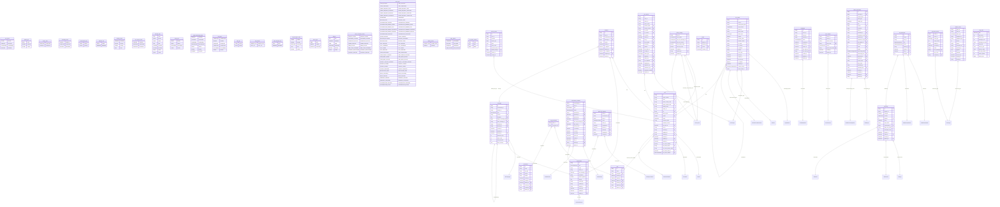

```mermaid
erDiagram

        user_status {
            ACTIVE ACTIVE
INACTIVE INACTIVE
SUSPENDED SUSPENDED
DELETED DELETED
        }
    


        gender_type {
            MALE MALE
FEMALE FEMALE
OTHER OTHER
        }
    


        privacy_level {
            EVERYONE EVERYONE
CONTACTS CONTACTS
        }
    


        friendship_status {
            PENDING PENDING
ACCEPTED ACCEPTED
DECLINED DECLINED
        }
    


        conversation_type {
            DIRECT DIRECT
GROUP GROUP
        }
    


        member_role {
            ADMIN ADMIN
MEMBER MEMBER
        }
    


        member_status {
            PENDING PENDING
ACTIVE ACTIVE
KICKED KICKED
LEFT LEFT
        }
    


        join_request_status {
            PENDING PENDING
APPROVED APPROVED
REJECTED REJECTED
        }
    


        message_type {
            TEXT TEXT
IMAGE IMAGE
VIDEO VIDEO
FILE FILE
STICKER STICKER
SYSTEM SYSTEM
AUDIO AUDIO
VOICE VOICE
        }
    


        media_type {
            IMAGE IMAGE
VIDEO VIDEO
DOCUMENT DOCUMENT
AUDIO AUDIO
        }
    


        media_processing_status {
            PENDING PENDING
UPLOADED UPLOADED
CONFIRMED CONFIRMED
PROCESSING PROCESSING
READY READY
FAILED FAILED
EXPIRED EXPIRED
        }
    


        call_status {
            COMPLETED COMPLETED
MISSED MISSED
REJECTED REJECTED
CANCELLED CANCELLED
NO_ANSWER NO_ANSWER
FAILED FAILED
        }
    


        call_type {
            VOICE VOICE
VIDEO VIDEO
        }
    


        call_provider {
            WEBRTC_P2P WEBRTC_P2P
DAILY_CO DAILY_CO
        }
    


        call_participant_role {
            HOST HOST
MEMBER MEMBER
        }
    


        call_participant_status {
            JOINED JOINED
MISSED MISSED
REJECTED REJECTED
LEFT LEFT
KICKED KICKED
        }
    


        device_type {
            WEB WEB
MOBILE MOBILE
DESKTOP DESKTOP
        }
    


        platform {
            IOS IOS
ANDROID ANDROID
WEB WEB
WINDOWS WINDOWS
MACOS MACOS
LINUX LINUX
        }
    


        token_revocation_reason {
            MANUAL_LOGOUT MANUAL_LOGOUT
PASSWORD_CHANGED PASSWORD_CHANGED
SUSPICIOUS_ACTIVITY SUSPICIOUS_ACTIVITY
TOKEN_ROTATION TOKEN_ROTATION
ADMIN_ACTION ADMIN_ACTION
NEW_LOGIN_OVERRIDE NEW_LOGIN_OVERRIDE
ACCOUNT_DEACTIVATED ACCOUNT_DEACTIVATED
ACCOUNT_DELETED ACCOUNT_DELETED
        }
    


        event_type {
            USER_BLOCKED USER_BLOCKED
USER_UNBLOCKED USER_UNBLOCKED
FRIEND_REQUEST_SENT FRIEND_REQUEST_SENT
FRIEND_REQUEST_ACCEPTED FRIEND_REQUEST_ACCEPTED
FRIEND_REQUEST_REJECTED FRIEND_REQUEST_REJECTED
FRIEND_REQUEST_CANCELLED FRIEND_REQUEST_CANCELLED
UNFRIENDED UNFRIENDED
MESSAGE_SENT MESSAGE_SENT
CONVERSATION_CREATED CONVERSATION_CREATED
CONVERSATION_MEMBER_ADDED CONVERSATION_MEMBER_ADDED
CONVERSATION_MEMBER_LEFT CONVERSATION_MEMBER_LEFT
CONVERSATION_MEMBER_PROMOTED CONVERSATION_MEMBER_PROMOTED
CONVERSATION_MEMBER_DEMOTED CONVERSATION_MEMBER_DEMOTED
CONVERSATION_DISSOLVED CONVERSATION_DISSOLVED
GROUP_CREATED GROUP_CREATED
MESSAGE_DELIVERED MESSAGE_DELIVERED
MESSAGE_SEEN MESSAGE_SEEN
CALL_INITIATED CALL_INITIATED
CALL_ANSWERED CALL_ANSWERED
CALL_ENDED CALL_ENDED
CALL_REJECTED CALL_REJECTED
USER_REGISTERED USER_REGISTERED
USER_PROFILE_UPDATED USER_PROFILE_UPDATED
USER_WENT_ONLINE USER_WENT_ONLINE
USER_WENT_OFFLINE USER_WENT_OFFLINE
PRIVACY_SETTINGS_UPDATED PRIVACY_SETTINGS_UPDATED
CONTACT_SYNCED CONTACT_SYNCED
CONTACT_ADDED CONTACT_ADDED
CONTACT_REMOVED CONTACT_REMOVED
NOTIFICATION_SENT NOTIFICATION_SENT
MEDIA_UPLOADED MEDIA_UPLOADED
MEDIA_DELETED MEDIA_DELETED
REMINDER_CREATED REMINDER_CREATED
REMINDER_TRIGGERED REMINDER_TRIGGERED
CONVERSATION_ARCHIVED CONVERSATION_ARCHIVED
CONVERSATION_MUTED CONVERSATION_MUTED
        }
    


        contact_source {
            PHONE_SYNC PHONE_SYNC
MANUAL MANUAL
        }
    


        login_method {
            PASSWORD PASSWORD
QR_CODE QR_CODE
BIOMETRIC BIOMETRIC
TWO_FACTOR TWO_FACTOR
        }
    


        two_factor_method {
            TOTP TOTP
SMS SMS
EMAIL EMAIL
        }
    
  "users" {
    String id "🗝️"
    String phone_number 
    String email "❓"
    String phone_country_code 
    String phone_number_hash "❓"
    String display_name 
    String avatar_url "❓"
    String bio "❓"
    DateTime date_of_birth "❓"
    Gender gender "❓"
    UserStatus status 
    String password_hash 
    Int password_version 
    DateTime last_seen_at "❓"
    String role_id "❓"
    String created_by "❓"
    String updated_by "❓"
    String deleted_by "❓"
    DateTime created_at 
    DateTime updated_at "❓"
    DateTime deleted_at "❓"
    Boolean two_factor_enabled 
    String two_factor_secret "❓"
    String two_factor_backup_codes 
    DateTime two_factor_setup_at "❓"
    TwoFactorMethod two_factor_method "❓"
    }
  

  "user_tokens" {
    String id "🗝️"
    String user_id 
    String refresh_token_hash 
    LoginMethod login_method 
    String device_id 
    String device_name "❓"
    DeviceType device_type "❓"
    Platform platform "❓"
    String browser_name "❓"
    String browser_version "❓"
    String os_name "❓"
    String os_version "❓"
    String ip_address "❓"
    String location "❓"
    String user_agent "❓"
    DateTime issued_at 
    DateTime expires_at 
    DateTime last_used_at 
    Boolean is_revoked 
    DateTime revoked_at "❓"
    TokenRevocationReason revoked_reason "❓"
    String parent_token_id "❓"
    }
  

  "user_devices" {
    String id "🗝️"
    String user_id 
    String device_id 
    String device_name 
    String browser_name "❓"
    String browser_version "❓"
    String os_name "❓"
    String os_version "❓"
    Boolean is_trusted 
    DateTime trusted_at "❓"
    String last_ip "❓"
    String last_location "❓"
    String fcm_token "❓"
    String platform "❓"
    DateTime last_active_at 
    DateTime created_at 
    DeviceType device_type "❓"
    String fingerprint "❓"
    String public_key "❓"
    String key_algorithm "❓"
    DateTime registered_at "❓"
    String registration_ip "❓"
    String attestation_type "❓"
    Boolean attestation_verified 
    DateTime attested_at "❓"
    }
  

  "roles" {
    String id "🗝️"
    String name 
    String description "❓"
    DateTime created_at 
    DateTime updated_at 
    DateTime deleted_at "❓"
    String created_by "❓"
    String updated_by "❓"
    String deleted_by "❓"
    }
  

  "permissions" {
    String id "🗝️"
    String name 
    String api_path 
    String method 
    String module 
    DateTime created_at 
    DateTime updated_at 
    DateTime deleted_at "❓"
    String created_by "❓"
    String updated_by "❓"
    String deleted_by "❓"
    }
  

  "role_permissions" {
    String role_id 
    String permission_id 
    }
  

  "privacy_settings" {
    String user_id "🗝️"
    PrivacyLevel show_profile 
    PrivacyLevel who_can_message_me 
    PrivacyLevel who_can_call_me 
    Boolean show_online_status 
    Boolean show_last_seen 
    DateTime created_at 
    String updated_by "❓"
    DateTime updated_at 
    }
  

  "friendships" {
    String id "🗝️"
    String user1_id 
    String user2_id 
    String requester_id 
    FriendshipStatus status 
    DateTime accepted_at "❓"
    DateTime declined_at "❓"
    DateTime expires_at "❓"
    DateTime last_action_at "❓"
    String last_action_by "❓"
    DateTime created_at 
    DateTime updated_at 
    DateTime deleted_at "❓"
    }
  

  "blocks" {
    String id "🗝️"
    String blocker_id 
    String blocked_id 
    String reason "❓"
    DateTime created_at 
    }
  

  "user_contacts" {
    String owner_id "🗝️"
    String owner_id 
    String contact_user_id 
    String alias_name "❓"
    ContactSource source 
    String phone_book_name "❓"
    DateTime created_at 
    DateTime updated_at 
    }
  

  "conversations" {
    String id "🗝️"
    ConversationType type 
    String name "❓"
    String avatar_url "❓"
    DateTime last_message_at "❓"
    String participants 
    Boolean require_approval 
    Json settings 
    String created_by "❓"
    String updated_by "❓"
    String deleted_by "❓"
    DateTime created_at 
    DateTime updated_at 
    DateTime deleted_at "❓"
    }
  

  "conversation_members" {
    String conversation_id 
    String user_id 
    MemberRole role 
    MemberStatus status 
    String promoted_by "❓"
    DateTime promoted_at "❓"
    String demoted_by "❓"
    DateTime demoted_at "❓"
    BigInt last_read_message_id "❓"
    DateTime last_read_at "❓"
    Int unread_count 
    Boolean is_archived 
    Boolean is_muted 
    Boolean is_pinned 
    DateTime pinned_at "❓"
    DateTime joined_at 
    DateTime left_at "❓"
    String kicked_by "❓"
    DateTime kicked_at "❓"
    }
  

  "group_join_requests" {
    String user_id "🗝️"
    String conversation_id 
    String user_id 
    JoinRequestStatus status 
    String inviter_id "❓"
    DateTime requested_at 
    DateTime expires_at "❓"
    String message "❓"
    String reviewed_by "❓"
    DateTime reviewed_at "❓"
    }
  

  "messages" {
    BigInt id "🗝️"
    String conversation_id 
    String sender_id "❓"
    MessageType type 
    String content "❓"
    Json metadata "❓"
    BigInt reply_to_message_id "❓"
    String client_message_id "❓"
    String updated_by "❓"
    String deleted_by "❓"
    DateTime created_at 
    DateTime updated_at 
    DateTime deleted_at "❓"
    Int delivered_count 
    Int seen_count 
    Int total_recipients 
    Json direct_receipts "❓"
    }
  

  "media_attachments" {
    String id "🗝️"
    BigInt message_id "❓"
    String original_name 
    String mime_type 
    MediaType media_type 
    BigInt size 
    String s3_key "❓"
    String s3_bucket 
    String cdn_url "❓"
    String thumbnail_url "❓"
    String thumbnail_s3_key "❓"
    String optimized_url "❓"
    String optimized_s3_key "❓"
    String hls_playlist_url "❓"
    Int duration "❓"
    Int width "❓"
    Int height "❓"
    MediaProcessingStatus processing_status 
    String processing_error "❓"
    DateTime processed_at "❓"
    String upload_id "❓"
    String s3_key_temp "❓"
    Int retry_count 
    String uploaded_by 
    String uploaded_from "❓"
    DateTime created_at 
    DateTime updated_at 
    DateTime deleted_at "❓"
    String deleted_by "❓"
    }
  

  "call_history" {
    String id "🗝️"
    String initiator_id 
    CallType call_type 
    CallProvider provider 
    Int duration "❓"
    CallStatus status 
    String end_reason "❓"
    String conversation_id "❓"
    String daily_room_name "❓"
    Int participant_count 
    DateTime started_at 
    DateTime ended_at "❓"
    DateTime created_at 
    DateTime deleted_at "❓"
    }
  

  "call_participants" {
    String id "🗝️"
    String call_id 
    String user_id 
    CallParticipantRole role 
    CallParticipantStatus status 
    String kicked_by "❓"
    DateTime joined_at "❓"
    DateTime left_at "❓"
    Int duration "❓"
    }
  

  "domain_events" {
    String event_id "🗝️"
    String event_id 
    EventType event_type 
    String aggregate_id 
    String aggregate_type 
    Int version 
    String source 
    String correlation_id "❓"
    String causation_id "❓"
    Json payload 
    Json metadata "❓"
    DateTime occurred_at 
    DateTime created_at 
    String issued_by "❓"
    }
  

  "processed_events" {
    String event_id "🗝️"
    String event_id 
    EventType event_type 
    Int event_version 
    String handler_id 
    DateTime processed_at 
    String status 
    String error_message "❓"
    Int retry_count 
    String correlation_id "❓"
    }
  

  "search_queries" {
    String id "🗝️"
    String user_id 
    String keyword 
    String search_type 
    Json filters "❓"
    Int result_count 
    Int execution_time_ms 
    String clicked_result_id "❓"
    DateTime clicked_at "❓"
    DateTime created_at 
    }
  

  "reminders" {
    String id "🗝️"
    String user_id 
    String conversation_id "❓"
    BigInt message_id "❓"
    String content 
    DateTime remind_at 
    Boolean is_triggered 
    DateTime triggered_at "❓"
    Boolean is_completed 
    DateTime completed_at "❓"
    DateTime created_at 
    }
  

  "daily_stats" {
    DateTime date "🗝️"
    Int new_users 
    Int active_users 
    Int messages_total 
    Json messages_by_type 
    Int calls_total 
    Json calls_by_type 
    Json calls_by_status 
    Int call_avg_duration 
    Int media_uploads 
    BigInt media_bytes 
    }
  
    "users" |o--|o "Gender" : "enum:gender"
    "users" |o--|| "UserStatus" : "enum:status"
    "users" }o--|o roles : "role"
    "users" |o--|o "TwoFactorMethod" : "enum:two_factor_method"
    "user_tokens" |o--|| "LoginMethod" : "enum:login_method"
    "user_tokens" |o--|o "DeviceType" : "enum:device_type"
    "user_tokens" |o--|o "Platform" : "enum:platform"
    "user_tokens" |o--|o "TokenRevocationReason" : "enum:revoked_reason"
    "user_tokens" |o--|o user_tokens : "parentToken"
    "user_tokens" }o--|| users : "user"
    "user_devices" |o--|o "DeviceType" : "enum:device_type"
    "user_devices" }o--|| users : "user"
    "role_permissions" }o--|| roles : "role"
    "role_permissions" }o--|| permissions : "permission"
    "privacy_settings" |o--|| users : "user"
    "privacy_settings" |o--|| "PrivacyLevel" : "enum:show_profile"
    "privacy_settings" |o--|| "PrivacyLevel" : "enum:who_can_message_me"
    "privacy_settings" |o--|| "PrivacyLevel" : "enum:who_can_call_me"
    "friendships" |o--|| "FriendshipStatus" : "enum:status"
    "user_contacts" |o--|| "ContactSource" : "enum:source"
    "conversations" |o--|| "ConversationType" : "enum:type"
    "conversation_members" |o--|| "MemberRole" : "enum:role"
    "conversation_members" |o--|| "MemberStatus" : "enum:status"
    "conversation_members" }o--|| conversations : "conversation"
    "group_join_requests" |o--|| "JoinRequestStatus" : "enum:status"
    "group_join_requests" }o--|| conversations : "conversation"
    "messages" |o--|| "MessageType" : "enum:type"
    "messages" }o--|| conversations : "conversation"
    "messages" |o--|o messages : "parentMessage"
    "media_attachments" |o--|| "MediaType" : "enum:media_type"
    "media_attachments" |o--|| "MediaProcessingStatus" : "enum:processing_status"
    "call_history" |o--|| "CallType" : "enum:call_type"
    "call_history" |o--|| "CallProvider" : "enum:provider"
    "call_history" |o--|| "CallStatus" : "enum:status"
    "call_participants" |o--|| "CallParticipantRole" : "enum:role"
    "call_participants" |o--|| "CallParticipantStatus" : "enum:status"
    "call_participants" }o--|| call_history : "callHistory"
    "domain_events" |o--|| "EventType" : "enum:event_type"
    "processed_events" |o--|| "EventType" : "enum:event_type"
    "search_queries" }o--|| users : "clicked_result_id"
    "reminders" }o--|| users : "user"
    "reminders" }o--|o conversations : "conversation"
    "reminders" }o--|o messages : "message"
```
