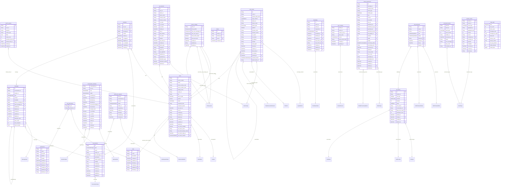

```mermaid
---
id: 27f72f04-7600-4f8b-bc76-34fc245ebb4a
---
erDiagram
  "users" {
    String id "🗝️"
    String phone_number
    String email "❓"
    String phone_country_code
    String phone_number_hash "❓"
    String display_name
    String avatar_url "❓"
    String bio "❓"
    DateTime date_of_birth "❓"
    Gender gender "❓"
    UserStatus status
    String password_hash
    Int password_version
    DateTime last_seen_at "❓"
    String role_id "❓"
    String created_by "❓"
    String updated_by "❓"
    String deleted_by "❓"
    DateTime created_at
    DateTime updated_at "❓"
    DateTime deleted_at "❓"
    Boolean two_factor_enabled
    String two_factor_secret "❓"
    String two_factor_backup_codes
    DateTime two_factor_setup_at "❓"
    TwoFactorMethod two_factor_method "❓"
    }


  "user_tokens" {
    String id "🗝️"
    String user_id
    String refresh_token_hash
    LoginMethod login_method
    String device_id
    String device_name "❓"
    DeviceType device_type "❓"
    Platform platform "❓"
    String browser_name "❓"
    String browser_version "❓"
    String os_name "❓"
    String os_version "❓"
    String ip_address "❓"
    String location "❓"
    String user_agent "❓"
    DateTime issued_at
    DateTime expires_at
    DateTime last_used_at
    Boolean is_revoked
    DateTime revoked_at "❓"
    TokenRevocationReason revoked_reason "❓"
    String parent_token_id "❓"
    }


  "user_devices" {
    String id "🗝️"
    String user_id
    String device_id
    String device_name
    String browser_name "❓"
    String browser_version "❓"
    String os_name "❓"
    String os_version "❓"
    Boolean is_trusted
    DateTime trusted_at "❓"
    String last_ip "❓"
    String last_location "❓"
    String fcm_token "❓"
    String platform "❓"
    DateTime last_active_at
    DateTime created_at
    DeviceType device_type "❓"
    String fingerprint "❓"
    String public_key "❓"
    String key_algorithm "❓"
    DateTime registered_at "❓"
    String registration_ip "❓"
    String attestation_type "❓"
    Boolean attestation_verified
    DateTime attested_at "❓"
    }


  "roles" {
    String id "🗝️"
    String name
    String description "❓"
    DateTime created_at
    DateTime updated_at
    DateTime deleted_at "❓"
    String created_by "❓"
    String updated_by "❓"
    String deleted_by "❓"
    }


  "permissions" {
    String id "🗝️"
    String name
    String api_path
    String method
    String module
    DateTime created_at
    DateTime updated_at
    DateTime deleted_at "❓"
    String created_by "❓"
    String updated_by "❓"
    String deleted_by "❓"
    }


  "role_permissions" {
    String role_id
    String permission_id
    }


  "privacy_settings" {
    String user_id "🗝️"
    PrivacyLevel show_profile
    PrivacyLevel who_can_message_me
    PrivacyLevel who_can_call_me
    Boolean show_online_status
    Boolean show_last_seen
    DateTime created_at
    String updated_by "❓"
    DateTime updated_at
    }


  "friendships" {
    String id "🗝️"
    String user1_id
    String user2_id
    String requester_id
    FriendshipStatus status
    DateTime accepted_at "❓"
    DateTime declined_at "❓"
    DateTime expires_at "❓"
    DateTime last_action_at "❓"
    String last_action_by "❓"
    DateTime created_at
    DateTime updated_at
    DateTime deleted_at "❓"
    }


  "blocks" {
    String id "🗝️"
    String blocker_id
    String blocked_id
    String reason "❓"
    DateTime created_at
    }


  "user_contacts" {
    String owner_id "🗝️"
    String owner_id
    String contact_user_id
    String alias_name "❓"
    ContactSource source
    String phone_book_name "❓"
    DateTime created_at
    DateTime updated_at
    }


  "conversations" {
    String id "🗝️"
    ConversationType type
    String name "❓"
    String avatar_url "❓"
    DateTime last_message_at "❓"
    String participants
    Boolean require_approval
    Json settings
    String created_by "❓"
    String updated_by "❓"
    String deleted_by "❓"
    DateTime created_at
    DateTime updated_at
    DateTime deleted_at "❓"
    }


  "conversation_members" {
    String conversation_id
    String user_id
    MemberRole role
    MemberStatus status
    String promoted_by "❓"
    DateTime promoted_at "❓"
    String demoted_by "❓"
    DateTime demoted_at "❓"
    BigInt last_read_message_id "❓"
    DateTime last_read_at "❓"
    Int unread_count
    Boolean is_archived
    Boolean is_muted
    Boolean is_pinned
    DateTime pinned_at "❓"
    DateTime joined_at
    DateTime left_at "❓"
    String kicked_by "❓"
    DateTime kicked_at "❓"
    }


  "group_join_requests" {
    String user_id "🗝️"
    String conversation_id
    String user_id
    JoinRequestStatus status
    String inviter_id "❓"
    DateTime requested_at
    DateTime expires_at "❓"
    String message "❓"
    String reviewed_by "❓"
    DateTime reviewed_at "❓"
    }


  "messages" {
    BigInt id "🗝️"
    String conversation_id
    String sender_id "❓"
    MessageType type
    String content "❓"
    Json metadata "❓"
    BigInt reply_to_message_id "❓"
    String client_message_id "❓"
    String updated_by "❓"
    String deleted_by "❓"
    DateTime created_at
    DateTime updated_at
    DateTime deleted_at "❓"
    Int delivered_count
    Int seen_count
    Int total_recipients
    Json direct_receipts "❓"
    }


  "media_attachments" {
    String id "🗝️"
    BigInt message_id "❓"
    String original_name
    String mime_type
    MediaType media_type
    BigInt size
    String s3_key "❓"
    String s3_bucket
    String cdn_url "❓"
    String thumbnail_url "❓"
    String thumbnail_s3_key "❓"
    String optimized_url "❓"
    String optimized_s3_key "❓"
    String hls_playlist_url "❓"
    Int duration "❓"
    Int width "❓"
    Int height "❓"
    MediaProcessingStatus processing_status
    String processing_error "❓"
    DateTime processed_at "❓"
    String upload_id "❓"
    String s3_key_temp "❓"
    Int retry_count
    String uploaded_by
    String uploaded_from "❓"
    DateTime created_at
    DateTime updated_at
    DateTime deleted_at "❓"
    String deleted_by "❓"
    }


  "call_history" {
    String id "🗝️"
    String initiator_id
    CallType call_type
    CallProvider provider
    Int duration "❓"
    CallStatus status
    String end_reason "❓"
    String conversation_id "❓"
    String daily_room_name "❓"
    Int participant_count
    DateTime started_at
    DateTime ended_at "❓"
    DateTime created_at
    DateTime deleted_at "❓"
    }


  "call_participants" {
    String id "🗝️"
    String call_id
    String user_id
    CallParticipantRole role
    CallParticipantStatus status
    String kicked_by "❓"
    DateTime joined_at "❓"
    DateTime left_at "❓"
    Int duration "❓"
    }


  "domain_events" {
    String event_id "🗝️"
    String event_id
    EventType event_type
    String aggregate_id
    String aggregate_type
    Int version
    String source
    String correlation_id "❓"
    String causation_id "❓"
    Json payload
    Json metadata "❓"
    DateTime occurred_at
    DateTime created_at
    String issued_by "❓"
    }


  "processed_events" {
    String event_id "🗝️"
    String event_id
    EventType event_type
    Int event_version
    String handler_id
    DateTime processed_at
    String status
    String error_message "❓"
    Int retry_count
    String correlation_id "❓"
    }


  "search_queries" {
    String id "🗝️"
    String user_id
    String keyword
    String search_type
    Json filters "❓"
    Int result_count
    Int execution_time_ms
    String clicked_result_id "❓"
    DateTime clicked_at "❓"
    DateTime created_at
    }


  "reminders" {
    String id "🗝️"
    String user_id
    String conversation_id "❓"
    BigInt message_id "❓"
    String content
    DateTime remind_at
    Boolean is_triggered
    DateTime triggered_at "❓"
    Boolean is_completed
    DateTime completed_at "❓"
    DateTime created_at
    }


  "daily_stats" {
    DateTime date "🗝️"
    Int new_users
    Int active_users
    Int messages_total
    Json messages_by_type
    Int calls_total
    Json calls_by_type
    Json calls_by_status
    Int call_avg_duration
    Int media_uploads
    BigInt media_bytes
    }

    "users" |o--|o "Gender" : "enum:gender"
    "users" |o--|| "UserStatus" : "enum:status"
    "users" }o--|o roles : "role"
    "users" |o--|o "TwoFactorMethod" : "enum:two_factor_method"
    "user_tokens" |o--|| "LoginMethod" : "enum:login_method"
    "user_tokens" |o--|o "DeviceType" : "enum:device_type"
    "user_tokens" |o--|o "Platform" : "enum:platform"
    "user_tokens" |o--|o "TokenRevocationReason" : "enum:revoked_reason"
    "user_tokens" |o--|o user_tokens : "parentToken"
    "user_tokens" }o--|| users : "user"
    "user_devices" |o--|o "DeviceType" : "enum:device_type"
    "user_devices" }o--|| users : "user"
    "role_permissions" }o--|| roles : "role"
    "role_permissions" }o--|| permissions : "permission"
    "privacy_settings" |o--|| users : "user"
    "privacy_settings" |o--|| "PrivacyLevel" : "enum:show_profile"
    "privacy_settings" |o--|| "PrivacyLevel" : "enum:who_can_message_me"
    "privacy_settings" |o--|| "PrivacyLevel" : "enum:who_can_call_me"
    "friendships" |o--|| "FriendshipStatus" : "enum:status"
    "user_contacts" |o--|| "ContactSource" : "enum:source"
    "conversations" |o--|| "ConversationType" : "enum:type"
    "conversation_members" |o--|| "MemberRole" : "enum:role"
    "conversation_members" |o--|| "MemberStatus" : "enum:status"
    "conversation_members" }o--|| conversations : "conversation"
    "group_join_requests" |o--|| "JoinRequestStatus" : "enum:status"
    "group_join_requests" }o--|| conversations : "conversation"
    "messages" |o--|| "MessageType" : "enum:type"
    "messages" }o--|| conversations : "conversation"
    "messages" |o--|o messages : "parentMessage"
    "media_attachments" |o--|| "MediaType" : "enum:media_type"
    "media_attachments" |o--|| "MediaProcessingStatus" : "enum:processing_status"
    "call_history" |o--|| "CallType" : "enum:call_type"
    "call_history" |o--|| "CallProvider" : "enum:provider"
    "call_history" |o--|| "CallStatus" : "enum:status"
    "call_participants" |o--|| "CallParticipantRole" : "enum:role"
    "call_participants" |o--|| "CallParticipantStatus" : "enum:status"
    "call_participants" }o--|| call_history : "callHistory"
    "domain_events" |o--|| "EventType" : "enum:event_type"
    "processed_events" |o--|| "EventType" : "enum:event_type"
    "search_queries" }o--|| users : "clicked_result_id"
    "reminders" }o--|| users : "user"
    "reminders" }o--|o conversations : "conversation"
    "reminders" }o--|o messages : "message"
```
