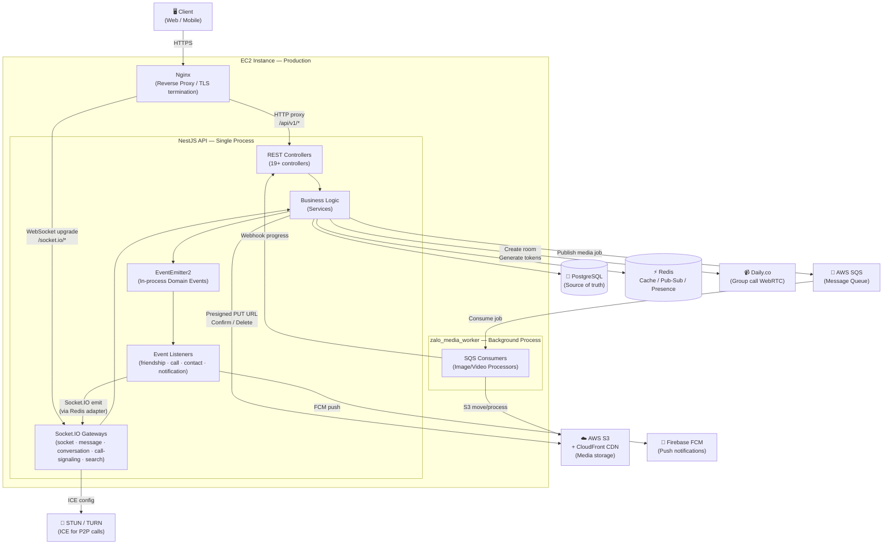

# High-Level Architecture Diagram

> **Môi trường tham chiếu:** Production (`docker-compose.prod.yml`) — EC2 single instance, AWS S3 + CloudFront, không có worker container riêng.  
> **Cập nhật:** 12/03/2026

---

## Sơ đồ tổng thể

<!-- [MermaidChart: 1f1d3e3d-e6bc-4a8f-8838-7d6625e35503] -->


---

## Mô tả các thành phần

### Client
- **Web**: React 19 + Vite SPA served qua CloudFront / Vercel.
- **Mobile**: Chưa phát triển — API đã chuẩn bị sẵn JWT + FCM.

### Nginx
- TLS termination (Let's Encrypt / ACM).
- Proxy pass đến NestJS trên cổng nội bộ `3000`.
- WebSocket upgrade (`Connection: Upgrade`) cho Socket.IO.
- Rate limit cơ bản ở layer này (bổ sung thêm `@Throttle` trong NestJS).

### NestJS API — Single Process

| Layer | Vai trò |
|---|---|
| **REST Controllers** | Validate input (DTO + class-validator), xác thực JWT (`JwtAuthGuard`), uỷ quyền xuống Service. |
| **Socket.IO Gateways** | Xử lý real-time events (message, call signaling, presence, search subscription). Dùng Redis adapter để broadcast qua nhiều process nếu scale ngang. |
| **Services** | Business logic, orchestration giữa Prisma / Redis / S3 / external APIs. |
| **EventEmitter2** | In-process event bus. Decouples cross-module side-effects (ví dụ: `friendship.accepted` → notify cả 2 bên qua Socket). |
| **Event Listeners** | Nhận domain events và thực hiện side-effect: push notification (FCM), socket broadcast, cập nhật cache. |

### PostgreSQL
- Source of truth cho toàn bộ domain data (22 models).
- Truy cập qua **Prisma ORM** (type-safe, migration tự động).
- Full-text search dùng `tsvector` + GIN index (module Search Engine).

### Redis
| Pattern | Dùng cho |
|---|---|
| **Cache-aside** | Block status, ICE server config, search results, user presence. |
| **Distributed lock / idempotency key** | Đảm bảo `message:send` không tạo duplicate khi client retry. |
| **Pub/Sub (adapter)** | Socket.IO multi-instance broadcast (sẵn sàng scale ngang EC2). |
| **Sorted set / counter** | Admin real-time KPI counters (`DailyStats`). |

### AWS S3 + CloudFront
- Client **tự upload trực tiếp** lên S3 qua **presigned PUT URL** — file không đi qua khối API Backend lần nào (Zero-buffer).
- `S3Service.generatePresignedUrl()` tạo HMAC URL cho client tự PUT file.
- `POST /media/upload/confirm`: NestJS API xác nhận upload, **trực tiếp move file** từ `temp/` sang `permanent/`, set status `READY` và lập tức trả về `cdnUrl` cho Frontend hiển thị ảnh gốc ngay (UX siêu nhanh).
- Nếu là Ảnh/Video, Backend sẽ đẩy sự kiện xử lý độ phân giải/thumbnail nhỏ vào **AWS SQS**. Media Worker sẽ xử lý chạy ngầm mà không làm treo API server.
- CloudFront CDN phục vụ media: `GET /media/serve/:id` → NestJS redirect 302 đến CloudFront URL.

### AWS SQS + zalo_media_worker
- **AWS SQS** cung cấp Message Queue bền vững làm buffer giữa API và Worker.
- **zalo_media_worker** chạy tách biệt hoàn toàn 1 process Node.js khác (không nghẽn API).
- Chịu trách nhiệm fetch stream từ S3, chạy ffmpeg/sharp để Resize/Compress ảnh và tạo thumbnail video. Sau khi xong, worker bắn webhook HTTP nội bộ ngược lại API để API broadcast Socket báo `%` cho các client.

### Daily.co
- `DailyCoService` gọi `https://api.daily.co/v1` bằng **axios** (server-side REST):
  - `POST /rooms` — tạo room cho group call.
  - `POST /meeting-tokens` — tạo meeting token cho từng participant.
  - `DELETE /rooms/:name` — cleanup khi cuộc gọi kết thúc.
- `DAILY_API_KEY` chỉ nằm trên server, **không bao giờ gửi xuống client**.
- Client nhận `roomUrl` + meeting token qua Socket event, sau đó **kết nối trực tiếp vào Daily.co** qua Daily.co SDK / iframe, không qua NestJS.

### Firebase FCM
- `FirebaseService` dùng `firebase-admin` SDK để gửi `MulticastMessage` đến FCM API của Google (HTTPS call từ server).
- FCM là **relay server** — nhận payload từ NestJS rồi đẩy push notification xuống thiết bị Android/iOS/Web.
- `PushNotificationService` được gọi từ Event Listeners (không phải trực tiếp từ Services).
- Device token được lưu trong bảng `user_devices`, đăng ký qua `POST /devices/token`.

### STUN / TURN
- NestJS **không bao giờ kết nối đến STUN/TURN server**.
- `IceConfigService` đọc `.env` (`STUN_SERVER_URL`, `TURN_SERVER_URL`, `TURN_SECRET`) và tạo TURN credentials ngắn hạn (HMAC-SHA1, RFC 5766) bằng `TurnCredentialService`.
- Kết quả là một JSON `{ iceServers: [...], iceTransportPolicy }` được gửi đến client qua Socket event (`call:incoming`, `call:accepted`).
- **Client** dùng config đó để thiết lập kết nối WebRTC peer-to-peer qua STUN/TURN — không có bất kỳ kết nối mạng nào từ NestJS → STUN.
- Dev: self-hosted coturn; Production: managed TURN (Metered.ca / Twilio). Google STUN (`stun.l.google.com:19302`) là fallback miễn phí.

---

## Luồng dữ liệu chính

### REST Request
```
Client → Nginx (TLS) → NestJS RestAPI → JwtAuthGuard → Controller → Service → Prisma/Redis → Response
```

### Socket.IO Event
```
Client → Nginx (WebSocket upgrade) → Socket.IO Gateway → JWT verify → Service → EventEmitter2 → Listeners → Socket broadcast / FCM push
```

### Media Upload (Kiến trúc "Serve Original Immediately")
```
① Client → POST /initiate → NestJS → S3Service.generatePresignedUrl() 
② Client → PUT [bytes] → AWS S3 (trực tiếp upload binary)
③ Client → POST /confirm → NestJS xác thực S3, move file vĩnh viễn, gán READY → Reponse cdnUrl tức thì.
④ Client → Nhận cdnUrl render trực tiếp ảnh/video chất lượng gốc (Zero Delays).
⑤ NestJS → Đẩy Message vào SQS Queue cho Worker (Nếu là ảnh/video).
⑥ Worker → Long-poll SQS → Tạo Thumbnail → Webhook về NestJS API cập nhật tiến trình chạy ngầm.
```

### WebRTC P2P Call (ICE config là JSON, không phải kết nối từ server)
```
Caller  → call:initiate (Socket) → CallSignalingGateway
NestJS  → IceConfigService.getIceConfig(userId) → build iceServers JSON (không gọi mạng ra ngoài)
NestJS  → emit call:incoming { iceServers, iceTransportPolicy } → Callee (Socket)
NestJS  → emit call:accepted { iceServers } → Caller (Socket)
Caller  ←→ STUN/TURN (client kết nối trực tiếp, server không tham gia)
Caller  ←→ Callee (WebRTC P2P data — không đi qua NestJS)
```

### Group Call (Daily.co SFU)
```
Caller → call:initiate (Socket) → NestJS
NestJS → DailyCoService → POST https://api.daily.co/v1/rooms (tạo room)
NestJS → DailyCoService → POST https://api.daily.co/v1/meeting-tokens (token cho từng participant)
NestJS → emit call:daily_room { roomUrl, token } → mỗi participant (Socket)
Client → Daily.co SDK / iframe (kết nối trực tiếp, không qua NestJS)
```

### In-process Domain Event (ví dụ: kết bạn)
```
FriendshipService.acceptRequest()
  → EventEmitter2.emit('friendship.accepted', payload)
    → FriendshipNotificationListener
      → SocketService.emitToUser(userId, 'friendship:accepted')        [user online]
      → PushNotificationService → FirebaseService (firebase-admin SDK)
          → fcm.googleapis.com → Mobile device                    [user offline]
```

