# 03 - Class Diagram (Generated from ERD)

> Cập nhật lần cuối: 04/05/2026
> Nguồn sự thật: [01-ERD.md](01-ERD.md), [schema.prisma](../../backend/zalo_backend/prisma/schema.prisma)

---

## Mục tiêu

Tài liệu này chuyển đổi từ ERD mới sang class diagram để dễ đọc hơn.

- Bám theo model và quan hệ vật lý trong schema hiện tại
- Tổng hợp thành 1 sơ đồ duy nhất
- Không thêm service/controller hoặc logic runtime

---

## Unified Class Diagram

```mermaid
---
id: 501cf6e6-d901-46dc-8dfb-e91275de452b
---
classDiagram
    direction LR

    class users {
      +String id
      +String phone_number
      +String email?
      +String display_name
      +String role_id?
      +UserStatus status
      +Boolean two_factor_enabled
      +TwoFactorMethod two_factor_method?
    }

    class user_tokens {
      +String id
      +String user_id
      +String refresh_token_hash
      +LoginMethod login_method
      +String device_id
      +TokenRevocationReason revoked_reason?
      +String parent_token_id?
    }

    class user_devices {
      +String id
      +String user_id
      +String device_id
      +DeviceType device_type?
      +Boolean is_trusted
      +DateTime last_active_at
    }

    class roles {
      +String id
      +String name
      +String description?
    }

    class permissions {
      +String id
      +String name
      +String api_path
      +String method
      +String module
    }

    class role_permissions {
      +String role_id
      +String permission_id
    }

    class privacy_settings {
      +String user_id
      +PrivacyLevel show_profile
      +PrivacyLevel who_can_message_me
      +PrivacyLevel who_can_call_me
      +Boolean show_online_status
      +Boolean show_last_seen
    }

    class friendships {
      +String id
      +String user1_id
      +String user2_id
      +String requester_id
      +FriendshipStatus status
      +DateTime expires_at?
    }

    class blocks {
      +String id
      +String blocker_id
      +String blocked_id
      +String reason?
    }

    class user_contacts {
      +String owner_id
      +String contact_user_id
      +String alias_name?
      +ContactSource source
    }

    class conversations {
      +String id
      +ConversationType type
      +String name?
      +DateTime last_message_at?
      +Boolean require_approval
    }

    class conversation_members {
      +String conversation_id
      +String user_id
      +MemberRole role
      +MemberStatus status
      +Int unread_count
      +Boolean is_archived
      +Boolean is_muted
      +Boolean is_pinned
    }

    class group_join_requests {
      +String id
      +String conversation_id
      +String user_id
      +JoinRequestStatus status
      +String inviter_id?
      +String reviewed_by?
    }

    class messages {
      +BigInt id
      +String conversation_id
      +String sender_id?
      +MessageType type
      +String content?
      +BigInt reply_to_message_id?
      +Int delivered_count
      +Int seen_count
      +Int total_recipients
    }

    class reminders {
      +String id
      +String user_id
      +String conversation_id?
      +BigInt message_id?
      +String content
      +DateTime remind_at
      +Boolean is_triggered
      +Boolean is_completed
    }

    class media_attachments {
      +String id
      +BigInt message_id?
      +MediaType media_type
      +BigInt size
      +MediaProcessingStatus processing_status
      +String uploaded_by
    }

    class call_history {
      +String id
      +String initiator_id
      +CallType call_type
      +CallProvider provider
      +CallStatus status
      +String conversation_id?
      +Int participant_count
    }

    class call_participants {
      +String id
      +String call_id
      +String user_id
      +CallParticipantRole role
      +CallParticipantStatus status
      +Int duration?
    }

    class domain_events {
      +String id
      +String event_id
      +EventType event_type
      +String aggregate_id
      +String aggregate_type
      +Int version
      +String source
      +DateTime occurred_at
    }

    class processed_events {
      +String id
      +String event_id
      +EventType event_type
      +Int event_version
      +String handler_id
      +String status
      +Int retry_count
    }

    class search_queries {
      +String id
      +String user_id
      +String keyword
      +String search_type
      +Int result_count
      +Int execution_time_ms
      +String clicked_result_id?
    }

    class daily_stats {
      +DateTime date
      +Int new_users
      +Int active_users
      +Int messages_total
      +Int calls_total
      +Int media_uploads
    }

      users "0..*" --> "0..1" roles : role
      users "1" --> "0..*" user_tokens : tokens
      users "1" --> "0..*" user_devices : devices
      users "1" --> "0..1" privacy_settings : privacy
      user_tokens "0..*" --> "0..1" user_tokens : parentToken
      role_permissions "0..*" --> "1" roles : role
      role_permissions "0..*" --> "1" permissions : permission

      conversations "1" --> "0..*" conversation_members : members
      conversations "1" --> "0..*" group_join_requests : join_requests
      conversations "1" --> "0..*" messages : messages
      messages "0..*" --> "0..1" messages : parentMessage

      reminders "0..*" --> "1" users : user
      reminders "0..*" --> "0..1" conversations : conversation
      reminders "0..*" --> "0..1" messages : message

      call_history "1" --> "0..*" call_participants : participants
    search_queries "0..*" --> "1" users : user
```

> Ghi chú: `friendships`, `blocks`, `user_contacts` đã decouple FK vật lý sang `users`; `media_attachments.message_id` và `call_history.conversation_id` là khóa mềm.

---

## Lưu ý đồng bộ

- File này là bản đọc dễ hơn của ERD, không thay thế ERD auto-generate.
- Khi schema đổi, ưu tiên regenerate [01-ERD.md](01-ERD.md) trước, sau đó sync file này.
