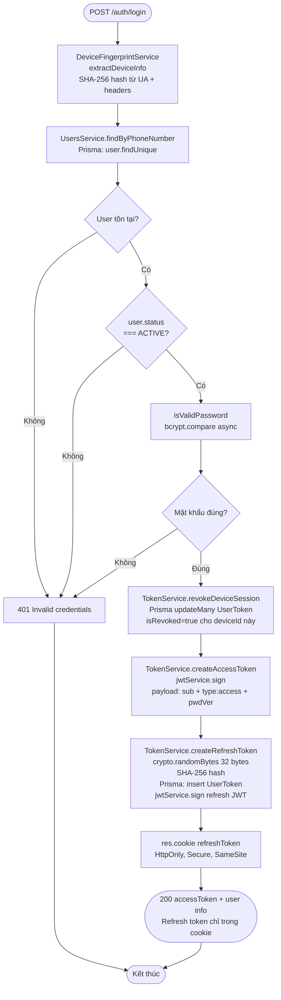
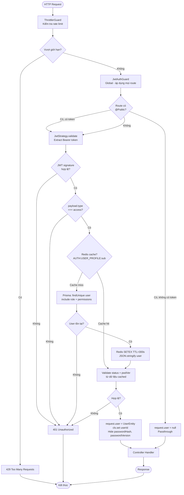
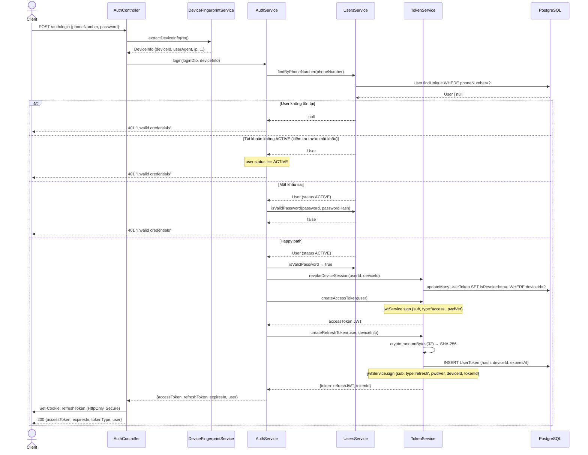
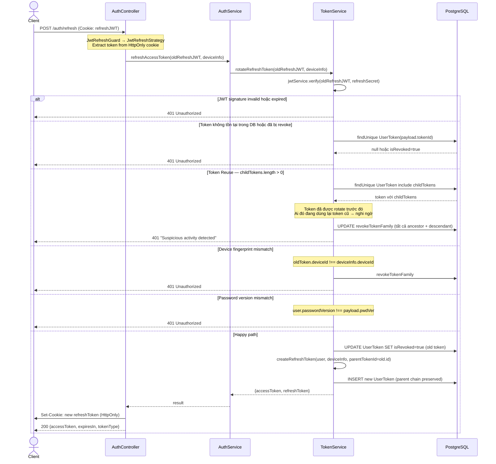
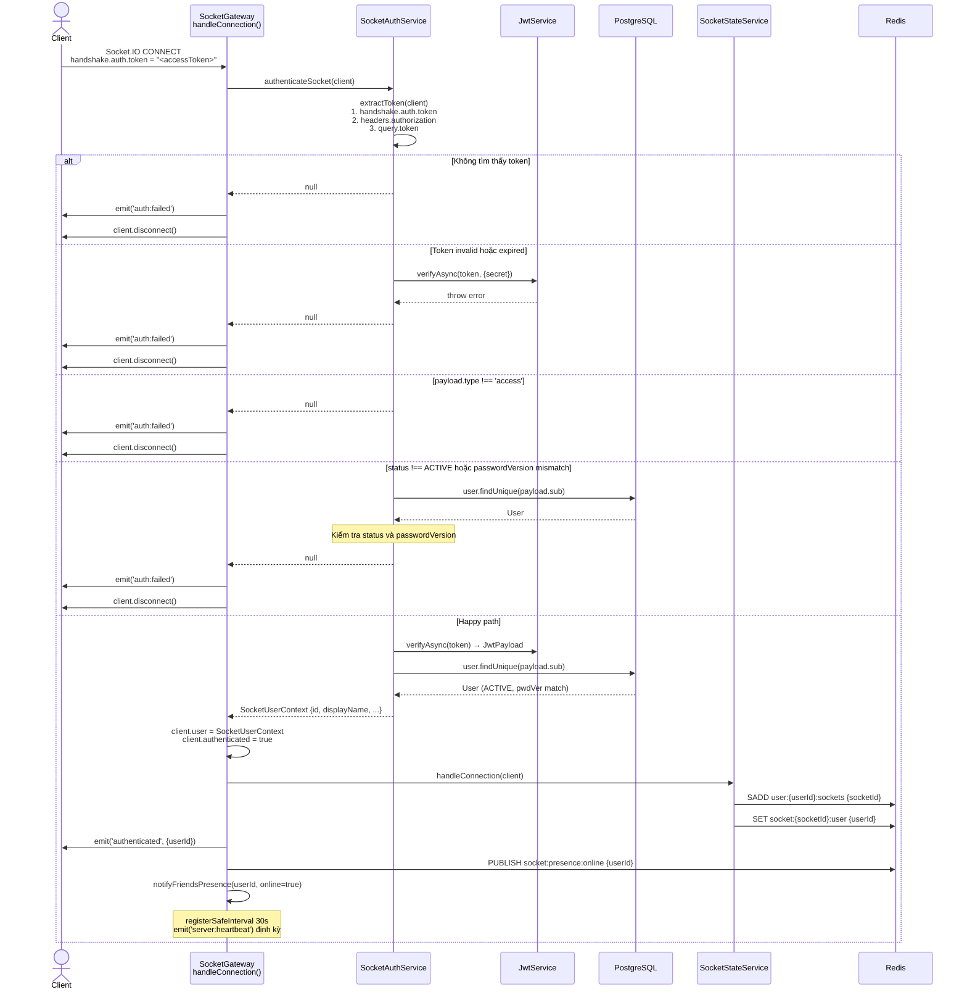

# Module: Authentication

> **Cập nhật lần cuối:** 12/03/2026 (fix B1–B8)
> **Nguồn sự thật:** `src/modules/auth/`
> **Swagger:** `/api/docs` → tag `Authentication`

---

## 1. Tổng quan

### Chức năng chính

Module Auth chịu trách nhiệm:

- Xác thực danh tính người dùng bằng số điện thoại + mật khẩu
- Phát hành và quản lý cặp token (access JWT stateless + refresh JWT lưu DB)
- Xoay vòng refresh token với cơ chế **token family reuse detection**
- Quản lý session đa thiết bị (mỗi `deviceId` có một session độc lập)
- Xác thực kết nối WebSocket (Socket.IO handshake)

### Danh sách Use Case

| # | Use Case |
|---|---|
| UC-1 | Đăng nhập bằng số điện thoại + mật khẩu |
| UC-2 | Làm mới access token (refresh rotation) |
| UC-3 | Đăng xuất khỏi thiết bị hiện tại |
| UC-4 | Xem danh sách session đang hoạt động |
| UC-5 | Đăng xuất từ xa thiết bị khác |
| UC-6 | Xem hồ sơ cá nhân (`/auth/me`) |
| UC-7 | Xác thực WebSocket handshake |

### Phụ thuộc vào module khác

| Module | Vai trò |
|---|---|
| `UsersModule` | Tra cứu user theo số điện thoại, đăng ký user mới, lấy profile |
| `ConfigModule` (jwtConfig) | Secret keys, thời hạn token, cookie options |
| `EventEmitterModule` | Emit `user.logged_out` khi đăng xuất (CallModule lắng nghe) |
| `IdempotencyModule` | Dùng trong `SecurityEventHandler` (xử lý `auth.security.revoked`) |
| `PrismaService` | Lưu trữ `UserToken` (refresh token family) |

---

## 2. API

> Xem chi tiết Request/Response tại Swagger UI: `/api/docs` → tag `Authentication`

| Method | Endpoint | Mô tả | Auth |
|--------|----------|-------|------|
| `POST` | `/auth/register` | Đăng ký tài khoản mới | Public |
| `POST` | `/auth/login` | Đăng nhập — trả accessToken trong body, refreshToken qua cookie | Public |
| `POST` | `/auth/refresh` | Xoay vòng token — đọc refreshToken từ cookie | Public + `JwtRefreshGuard` |
| `POST` | `/auth/logout` | Đăng xuất thiết bị hiện tại — xoá session + cookie | `JwtAuthGuard` |
| `GET` | `/auth/me` | Lấy hồ sơ người dùng hiện tại (kèm role + permissions) | `JwtAuthGuard` |
| `GET` | `/auth/sessions` | Danh sách session đang hoạt động của user | `JwtAuthGuard` |
| `DELETE` | `/auth/sessions/:deviceId` | Đăng xuất từ xa một thiết bị cụ thể | `JwtAuthGuard` |

**Ghi chú endpoint:**
- `POST /auth/register` delegates toàn bộ logic sang `UsersService.register()`.
- `POST /auth/logout` trả về `204 No Content`.
- `DELETE /auth/sessions/:deviceId` trả về `204 No Content`.
- Refresh token **không bao giờ** xuất hiện trong response body — chỉ qua `HttpOnly` cookie.

---

## 3. Activity Diagram

### 3.1 — Luồng đăng nhập (Login + Token Issuance)

### 3.2 — Chuỗi guard xác thực JWT (HTTP Request)

---

## 4. Sequence Diagram

### 4.1 — POST /auth/login (Happy path + Error paths)

### 4.2 — POST /auth/refresh — Token Rotation với Reuse Detection

### 4.3 — WebSocket Handshake Authentication

---

## 5. Các lưu ý kỹ thuật

### Token Architecture

| Loại | Kiểu | Lưu ở đâu | Thời hạn | Truyền qua |
|------|------|-----------|----------|-----------|
| Access Token | Stateless JWT | Không lưu server | Từ `jwtConfig.accessToken.expiresIn` | `Authorization: Bearer` header |
| Refresh Token | JWT + DB record | PostgreSQL `UserToken` table | Từ `jwtConfig.refreshToken.expiresIn` | `HttpOnly` cookie |

**Token family model:** Mỗi refresh token có `parentTokenId`. Khi rotate, token cũ bị revoke và token mới trỏ về `parentTokenId=old.id`. Nếu token cũ được dùng lại sau khi đã rotate (`childTokens.length > 0`) → toàn bộ family bị revoke (phát hiện token bị đánh cắp).

### Device Fingerprint

`deviceId` = SHA-256 hash của: `userAgent + acceptLanguage + acceptEncoding + X-Screen-Resolution + X-Timezone + X-Platform` — truncated to 32 hex chars. Client có thể gửi custom headers (`X-Device-Name`, `X-Device-Type`, `X-Platform`) để nhận diện thiết bị.

### Events được emit ra ngoài

| Event | Trigger | Listener |
|-------|---------|---------|
| `user.logged_out` | `AuthService.logout()` | `CallLogoutHandler` (dọn dẹp cuộc gọi đang diễn ra) |
| `auth.security.revoked` | External (chưa xác định emitter) | `SecurityEventHandler` — revoke toàn bộ token + force-disconnect socket |

### Caching

`JwtStrategy.validate()` cache user profile trong Redis với TTL **5 phút** (key: `AUTH:USER_PROFILE:{userId}`).

- **Cache hit**: đọc JSON từ Redis, kiểm tra `status` và `passwordVersion` → trả `UserEntity` mà không cần query DB.
- **Cache miss**: thực hiện Prisma query với eager load `role → rolePermissions → permission`, sau đó ghi vào cache.
- **Invalidation**: `UsersService.update()` và `UsersService.updateByAdmin()` gọi `redis.del(key)` ngay sau khi cập nhật — đảm bảo cache không stale khi đổi role, status hoặc password.

---

## 6. Bugs & Issues phát hiện khi phân tích

> ✅ Tất cả các vấn đề dưới đây đã được fix. Xem chi tiết commit tương ứng.

| # | File | Mức độ | Mô tả |
|---|------|--------|-------|
| **B1** ✅ | `users/users.controller.ts` | 🔴 Critical | **Đã fix:** `@UseGuards(RolesGuard)` + `@Roles('ADMIN')` được áp dụng cho `POST /users`, `GET /users`, `PATCH /users/:id/admin-update`, `DELETE /users/:id`. |
| **B2** ✅ | `auth/dto/login.dto.ts` | 🟡 Medium | **Đã fix:** `@Matches(/(84\|0[3\|5\|7\|8\|9])+([0-9]{8})\b/)` đã được bỏ comment. Chỉ chấp nhận số điện thoại đúng định dạng Việt Nam. |
| **B3** ✅ | `auth/listeners/security-event.handler.ts` | 🟡 Medium | **Đã fix:** `handleSecurityRevoked()` gọi `TokenService.revokeAllUserSessions()` + `SocketGateway.forceDisconnectUser()` (lazy-resolved qua `ModuleRef` + `OnApplicationBootstrap`). |
| **B4** ✅ | `common/guards/local-auth.guard.ts` | 🟡 Medium | **Đã fix:** File đã bị xoá. Không còn dead code tham chiếu `LocalStrategy` không tồn tại. |
| **B5** ✅ | `auth/services/token.service.ts` | 🟠 Low | **Đã fix:** Thời hạn refresh token đọc từ `jwtConfig.refreshToken.expiresIn` (parse regex `^\d+d$`), fallback 7 ngày. |
| **B6** ✅ | `auth/strategies/jwt.strategy.ts` | 🟠 Low | **Đã fix:** `JwtStrategy.validate()` cache user profile trong Redis TTL 5 phút (`AUTH:USER_PROFILE:{userId}`). Invalidated khi `update()` hoặc `updateByAdmin()`. |
| **B7** ✅ | `auth/services/token.service.ts` | 🟠 Low | **Đã fix:** `findTokenFamily()` thay thế bằng PostgreSQL `WITH RECURSIVE` CTE — single query cho toàn bộ ancestor + descendant tree. |
| **B8** ✅ | `auth/auth.service.ts` | 🟠 Info | **Đã fix:** Kiểm tra `user.status` xảy ra **trước** kiểm tra mật khẩu. Cả hai trường hợp lỗi đều trả cùng thông báo `"Invalid credentials"`. |

---

## 7. Roadmap

### Mobile & Multi-platform Auth *(chưa triển khai)*

| Feature | Trạng thái | Ghi chú |
|---------|-----------|---------|
| QR Login | Skeleton (`/auth/qr/*` routes có thể có) | Xem `doc/plan/auth/QR-LOGIN-PLAN.md` |
| OTP / Phone verification | Chưa có | Sẽ thêm `/auth/otp/send` + `/auth/otp/verify` |
| Social Login (Google/Facebook) | Không có kế hoạch | — |
| Biometrics (FaceID/TouchID) | Không có kế hoạch | Client-side only, server không thay đổi |

> **Lưu ý cho mobile:** JWT guard, socket handshake, guard chain **không thay đổi** khi thêm mobile. Chỉ thêm login method mới (`/auth/login/phone`). Các module khác phụ thuộc vào Auth không cần cập nhật.

