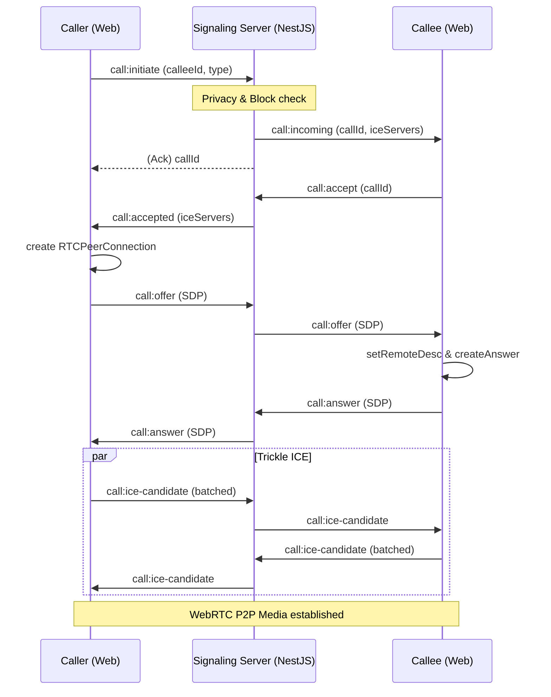

# Module: Call (WebRTC & Daily.co)

> **Cập nhật lần cuối:** 14/03/2026
> **Trạng thái:** Hoàn thiện Phase 3 (WebRTC P2P + Daily.co Hybrid)
> **Kiến trúc:** Signaling Server (Socket.IO) + STUN/TURN + SFU (Daily.co)

---

## 1. Tổng quan

Call module chịu trách nhiệm thiết lập và quản lý các cuộc gọi Video/Voice thời gian thực. Hệ thống sử dụng kiến trúc lai (Hybrid):
- **1-1 P2P WebRTC**: Ưu tiên kết nối trực tiếp giữa 2 trình duyệt để giảm độ trễ và chi phí server.
- **Daily.co (SFU/MCU)**: Sử dụng cho cuộc gọi nhóm hoặc làm phương án dự phòng (fallback) khi kết nối P2P thất bại.

### 1.1 Use Cases chính
- Bắt đầu cuộc gọi (Voice/Video)
- Chấp nhận / Từ chối cuộc gọi
- Kết thúc cuộc gọi
- Tự động chuyển đổi sang Daily.co khi P2P bị lỗi (Network Failover)
- Xem lịch sử cuộc gọi

---

## 2. Luồng hoạt động (Architecture)

### 2.1 STUN/TURN Mechanics (Trái tim của WebRTC)

Hệ thống sử dụng cơ chế ICE (Interactive Connectivity Establishment) để vượt qua các lớp NAT/Firewall:

1.  **STUN (Session Traversal Utilities for NAT)**: 
    - **Máy chủ:** `stun:stun.l.google.com:19302` (Mặc định).
    - **Vai trò:** Giúp trình duyệt tự tìm thấy IP Public và Port của chính mình.
    - **Đặc điểm:** Miễn phí, nhẹ, nhưng thất bại nếu cả 2 bên cùng ở sau Symmetric NAT (phòng net, công ty lớn).
2.  **TURN (Traversal Using Relays around NAT)**:
    - **Máy chủ:** Cấu hình qua `TURN_SERVER_URL` (thường là `coturn`).
    - **Vai trò:** Khi STUN thất bại, toàn bộ dữ liệu Media (Audio/Video) sẽ được truyền qua server trung gian.
    - **Đặc điểm:** Tốn băng thông server, yêu cầu xác thực (`API_INTERNAL_KEY` kết hợp HMAC-SHA1).
3.  **Transport Policy**:
    - `all`: Thừa nhận kết nối trực tiếp (P2P) nếu có thể. Tốc độ nhanh nhất nhưng lộ IP Public của user cho phía bên kia.
    - `relay`: Ép buộc đi qua TURN server. Bảo vệ quyền riêng tư tuyệt đối (ẩn IP), đánh đổi bằng một chút latency (20-50ms).

### 2.2 Signaling Flow (Sequence Diagram)

Cuộc gọi 1-1 thành công (Happy Path):

---

## 3. Các thành phần chính (Backend)

| Thành phần | Vai trò |
|---|---|
| `CallSignalingGateway` | Xử lý Signaling via Socket.IO, quản lý Room, Timeout Ringing. |
| `CallHistoryService` | Quản lý trạng thái Active Call trong **Redis** và lưu lịch sử vào **PostgreSQL**. |
| `IceConfigService` | Cấp phát danh sách server STUN/TURN và cấu hình policy cho User. |
| `DailyCoService` | Gọi API Daily.co để tạo Room và Meeting Tokens cho cuộc gọi nhóm. |
| `CallStateMachine` | Đảm bảo các bước chuyển trạng thái (IDLE -> RINGING -> ACTIVE) luôn hợp lệ. |

---

## 4. Xử lý lỗi & Failover

- **Ringing Timeout (30s)**: Nếu Callee không bắt máy trong 30 giây, Server tự động gửi `call:ended` với lý do `TIMEOUT`.
- **Ringing Ack Backup (2s)**: Nếu sau 2 giây gửi `call:incoming` mà Callee không xác nhận đã nhận (ACK), Server phát Domain Event `CALL_PUSH_NOTIFICATION_NEEDED` để gửi Push qua FCM (dành cho User offline/app bị kill).
- **ICE Candidate Batching (50ms)**: Để tránh quá tải signaling, server gom các gói ICE candidate nhỏ lẻ lại và gửi theo cụm 50ms một lần.
- **Failover to Daily.co**: Trong quá trình gọi P2P, nếu ICE connection bị rớt (`disconnected`) quá 3s, client sẽ yêu cầu `ICE Restart`. Nếu sau 30s restart vẫn thất bại, Client tự động gọi `call:switch_to_daily` để đưa cả 2 bên vào phòng Daily.co SFU (ổn định tuyệt đối).

---

## 5. Rủi ro & Lưu ý kỹ thuật (Nguồn sự thật tại Code)

1.  **MDR-Call-01 (Planned Feature)**: 
    - Trạng thái: `IceConfigService` đã có code handled `allowDirectConnection` nhưng Prisma Schema `PrivacySettings` chưa hỗ trợ cột này. Hiện tại hệ thống đang lấy default từ `.env`.
2.  **MDR-Call-02 (Distributed Lock)**:
    - Khi kết thúc cuộc gọi, hệ thống sử dụng **Redis Distributed Lock** (`call:end_lock:${callId}`) để tránh việc 2 user cùng bấm Hangup gây ra lỗi ghi đè bản ghi DB hoặc duplicate tin nhắn lịch sử.
3.  **Daily.co Limits**:
    - Cuộc gọi nhóm phụ thuộc 100% vào Daily.co. Nếu Daily.co API sập, tính năng gọi nhóm sẽ bị tê liệt hoàn toàn (nhưng gọi 1-1 P2P vẫn hoạt động bình thường).

---

## 6. API Reference (REST)
> Chi tiết Request/Response xem tại Swagger: `/api/docs` (Tag: `Call`)

| Method | Endpoint | Mô tả |
|---|---|---|
| `GET` | `/calls/history` | Lấy lịch sử cuộc gọi (phân trang) |
| `GET` | `/calls/missed/count` | Đếm số cuộc gọi nhỡ chưa đọc |
| `POST` | `/calls/missed/mark-viewed` | Đánh dấu đã xem toàn bộ cuộc gọi nhỡ |
