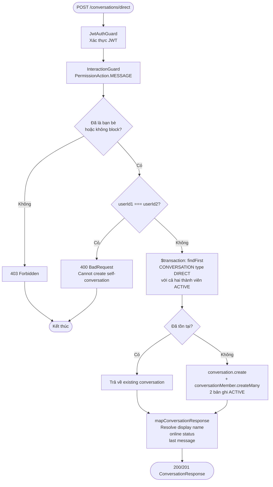
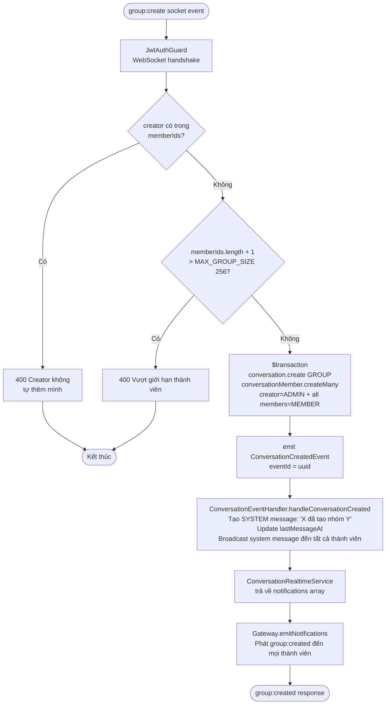
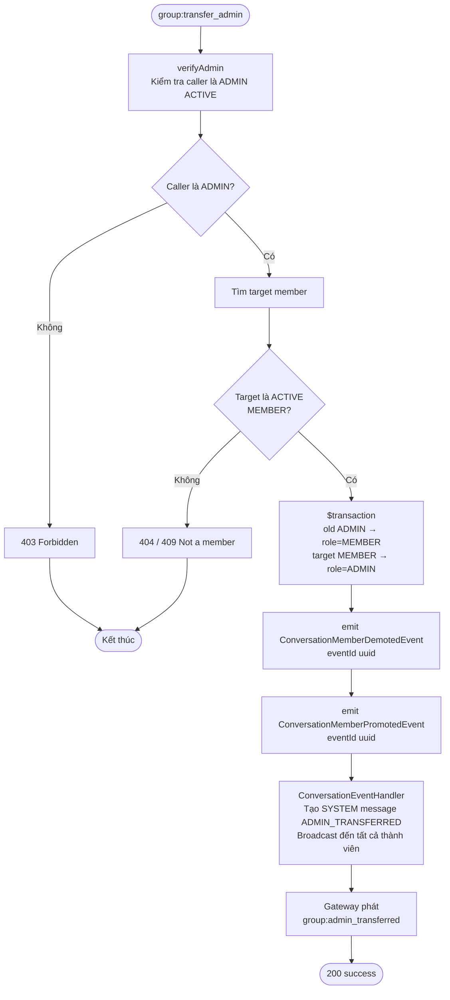
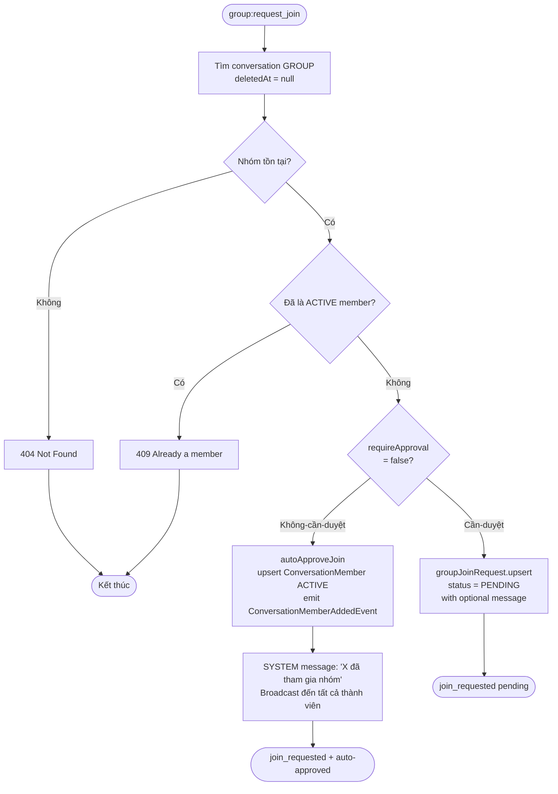
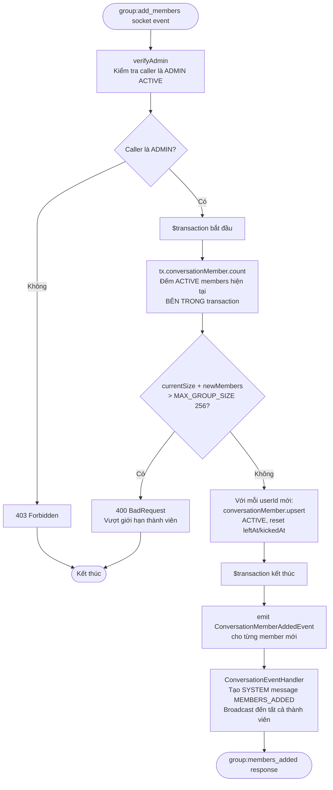
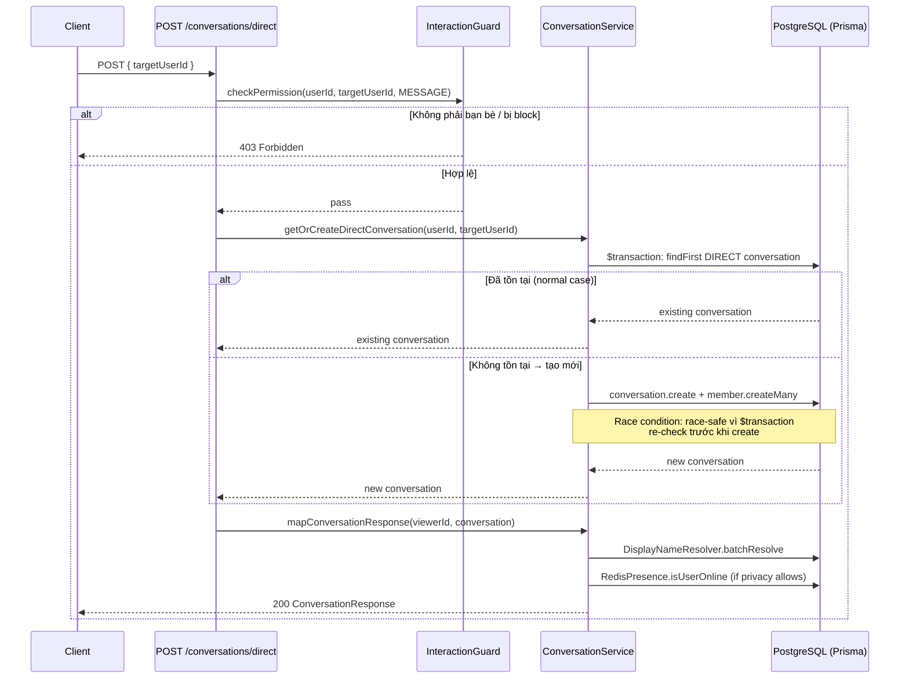
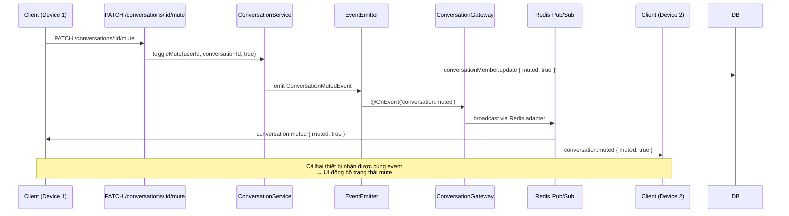
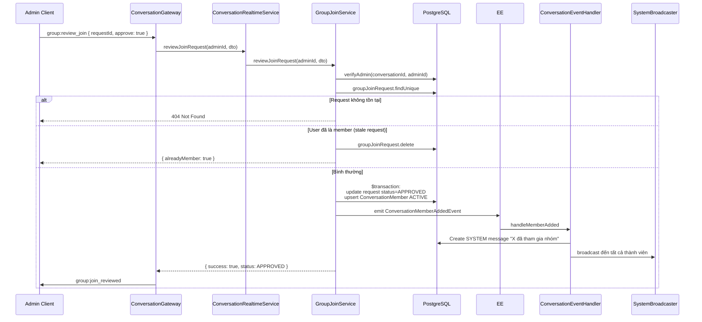

# Module: Conversation

> **Cập nhật lần cuối:** 12/03/2026
> **Nguồn sự thật:** `src/modules/conversation/`
> **Swagger:** `/api/docs` → tag `Conversations`

---

## 1. Tổng quan

### Chức năng chính

Module Conversation chịu trách nhiệm:

- Tạo và quản lý hội thoại trực tiếp (1-1) và nhóm chat (GROUP)
- Quản lý thành viên nhóm: thêm, xoá, phân quyền Admin, rời nhóm, giải tán
- Luồng xin tham gia nhóm: yêu cầu tham gia (join request), duyệt/từ chối, mời thành viên
- Pin hội thoại (tối đa 5), tắt thông báo (mute), lưu trữ (archive) theo từng user
- Pin tin nhắn trong nhóm (tối đa 10, lưu trong JSONB settings)
- Đồng bộ đa thiết bị: trạng thái mute/archive được phát qua event đến mọi socket của user
- Gửi system message tự động khi có thay đổi thành viên (qua `ConversationEventHandler`)
- Cung cấp cursor-pagination cho danh sách hội thoại và nhóm

### Danh sách Use Case

| # | Use Case |
|---|---|
| UC-1 | Tạo hội thoại 1-1 (idempotent — get-or-create) |
| UC-2 | Lấy danh sách hội thoại (cursor-based, pinned-first) |
| UC-3 | Lấy danh sách nhóm của user (có tìm kiếm) |
| UC-4 | Lấy chi tiết hội thoại và danh sách thành viên |
| UC-5 | Tắt/bật thông báo (mute) hội thoại |
| UC-6 | Lưu trữ/khôi phục (archive) hội thoại |
| UC-7 | Pin/unpin hội thoại (tối đa 5 per user) |
| UC-8 | Pin/unpin tin nhắn trong hội thoại (tối đa 10) |
| UC-9 | Tạo nhóm chat (socket) |
| UC-10 | Cập nhật thông tin nhóm (socket, admin only) |
| UC-11 | Thêm/mời thành viên vào nhóm (socket) |
| UC-12 | Xoá thành viên khỏi nhóm (socket, admin only) |
| UC-13 | Chuyển quyền admin (socket, admin only) |
| UC-14 | Rời nhóm (socket) |
| UC-15 | Giải tán nhóm (socket, admin only) |
| UC-16 | Xin tham gia nhóm có bật requireApproval |
| UC-17 | Duyệt / từ chối yêu cầu tham gia (admin) |
| UC-18 | Huỷ yêu cầu tham gia |
| UC-19 | Lấy danh sách yêu cầu tham gia đang chờ |
| UC-20 | Mời thành viên vào nhóm (non-admin, tạo join request) |

### Phụ thuộc vào module khác

| Module | Vai trò |
|---|---|
| `SocketModule` | Phát sự kiện realtime đến client (dùng `forwardRef` tránh circular) |
| `AuthorizationModule` | `InteractionGuard` — kiểm tra bạn bè / không bị block trước khi tạo hội thoại 1-1 |
| `PrivacyModule` | `PrivacyService` — kiểm tra `showOnlineStatus` khi enrich online status; `DisplayNameResolver` — ưu tiên aliasName > phoneBookName > displayName |
| `IdempotencyModule` | Mọi event handler đều idempotent để tránh xử lý trùng khi event retry |
| `PrismaService` | Source of truth: `Conversation`, `ConversationMember`, `GroupJoinRequest`, `Message` |
| `RedisPresenceService` | Kiểm tra user có online không (respects privacy settings) |
| `EventEmitterModule` | Emit domain events (`conversation.*`) và lắng nghe events từ module khác |
| `MessageModule` | Phát sinh `message.sent` event → `ConversationEventHandler` cập nhật `lastMessageAt` |
| `FriendshipModule` | Phát sinh `friendship.accepted` → `FriendshipConversationListener` tự động tạo hội thoại 1-1 |
| `CallModule` | Phát sinh `call.ended` → `CallConversationListener` cập nhật `lastMessageAt` |

---

## 2. API

> Xem chi tiết Request/Response tại Swagger UI: `/api/docs` → tag `Conversations`

### 2.1 REST Endpoints

| Method | Endpoint | Mô tả | Auth | Ghi chú |
|--------|----------|-------|------|---------|
| `POST` | `/conversations/direct` | Tạo/lấy hội thoại 1-1 | `JwtAuthGuard` + `InteractionGuard(MESSAGE)` | Idempotent; yêu cầu bạn bè hoặc không bị block |
| `GET` | `/conversations` | Danh sách hội thoại | `JwtAuthGuard` | Cursor pagination; `?archived=true` để lấy archived |
| `GET` | `/conversations/groups` | Danh sách nhóm của user | `JwtAuthGuard` | `?search=` để tìm theo tên nhóm |
| `GET` | `/conversations/:id` | Chi tiết hội thoại | `JwtAuthGuard` | Kèm resolved display name |
| `GET` | `/conversations/:id/members` | Danh sách thành viên | `JwtAuthGuard` | Kèm resolved display name, role, status |
| `PATCH` | `/conversations/:id/mute` | Toggle mute | `JwtAuthGuard` | Emit `ConversationMutedEvent` → đồng bộ đa thiết bị |
| `PATCH` | `/conversations/:id/archive` | Toggle archive | `JwtAuthGuard` | Auto-unpin nếu đang pin; emit `ConversationArchivedEvent` |
| `POST` | `/conversations/:id/pin` | Pin hội thoại | `JwtAuthGuard` | Tối đa 5 per user; `ConflictException` nếu đã pin |
| `DELETE` | `/conversations/:id/pin` | Unpin hội thoại | `JwtAuthGuard` | — |
| `GET` | `/conversations/:id/pinned-messages` | Danh sách tin nhắn đã pin | `JwtAuthGuard` | Đọc từ `settings.pinnedMessages[]` JSONB |
| `POST` | `/conversations/:id/pin-message` | Pin một tin nhắn | `JwtAuthGuard` | Tối đa 10; bất kỳ thành viên ACTIVE nào |
| `DELETE` | `/conversations/:id/pin-message` | Unpin một tin nhắn | `JwtAuthGuard` | — |

**Ghi chú endpoints:**
- `InteractionGuard(MESSAGE)` trên `POST /conversations/direct` gọi `AuthorizationService.checkPermission(actor, target, MESSAGE)` — trả `403` nếu chưa kết bạn hoặc bị block.
- `GET /conversations` trả về `isArchived=false` theo mặc định (`?archived=true` để lấy archived conversations).
- Pinned conversations luôn xuất hiện đầu tiên — được xử lý **in-memory sort sau DB query**.

### 2.2 Socket Events (ConversationGateway)

#### Client → Server (subscribe)

| Event | Payload DTO | Mô tả | Quyền |
|-------|-------------|-------|-------|
| `group:create` | `CreateGroupDto` | Tạo nhóm mới | Bất kỳ |
| `group:update` | `UpdateGroupDto` | Cập nhật tên/avatar/mô tả nhóm | Admin |
| `group:add_members` | `AddMembersDto` | Thêm thành viên | Admin (nếu `requireApproval`), bất kỳ nếu không |
| `group:remove_member` | `RemoveMemberDto` | Xoá thành viên | Admin |
| `group:transfer_admin` | `TransferAdminDto` | Chuyển quyền admin | Admin |
| `group:leave` | `{ conversationId }` | Rời nhóm | Member |
| `group:dissolve` | `{ conversationId }` | Giải tán nhóm | Admin |
| `group:request_join` | `RequestJoinDto` | Gửi yêu cầu tham gia | Bất kỳ (chưa phải thành viên) |
| `group:review_join` | `ReviewJoinRequestDto` | Duyệt/từ chối yêu cầu | Admin |
| `group:get_pending` | `{ conversationId }` | Lấy danh sách chờ duyệt | Admin |
| `group:invite_members` | `InviteMembersDto` | Mời thành viên (tạo join request) | Member (non-admin) |
| `conversation:pin_message` | `PinMessageDto` | Pin tin nhắn | Bất kỳ thành viên ACTIVE |
| `conversation:unpin_message` | `UnpinMessageDto` | Unpin tin nhắn | Bất kỳ thành viên ACTIVE |

##### Notification events phát đến clients (Server → Client)

| Event | Gửi tới | Khi nào |
|-------|---------|---------|
| `group:created` | Tất cả thành viên mới | Sau `group:create` thành công |
| `group:updated` | Tất cả thành viên ACTIVE | Sau `group:update` |
| `group:members_added` | Admin + thành viên mới | Sau `group:add_members` |
| `group:member_removed` | Admin + thành viên bị xoá | Sau `group:remove_member` |
| `group:admin_transferred` | Tất cả thành viên | Sau `group:transfer_admin` |
| `group:member_left` | Tất cả thành viên còn lại + actor | Sau `group:leave` |
| `group:dissolved` | Tất cả thành viên | Sau `group:dissolve` (kèm system message `GROUP_DISSOLVED`) |
| `group:join_requested` | Actor | Sau `group:request_join` |
| `group:join_reviewed` | Actor | Sau `group:review_join` |
| `group:pending_requests` | Admin | Response cho `group:get_pending` |
| `group:members_invited` | Actor | Sau `group:invite_members` |
| `conversation:message_pinned` | Tất cả thành viên ACTIVE | Sau `conversation:pin_message` |
| `conversation:message_unpinned` | Tất cả thành viên ACTIVE | Sau `conversation:unpin_message` |
| `conversation:archived` | Tất cả sockets của user | Cross-device sync qua `ConversationArchivedEvent` |
| `conversation:muted` | Tất cả sockets của user | Cross-device sync qua `ConversationMutedEvent` |

---

## 3. Activity Diagram

### 3.1 — Luồng tạo hội thoại 1-1 (POST /conversations/direct)



### 3.2 — Luồng tạo nhóm (group:create socket event)



### 3.3 — Luồng pin hội thoại (POST /conversations/:id/pin)

```mermaid
flowchart TD
    A([POST /conversations/:id/pin]) --> B[JwtAuthGuard]
    B --> C[Đếm số hội thoại đang pin\ncủa user trong ConversationMember]
    C --> D{pinnedCount >= 5?}
    D -- Có --> ERR1[409 Conflict\nMax 5 pinned conversations]
    D -- Không --> E{Đã pin rồi?}
    E -- Có --> ERR2[409 Conflict\nAlready pinned]
    E -- Không --> F[conversationMember.update\nsetPinnedAt = now()]
    F --> G([200 success])
    ERR1 --> Z([Kết thúc])
    ERR2 --> Z
```

### 3.4 — Luồng chuyển quyền Admin (group:transfer_admin)



### 3.5 — Luồng xin tham gia nhóm (group:request_join)



### 3.6 — Luồng giải tán nhóm (group:dissolve) ✅ Fixed

```mermaid
flowchart TD
    A([group:dissolve socket event]) --> B[verifyAdmin\nKiểm tra caller là ADMIN ACTIVE]
    B --> C{Caller là ADMIN?}
    C -- Không --> ERR1[403 Forbidden]
    C -- Có --> D[getActiveMembers\nLấy danh sách thành viên ACTIVE]
    D --> E[prisma.user.findUnique\nLấy tên admin]
    E --> F[message.create\ntype=SYSTEM, content='X đã giải tán nhóm'\nmetadata.action='GROUP_DISSOLVED'\nTRƯỚC soft-delete]
    F --> G[conversation.update\nlastMessageAt = sysMsg.createdAt]
    G --> H[SystemMessageBroadcaster.broadcast\nPhát message:new + unreadCount++\ncho members đang online]
    H --> I[enqueueForOfflineMembers\nKiểm tra từng member:\nRedisRegistryService.getUserSockets]
    I --> J{Member có\nactive sockets?}
    J -- Có online --> K[Bỏ qua — đã nhận qua broadcast]
    J -- Offline --> L[redis.zadd user:{id}:offline_msgs\nTTL 7 ngày]
    K --> M[groupService.dissolveGroup\nSoft-delete + emit ConversationDissolvedEvent]
    L --> M
    M --> N([group:dissolved → tất cả thành viên\n+ messages:sync khi offline user reconnect])
    ERR1 --> Z([Kết thúc])
```

### 3.7 — Luồng thêm thành viên (group:add_members) ✅ Fixed



---

## 4. Sequence Diagram

### 4.1 — Tạo hội thoại 1-1 với race condition handling



### 4.2 — Đa thiết bị: Đồng bộ mute/archive



### 4.3 — Luồng duyệt join request



### 4.4 — Giải tán nhóm với offline notification ✅ Fixed

```mermaid
sequenceDiagram
    participant Admin as Admin Client
    participant GW as ConversationGateway
    participant RTS as ConversationRealtimeService
    participant DB as PostgreSQL
    participant SB as SystemMessageBroadcaster
    participant Redis as Redis
    participant Online as Member (online)
    participant Offline as Member (offline)

    Admin->>GW: group:dissolve { conversationId }
    GW->>RTS: dissolveGroup(conversationId, adminId)
    RTS->>DB: getActiveMembers(conversationId)
    DB-->>RTS: memberIds[]
    RTS->>DB: user.findUnique(adminId) — lấy displayName
    RTS->>DB: message.create(type=SYSTEM, action=GROUP_DISSOLVED)
    Note over RTS,DB: Tạo TRƯỚC soft-delete để getActiveMembers vẫn hoạt động
    RTS->>DB: conversation.update(lastMessageAt)
    RTS->>SB: broadcast(conversationId, sysMsg)
    SB->>Online: message:new + conversation:list:itemUpdated
    SB->>DB: unreadCount++ (cho members có unread)
    RTS->>Redis: getUserSockets(memberId) — cho từng member
    Redis-->>RTS: [] (offline)
    RTS->>Redis: zadd user:{id}:offline_msgs (score=timestamp)
    Note over RTS,Redis: TTL 7 ngày; same format as MessageQueueService
    RTS->>DB: groupService.dissolveGroup — soft-delete + ConversationDissolvedEvent
    RTS-->>GW: notifications[]
    GW->>Admin: group:dissolved
    GW->>Online: group:dissolved
    Note over Offline,Redis: Khi Offline reconnect:
    Offline->>GW: socket connect
    GW->>Redis: syncOfflineMessages(socket)
    Redis-->>GW: offline queue (kèm GROUP_DISSOLVED system msg)
    GW->>Offline: messages:sync []
```

---

## 5. Các lưu ý kỹ thuật

### 5.1 — Display Name Resolution

Tất cả response trả về `displayName` đều đi qua `DisplayNameResolver.batchResolve(viewerId, targetIds)` với thứ tự ưu tiên:

```
aliasName (đặt tên riêng) > phoneBookName (từ danh bạ) > displayName (tên hệ thống)
```

Đây là quyết định thiết kế quan trọng: **tên hiển thị phụ thuộc vào người đang xem** (viewer-relative), không phải tên tuyệt đối. Cùng một user nhưng mỗi viewer có thể thấy tên khác nhau.

### 5.2 — Cursor Pagination + Pinned-First Sort

`getUserConversations` dùng **một DB query duy nhất** sort theo `lastMessageAt DESC`, sau đó:

1. Fetch tất cả kết quả (theo cursor/limit)
2. **In-memory sort**: đẩy các conversation có `isPinned=true` lên trên, sort theo `pinnedAt DESC`

> ⚠️ **Lưu ý:** Nếu một conversation được pin nhưng có `lastMessageAt` cũ, nó có thể **không xuất hiện trong trang đầu tiên** của cursor pagination. Thứ tự pinned-first chỉ đúng trong phạm vi một trang — không đúng cross-page. Đây là design limitation chấp nhận được, không phải bug.

### 5.3 — Pinned Messages trong JSONB

Tin nhắn được pin **không** lưu trong bảng riêng mà trong field `settings` kiểu `jsonb` của `Conversation`:

```json
{
  "pinnedMessages": ["123456789", "987654321"]
}
```

`getPinnedMessages` đọc `settings.pinnedMessages`, fetch `Message` records tương ứng, trả về kèm author info. Tối đa **10 tin nhắn pin**.

### 5.4 — Group Settings trong JSONB

Tương tự, group description được lưu trong `settings` JSONB:

```json
{
  "description": "Mô tả nhóm...",
  "pinnedMessages": [...]
}
```

`updateGroup` dùng `prisma.$executeRaw` để merge JSONB (không ghi đè toàn bộ):
```sql
UPDATE "Conversation" SET "settings" = "settings" || $1::jsonb WHERE id = $2
```

### 5.5 — Upsert Pattern cho addMembers / autoApproveJoin

Khi thêm lại một thành viên đã từng rời nhóm hoặc bị kick, hệ thống **không tạo mới** `ConversationMember` mà **reactivate** bản ghi cũ:

```typescript
conversationMember.upsert({
  create: { ..., status: ACTIVE },
  update: { status: ACTIVE, leftAt: null, kickedBy: null, kickedAt: null }
})
```

### 5.6 — Circular Dependency: SocketModule

`ConversationModule` import `forwardRef(() => SocketModule)` để tránh circular dependency.  
`SystemMessageBroadcasterService` dùng `ModuleRef` để lazy-load `SocketGateway` — tránh inject trực tiếp trong constructor:

```typescript
// Lazy load để tránh circular dep
private getGateway() {
  return this.moduleRef.get(SocketGateway, { strict: false });
}
```

### 5.7 — Race Condition Safe: getOrCreateDirectConversation

Pattern double-check bên trong `$transaction`:

```typescript
async getOrCreateDirectConversation(userId1, userId2) {
  return this.prisma.$transaction(async (tx) => {
    // Check lần 1 (trước khi tạo)
    let conv = await tx.conversation.findFirst({ ... });
    if (conv) return conv;
    // Tạo mới
    conv = await tx.conversation.create({ ... });
    return conv;
  });
}
```

PostgreSQL transaction isolation đảm bảo chỉ một request tạo được conversation khi có race condition.

### 5.8 — CrossDevice Sync Flow

Khi user mute hoặc archive hội thoại từ một thiết bị:
1. HTTP handler cập nhật DB
2. Emit `ConversationMutedEvent` / `ConversationArchivedEvent`
3. `ConversationGateway` listen event, gọi `SocketGateway.emitToUser(userId, event, data)`
4. Redis adapter fan-out đến **tất cả socket connections** của `userId` — bao gồm các thiết bị khác

### 5.9 — inviteMembers vs addMembers

| | `addMembers` (GroupService) | `inviteMembers` (GroupJoinService) |
|---|---|---|
| **Caller** | Admin | Bất kỳ member ACTIVE |
| **requireApproval** | Không quan trọng (admin bypass) | Chỉ cho phép nếu `requireApproval=true` |
| **Kết quả** | Thêm trực tiếp vào nhóm | Tạo `GroupJoinRequest` với `inviterId` |
| **Cần admin duyệt?** | Không | Có (admin vẫn phải review) |

### 5.10 — toggleArchive tự động Unpin

```typescript
if (archived && isPinned) {
  await this.unpinConversation(userId, conversationId);
}
```

Khi archive một conversation đang được pin, hệ thống tự động unpin — đảm bảo conversation archived không xuất hiện trong danh sách pinned.

---

## 6. Bugs & Issues

> Tất cả bugs phát hiện trong quá trình phân tích code. Code là nguồn sự thật.
> Đánh giá lại lần 3 — chỉ giữ lại bugs có bằng chứng từ source code. ✅ = đã fix.

### ~~B1 — `dissolveGroup` không tạo system message~~ ✅ Đã fix

| | |
|---|---|
| **File** | `conversation-realtime.service.ts`, `group.service.ts` |
| **Trạng thái** | ✅ **Đã fix** |

**Vấn đề gốc:**  
Mọi lifecycle event khác (`GROUP_CREATED`, `MEMBERS_ADDED`, `MEMBER_LEFT`, `MEMBER_KICKED`, `ADMIN_TRANSFERRED`) đều tạo system message. Riêng `dissolveGroup` không tạo system message, không emit domain event. User offline lúc nhóm giải tán sẽ không thấy thông báo khi online lại.

**Fix đã áp dụng:**

1. **`conversation-realtime.service.ts` → `dissolveGroup()`**: TRƯỚC khi soft-delete, tạo SYSTEM message (`GROUP_DISSOLVED`) và broadcast đến tất cả members online. Đồng thời enqueue vào Redis offline queue cho members đang offline (kiểm tra active sockets qua `RedisRegistryService`), đảm bảo khi user offline reconnect qua `syncOfflineMessages` sẽ nhận được thông báo.

2. **`group.service.ts` → `dissolveGroup()`**: Emit `ConversationDissolvedEvent` domain event sau soft-delete (audit trail + idempotency).

3. **`conversation-event.handler.ts`**: Thêm handler `@OnEvent('conversation.dissolved')` ghi idempotency record (system message đã được tạo trước đó bởi realtime service).

4. **Prisma schema**: Thêm `CONVERSATION_DISSOLVED` vào `EventType` enum.

5. **`ConversationDissolvedEvent`**: Event class mới trong `conversation.events.ts`.

---

### ~~B2 — `addMembers` race condition — kiểm tra size ngoài transaction~~ ✅ Đã fix

| | |
|---|---|
| **File** | `src/modules/conversation/services/group.service.ts` |
| **Method** | `addMembers()` |
| **Trạng thái** | ✅ **Đã fix** |

**Vấn đề gốc:**  
`addMembers` đếm `conversationMember.count()` **NGOÀI** `$transaction`, rồi mới insert trong transaction. Hai request đồng thời có thể cùng pass kiểm tra size rồi cả hai insert, vượt quá `MAX_GROUP_SIZE = 256`.

**Fix đã áp dụng:**  
Di chuyển `count()` vào **bên trong** `$transaction`, trước khi upsert members:

```typescript
await this.prisma.$transaction(async (tx) => {
  const currentSize = await tx.conversationMember.count({
    where: { conversationId, status: MemberStatus.ACTIVE },
  });
  if (currentSize + newUserIds.length > this.MAX_GROUP_SIZE) {
    throw new BadRequestException(...);
  }
  // ... upsert members
});
```

---

### Ghi chú kỹ thuật — Các mục đã loại bỏ sau đánh giá lại

Các mục sau đã được phân tích lại kỹ lưỡng và xác nhận **KHÔNG PHẢI BUG**:

| Mục gốc | Lý do loại bỏ |
|----------|---------------|
| `blockMap` luôn rỗng | Đúng design — block là "ngầm" (silent), đối phương không được biết mình bị block. Block không có logic trong group conversation. |
| BigInt trong `getPinnedMessages` | Đã xử lý — method có `m.id.toString()`. Socket path: `messageId` đến từ JSON deserialization nên là string/number, không phải native BigInt. `WsTransformInterceptor` + `safeJSON` xử lý ack values. |
| Pagination + pinned sort | Cursor pagination theo `id` (không phải `lastMessageAt`). In-memory sort trong page là pattern chấp nhận được. |
| `@IsUUID('all')` | `'all'` là tham số hợp lệ của class-validator — chấp nhận UUID v3, v4, v5. |
| `dissolveGroup` không notify | SAI — `ConversationRealtimeService.dissolveGroup()` fetch active members TRƯỚC khi dissolve rồi gửi socket notification đến TẤT CẢ members. |
| Stub handlers (demoted, profile updated) | Đúng design — `handleMemberDemoted`: đã covered bởi `handleMemberPromoted` tạo system message "ADMIN_TRANSFERRED". `handleUserProfileUpdated`: `ConversationMember` KHÔNG CÓ cột `displayName` — display name được resolve tại query time qua `DisplayNameResolver.batchResolve()`. |
