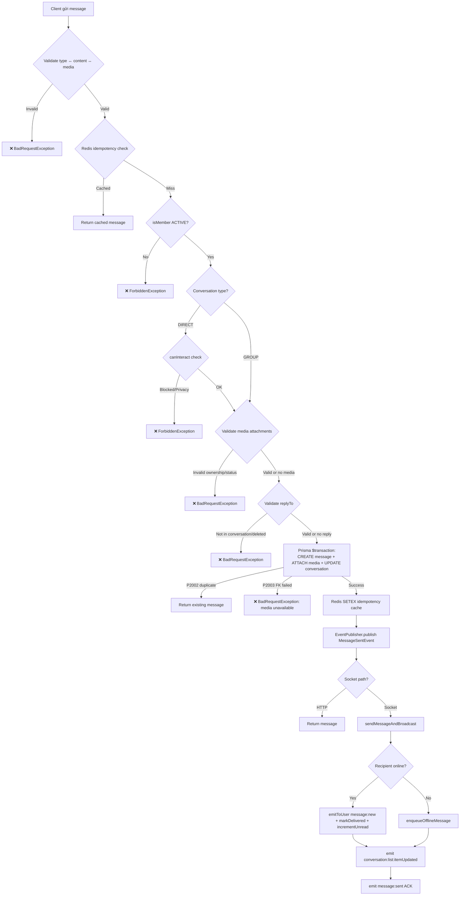
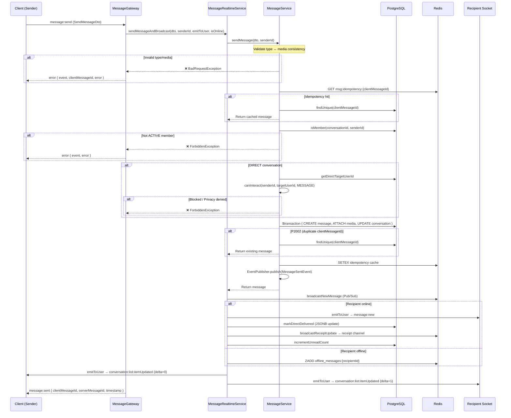
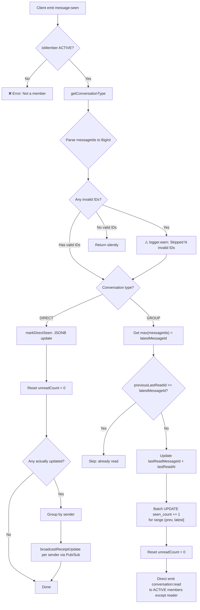
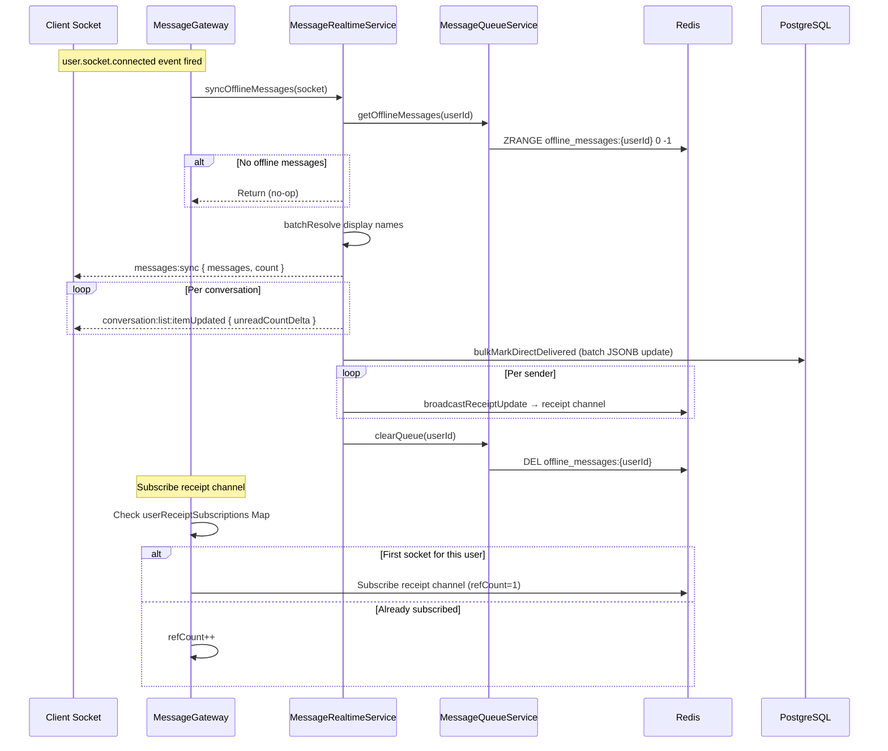
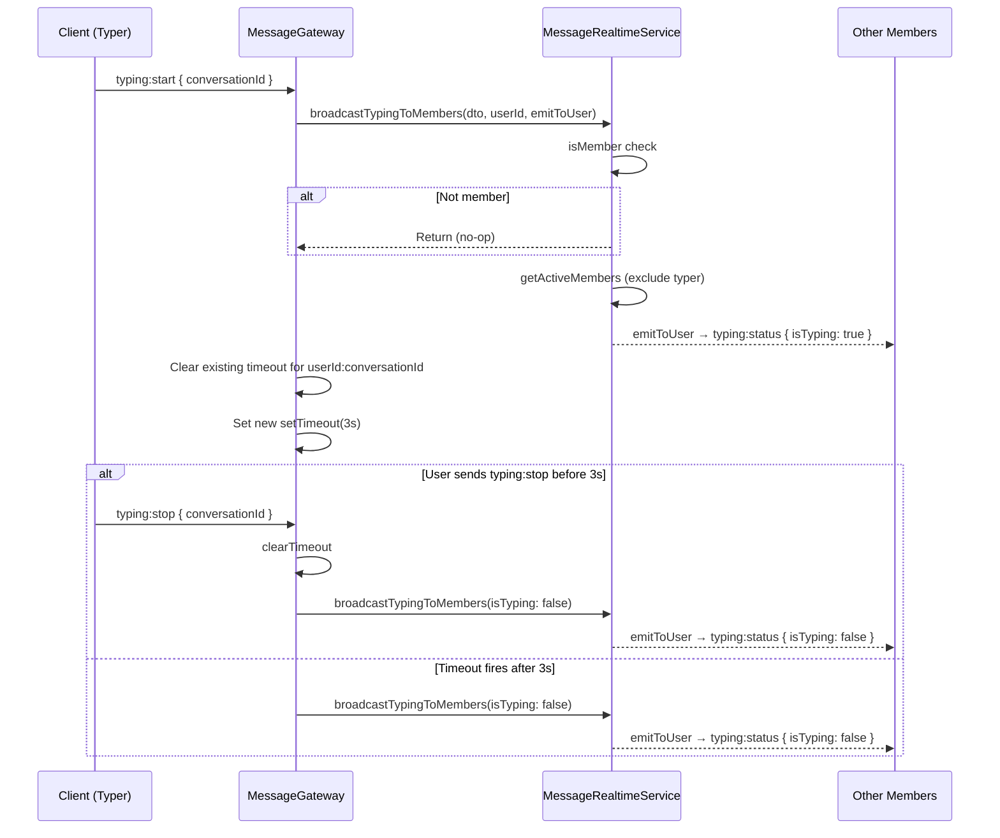
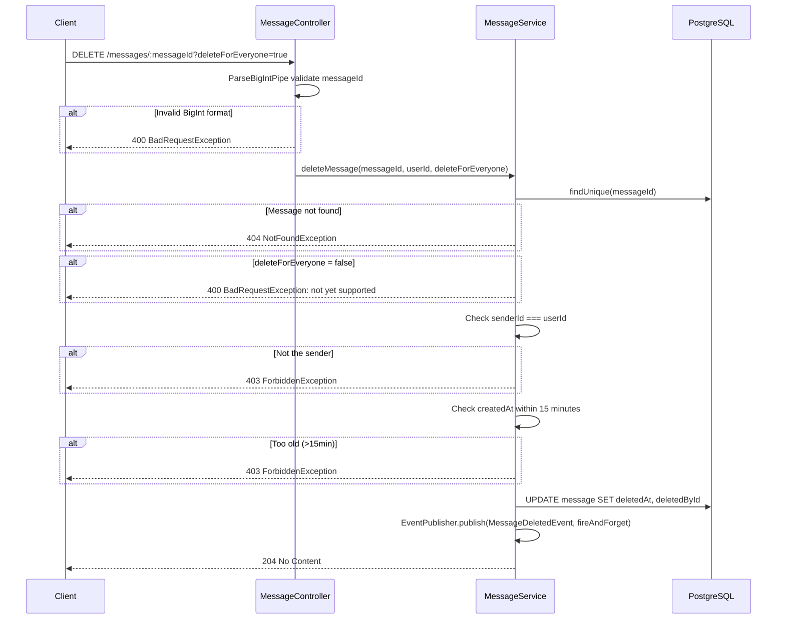

# Module: Message

> **Cập nhật lần cuối:** 13/03/2026
> **Nguồn sự thật:** `backend/zalo_backend/src/modules/message/`
> **Swagger:** `/api/docs` (tag: `messages`)

---

## 1. Tổng quan

### 1.1 Mục tiêu và phạm vi sở hữu

Message module sở hữu toàn bộ lifecycle của tin nhắn:

- **Gửi tin nhắn** qua Socket (`message:send`) và REST fallback (`POST /messages`)
- **Idempotency** 2 lớp khi gửi: Redis cache theo `clientMessageId` + DB unique constraint `clientMessageId`
- **Validate nghiệp vụ** trước khi gửi: membership ACTIVE, quyền DIRECT (privacy/block), media ownership & status, reply target consistency, message type ↔ media type consistency
- **Receipt tracking**: delivered và seen riêng biệt cho DIRECT (JSONB `directReceipts`) và GROUP (`lastReadMessageId` + `seenCount` counter)
- **Offline message queue**: Redis sorted-set, sync khi reconnect
- **Realtime fanout**: emit `message:new` cho online, queue cho offline, cập nhật `conversation:list:itemUpdated`
- **Display name resolution**: enrich `resolvedDisplayName` theo viewer (alias từ `UserContact`)
- **Xóa tin nhắn**: delete-for-everyone (soft delete, giới hạn 15 phút)
- **Truy vấn**: lịch sử chat cursor-based, context quanh target message (jump-to-message), recent media với keyword search
- **System message call-log**: tự động tạo khi nhận event `call.ended`
- **Archive/restore conversation**: tự động khi nhận event `user.blocked` / `user.unblocked`

Message module **không** sở hữu:

- Lifecycle conversation (tạo/dissolve/quản trị member) → `ConversationModule`
- Media upload pipeline (presigned URL, confirm, processing) → `MediaModule`
- Push notification delivery → `NotificationsModule`
- Search indexing & real-time search → `SearchEngineModule`

### 1.2 Use cases thực tế theo code

| Mã | Use case | Luồng chính |
|---|---|---|
| UC-MSG-01 | Gửi text message | Socket `message:send` hoặc REST `POST /messages` |
| UC-MSG-02 | Gửi message có media | Validate mediaIds (ownership, status, chưa attach), persist + attach |
| UC-MSG-03 | Retry gửi message (idempotency) | Redis cache key `msg:idempotency:{clientMessageId}` + DB unique constraint `clientMessageId` |
| UC-MSG-04 | Reply message | Validate replyTo: cùng conversation, chưa bị xóa |
| UC-MSG-05 | Delivered ACK (DIRECT only) | Socket `message:delivered` / `message:delivered:ack` → `markDirectDelivered` (JSONB update) |
| UC-MSG-06 | Seen ACK cho DIRECT | Socket `message:seen` → `markDirectSeen` (JSONB + seenCount) + receipt broadcast |
| UC-MSG-07 | Seen ACK cho GROUP | Socket `message:seen` → `markGroupConversationRead` (`lastReadMessageId` + batch `seenCount`) + direct emit `conversation:read` |
| UC-MSG-08 | Typing indicator | `typing:start` → broadcast + debounced auto-timeout 3s; `typing:stop` cancel timeout |
| UC-MSG-09 | Đồng bộ offline messages | `user.socket.connected` → `syncOfflineMessages` → emit `messages:sync` + `conversation:list:itemUpdated` + mark delivered + clear queue |
| UC-MSG-10 | Lấy lịch sử chat (cursor) | `GET /messages` (limit 1–100, default 50, direction older/newer) |
| UC-MSG-11 | Jump-to-message context | `GET /messages/context` (before + target + after messages) |
| UC-MSG-12 | Lấy recent media | `GET /messages/conversations/:conversationId/media/recent` (cursor pagination, keyword search) |
| UC-MSG-13 | Delete for everyone | `DELETE /messages/:messageId?deleteForEveryone=true` (soft delete, ≤15 phút, chỉ sender) |
| UC-MSG-14 | Call log system message | `call.ended` event → `CallMessageListener` → tạo SYSTEM message + broadcast via `SystemMessageBroadcasterService` |
| UC-MSG-15 | Archive conversation khi bị block | `user.blocked` event → `MessagingBlockListener` → soft delete DIRECT conversation |
| UC-MSG-16 | Restore conversation khi bỏ block | `user.unblocked` event → `MessagingBlockListener` → restore DIRECT conversation |

---

## 2. Phụ thuộc module và tương tác liên module

### 2.1 Module imports

| Module import | Vai trò |
|---|---|
| `DatabaseModule` | Cung cấp `PrismaService` |
| `RedisModule` | Cung cấp `RedisService`, `RedisPubSubService` |
| `EventEmitterModule` | NestJS event emitter (EventEmitter2) |
| `EventsModule` | Cung cấp `EventPublisher` (domain event persistence + emit) |
| `SharedModule` | Cung cấp `DisplayNameResolver` (resolve alias name theo viewer) |
| `AuthorizationModule` | Cung cấp `InteractionAuthorizationService` (privacy/block check cho DIRECT) |
| `SocketModule` (forwardRef) | Cung cấp `SocketStateService` (tra cứu socketIds, online status) |
| `ConversationModule` | Cung cấp `SystemMessageBroadcasterService` (dùng trong `CallMessageListener`) |
| `IdempotencyModule` | Cung cấp `IdempotencyService` (dùng trong `CallMessageListener`) |

### 2.2 Services được cung cấp (providers)

| Service | Vai trò | Export? |
|---|---|---|
| `MessageService` | Core: sendMessage, getMessages, getMessagesContext, deleteMessage, getRecentMedia | ✅ |
| `ReceiptService` | Receipt persistence: markDirectDelivered, markDirectSeen, markGroupConversationRead | ✅ |
| `MessageQueueService` | Offline queue: enqueue (sorted-set), get, clear | ✅ |
| `MessageBroadcasterService` | Redis Pub/Sub wrapper: broadcast + subscribe cho newMessage, receipt, typing, conversationRead | ✅ |
| `MessageRealtimeService` | Orchestrator: sendMessageAndBroadcast, markAsSeen, syncOfflineMessages, broadcastTypingToMembers | ❌ |
| `MessageGateway` | WebSocket gateway: xử lý socket events, quản lý receipt subscriptions (refCount per user) + typing timeouts | ❌ |

### 2.3 Domain Events phát ra

| Event | Payload | Emit bởi | Options |
|---|---|---|---|
| `message.sent` | `{ messageId, conversationId, senderId, content, type }` | `MessageService.sendMessage()` | `throwOnListenerError: true` |
| `message.deleted` | `{ messageId, conversationId, deletedBy }` | `MessageService.deleteMessage()` | `fireAndForget: true` |

### 2.4 Listeners cross-module tiêu thụ `message.sent`

| Listener | Module | Hành vi |
|---|---|---|
| `ConversationEventHandler` | Conversation | Emit `conversation:list:itemUpdated` cho tất cả members |
| `MessageNotificationListener` | Notifications | Tìm offline recipients → batch push notification qua FCM |
| `SearchEventListener` | Search Engine | Invalidate cache + emit `search.internal.newMatch` |
| `StatsCounterListener` | Admin | `INCR stats:messages:daily:{YYYYMMDD}` trong Redis |

### 2.5 Listener tiêu thụ `message.deleted`

| Listener | Module | Hành vi |
|---|---|---|
| `SearchEventListener` | Search Engine | Invalidate cache + emit `search.internal.resultRemoved` |

### 2.6 Domain Events mà Message module lắng nghe

| Event | Listener | Hành vi |
|---|---|---|
| `call.ended` | `CallMessageListener` | Tạo SYSTEM call-log message (idempotent) + broadcast qua `SystemMessageBroadcasterService` |
| `user.blocked` | `MessagingBlockListener` | Soft delete DIRECT conversation giữa 2 user |
| `user.unblocked` | `MessagingBlockListener` | Restore DIRECT conversation (`deletedAt = null`) |
| `user.socket.connected` | `MessageGateway` (`@OnEvent`) | Sync offline messages + subscribe receipt channel (refCount) |
| `user.socket.disconnected` | `MessageGateway` (`@OnEvent`) | Decrement refCount, unsubscribe khi last socket disconnects |

---

## 3. API REST (MessageController)

Toàn bộ endpoints được bảo vệ bởi `JwtAuthGuard`.

| Method | Endpoint | Mô tả | Auth |
|---|---|---|---|
| POST | `/messages` | Gửi message qua HTTP fallback | JWT |
| GET | `/messages` | Lấy danh sách message (cursor pagination) | JWT |
| GET | `/messages/context` | Lấy context quanh 1 message (jump-to-message) | JWT |
| GET | `/messages/conversations/:conversationId/media/recent` | Lấy media gần đây trong conversation | JWT |
| DELETE | `/messages/:messageId` | Xóa message (`ParseBigIntPipe` validate messageId format) | JWT |

> Xem chi tiết Request/Response tại Swagger UI: `/api/docs`

### 3.1 Rule nghiệp vụ quan trọng

1. **Membership**: Chỉ member `ACTIVE` mới được đọc/gửi trong conversation
2. **DIRECT privacy**: Enforce `canInteract(senderId, targetUserId, PermissionAction.MESSAGE)` qua `InteractionAuthorizationService`
3. **Reply validation**: replyTo message phải cùng `conversationId` và chưa bị xóa (`deletedAt IS NULL`)
4. **Media validation** (5 điều kiện):
   - Tất cả `mediaIds` phải tồn tại
   - `uploadedBy === senderId` (ownership)
   - `messageId === null` (chưa attach message khác)
   - `deletedAt === null`
   - `processingStatus` IN (`READY`, `PROCESSING`)
5. **Type ↔ Media consistency** (chi tiết ở mục 5.6)
6. **Delete-for-everyone**: chỉ sender, chỉ trong 15 phút từ `createdAt`
7. **Delete-for-me**: **chưa implement** → trả `BadRequestException`

## 4. Socket Events (MessageGateway)

Gateway namespace: `/socket.io`
Guards: `WsJwtGuard` → `WsThrottleGuard`
Pipes: `ValidationPipe({ transform: true })`
Interceptors: `WsTransformInterceptor`
Filters: `WsExceptionFilter`

### 4.1 Client → Server

| Event | Payload | Hành vi |
|---|---|---|
| `message:send` | `SendMessageDto` | `sendMessageAndBroadcast()` → trả `message:sent` ACK cho sender |
| `message:delivered` | `{ messageId: string }` | Tra DB → nếu DIRECT: `markDirectDelivered` → broadcast receipt |
| `message:delivered:ack` | `{ messageId: string }` | **Alias** của `message:delivered` |
| `message:seen` | `MarkAsReadDto` | `markAsSeen(dto, userId, emitToUser)` → xử lý DIRECT hoặc GROUP |
| `typing:start` | `TypingIndicatorDto` | Broadcast `typing:status` + debounced auto-stop 3s (cancel timeout cũ) |
| `typing:stop` | `TypingIndicatorDto` | Broadcast `typing:status { isTyping: false }` + cancel timeout nếu có |

### 4.2 Server → Client

| Event | Payload | Khi nào emit |
|---|---|---|
| `message:new` | `{ message, conversationId }` | Recipient online, qua direct `emitToUser` |
| `message:sent` | `{ clientMessageId, serverMessageId, timestamp }` | ACK cho sender socket |
| `message:receipt` | `{ messageId, conversationId, userId, type, timestamp }` | Receipt update, qua Redis Pub/Sub receipt channel |
| `conversation:read` | `{ conversationId, userId, messageId, timestamp }` | Group read broadcast, qua direct `emitToUser` cho ACTIVE members |
| `typing:status` | `{ conversationId, userId, isTyping }` | Member đang gõ/dừng gõ |
| `messages:sync` | `{ messages, count }` | Reconnect: batch offline messages |
| `conversation:list:itemUpdated` | `{ conversationId, lastMessage, lastMessageAt, unreadCountDelta }` | Cập nhật sidebar |
| `error` | `{ event, error, clientMessageId? }` | Xử lý socket event lỗi |

### 4.3 Gateway lifecycle

**`user.socket.connected`** (`@OnEvent`):
1. `syncOfflineMessages(socket)`
2. Receipt subscription (refCount pattern): nếu user chưa có subscription → subscribe receipt channel, `refCount=1`; nếu đã có → `refCount++`

**`user.socket.disconnected`** (`@OnEvent`):
1. `refCount--`; nếu `refCount=0` → unsubscribe receipt channel + delete entry
2. `cleanupSubscriptions(socketId)` → gỡ per-socket subscriptions

---

## 5. Kiến trúc nghiệp vụ cốt lõi

### 5.1 Send message pipeline

```
1. MessageValidator.validateMessageTypeConsistency(dto)
2. Redis GET msg:idempotency:{clientMessageId} → nếu có: return cached
3. isMember(conversationId, senderId) → ACTIVE check
4. [DIRECT] getDirectTargetUserId + canInteract(MESSAGE)
5. validateMediaAttachments(mediaIds, senderId, type)
6. resolveReplyToId(dto)
7. computeReceiptFields → DIRECT: directReceipts JSONB | GROUP: totalRecipients
8. Prisma $transaction: CREATE message + ATTACH media + UPDATE conversation.lastMessageAt
9. Redis SETEX idempotency cache
10. EventPublisher.publish(MessageSentEvent) — throwOnListenerError: true
11. [Socket path] sendMessageAndBroadcast:
    a. broadcastNewMessage (Pub/Sub)
    b. Online: emitToUser(message:new) + markDelivered + incrementUnreadCount
    c. Offline: enqueueMessage (sorted-set)
    d. emit conversation:list:itemUpdated
    e. emit message:sent ACK cho sender
```

### 5.2 Idempotency 2 lớp

1. **Redis layer** (fast path): `GET msg:idempotency:{clientMessageId}` → query DB full message + return
2. **Database layer** (safety net): unique constraint `clientMessageId` → P2002 caught → query lại + return

Khi P2003 (FK constraint failed — media đã bị xóa): throw `BadRequestException`.

### 5.3 Receipt semantics

**DIRECT (1-1) — JSONB `directReceipts`:**

```json
{ "<recipientUserId>": { "delivered": "ISO" | null, "seen": "ISO" | null } }
```

- **Delivered**: `jsonb_set` atomic, idempotent (chỉ update nếu `IS NULL`), tăng `delivered_count` conditionally
- **Seen**: `jsonb_set` cả `delivered` + `seen`, tăng `seen_count` + `delivered_count`, dùng `RETURNING` lấy actually-updated IDs
- Reset `unreadCount = 0`, broadcast `message:receipt { type: seen }` chỉ cho messages thực sự update

**GROUP — counter-based:**

- Source-of-truth: `ConversationMember.lastReadMessageId`
- Lấy `max(messageIds)` → skip nếu `previousLastReadId >= latestMessageId`
- Update `lastReadMessageId` + `lastReadAt`
- Batch `UPDATE messages SET seen_count += 1` cho range `(previousLastReadId, latestMessageId]`
- Reset `unreadCount = 0`
- Direct emit `conversation:read` cho tất cả ACTIVE members (trừ reader) qua `emitToUser` callback

### 5.4 Offline message sync

**Queue:** Redis sorted-set, key = `offline_messages:{userId}`, score = `createdAt.getTime()`, max 1000 items + TTL

**Sync** (trên `user.socket.connected`):
1. ZRANGE lấy toàn bộ → batch resolve display names
2. Emit `messages:sync` + group by conversation → `conversation:list:itemUpdated`
3. `bulkMarkDirectDelivered` → broadcast receipt cho từng sender → `clearQueue`

### 5.5 Display name resolution

`DisplayNameResolver` enrich `resolvedDisplayName` theo viewer. Được dùng ở: `getMessages`, `getMessagesContext`, `syncOfflineMessages`, `deliverMessageToRecipients`.

### 5.6 MessageValidator — Type ↔ Media

| MessageType | Content | Media | Max media | MediaType |
|---|---|---|---|---|
| `TEXT` | Bắt buộc | **Cấm** | 0 | — |
| `IMAGE` | Optional | ≥1 | 10 | `IMAGE` |
| `STICKER` | Optional | ≥1 | 10 | `IMAGE` |
| `VIDEO` | Optional | Đúng 1 | 1 | `VIDEO` |
| `FILE` | Optional | ≥1 | 5 | `DOCUMENT` |
| `AUDIO` | Optional | ≥1 | 5 | `AUDIO` |
| `VOICE` | **Cấm** | Đúng 1 | 1 | `AUDIO` |
| `SYSTEM` | — | — | — | User không được gửi |

### 5.7 Delete semantics

- **deleteForEveryone**: chỉ sender, ≤15 phút, soft delete (`deletedAt` + `deletedById`), emit `MessageDeletedEvent`
- **deleteForMe**: **chưa implement** → `BadRequestException`

### 5.8 Kiến trúc realtime delivery

Toàn bộ realtime delivery dùng **direct emit** qua `emitToUser()`:

| Event | Kênh delivery | Ghi chú |
|---|---|---|
| `message:new` | Direct emit | `emitToUser` cho online recipients |
| `message:sent` | Direct emit | ACK cho sender socket |
| `message:receipt` | Redis Pub/Sub `receipt(userId)` | Subscribe lúc connected (refCount per user) |
| `conversation:read` | Direct emit | Cho ACTIVE members trừ reader |
| `typing:status` | Direct emit | `broadcastTypingToMembers` |
| `messages:sync` | Direct emit | Offline messages on reconnect |
| `conversation:list:itemUpdated` | Direct emit | Sidebar update |

### 5.9 Redis keys

| Key pattern | Loại | Dùng cho |
|---|---|---|
| `channels.newMessage(conversationId)` | Pub/Sub | Broadcast message mới (cho future subscribers) |
| `channels.receipt(userId)` | Pub/Sub | Receipt updates gửi đến sender |
| `channels.typing(conversationId)` | Pub/Sub | Typing status (cho future subscribers) |
| `messageIdempotency(clientMessageId)` | String + TTL | Idempotency cache |
| `offlineMessages(userId)` | Sorted Set + TTL | Offline message queue |

---

## 6. Diagrams

### 6.1 Activity Diagram — Send Message (UC-MSG-01/02)



### 6.2 Sequence Diagram — Send Message via Socket (Happy Path + Errors)



### 6.3 Activity Diagram — Mark As Seen (UC-MSG-06/07)



### 6.4 Sequence Diagram — Offline Sync (UC-MSG-09)



### 6.5 Sequence Diagram — Typing Indicator (UC-MSG-08)



### 6.6 Sequence Diagram — Delete Message (UC-MSG-13)



---

## 7. Ghi chú kỹ thuật

### 7.1 EventPublisher behavior

- `MessageSentEvent`: `throwOnListenerError: true` → listener lỗi sẽ propagate lên sendMessage
- `MessageDeletedEvent`: `fireAndForget: true` → lỗi chỉ log warning

### 7.2 CallMessageListener

- Lắng nghe `call.ended` (async), idempotent qua `IdempotencyService`
- Build content theo `callType` × `status` × `durationSeconds`
- Broadcast qua `SystemMessageBroadcasterService` (thuộc **ConversationModule**)

### 7.3 MessagingBlockListener

- `user.blocked` → soft delete DIRECT conversation
- `user.unblocked` → restore (`deletedAt = null`)
- **Không emit event** sau archive/restore

### 7.4 `ParseBigIntPipe`

Custom pipe tại `src/common/pipes/parse-bigint.pipe.ts` — validate BigInt string params, trả 400 thay vì 500 khi format sai. Dùng cho `DELETE /messages/:messageId`.

---

## 8. Lịch sử fix bugs (R1-R7)

> Tất cả bugs dưới đây đã được fix vào 13/03/2026.

| Bug | Severity | Mô tả | Fix |
|---|---|---|---|
| MSG-R1 | 🔴 CRITICAL | `unsubscribe(channel)` không truyền handler → xóa toàn bộ handlers trên channel khi 1 socket disconnect | Capture `wrappedHandler`, truyền vào `unsubscribe(channel, wrappedHandler)` |
| MSG-R2 | 🔴 HIGH | `subscribeToConversation` dead code → `conversation:read` group broadcast không đến client | Xóa dead code, chuyển `conversation:read` sang direct emit cho ACTIVE members |
| MSG-R3 | 🔴 HIGH | Receipt subscription duplicate: N sockets → N handlers → N×N receipt emits | `userReceiptSubscriptions` Map với refCount — chỉ 1 handler per user |
| MSG-R4 | 🟡 MEDIUM | `DELETE /messages/:messageId` parse BigInt không có try/catch → 500 | Tạo `ParseBigIntPipe` reusable → 400 BadRequest |
| MSG-R5 | 🟡 MEDIUM | `markAsSeen` bỏ qua invalid messageIds im lặng | Thêm `logger.warn` khi có invalid IDs |
| MSG-R6 | ⚪ LOW | Stub listeners (`MessageBroadcasterListener`, `MessagingUserPresenceListener`) chỉ log, tốn resources | Xóa khỏi module providers |
| MSG-R7 | ⚪ LOW | Typing auto-stop `setTimeout` không cancel được → flickering | `typingTimeouts` Map — debounced per `userId:conversationId` |

---

## 9. Ghi chú cho Scale tương lai (Single → Multi-Instance)

> Kiến trúc hiện tại là **single-process**. Phần lớn state đã dùng Redis (socket registry, presence, idempotency, offline queue). Khi cần scale:

| Thành phần | Hiện tại | Cần cho multi-instance |
|---|---|---|
| Socket.IO | Direct emit, không có Redis Adapter | Cài `@socket.io/redis-adapter` (đã có trong `package.json`) |
| Receipt subscription | In-memory `userReceiptSubscriptions` Map | Chuyển sang Socket.IO rooms + adapter tự routing |
| Typing timeouts | In-memory `typingTimeouts` Map | Vẫn OK nếu typing:start/stop luôn đến cùng process (sticky session) |
| Cron jobs | Chạy 1x per process | Cần distributed lock (Redis SETNX) cho `ReminderSchedulerService` |
| EventEmitter2 | Process-local | Không cần sửa — request + listeners chạy cùng process |
| Nginx | `upstream api:3000` (1 backend) | Thêm `ip_hash` + multiple backends |
| Estimate effort | — | **~2-3 ngày dev**, không cần rewrite kiến trúc |
