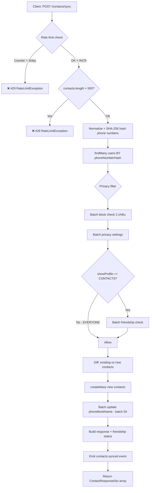
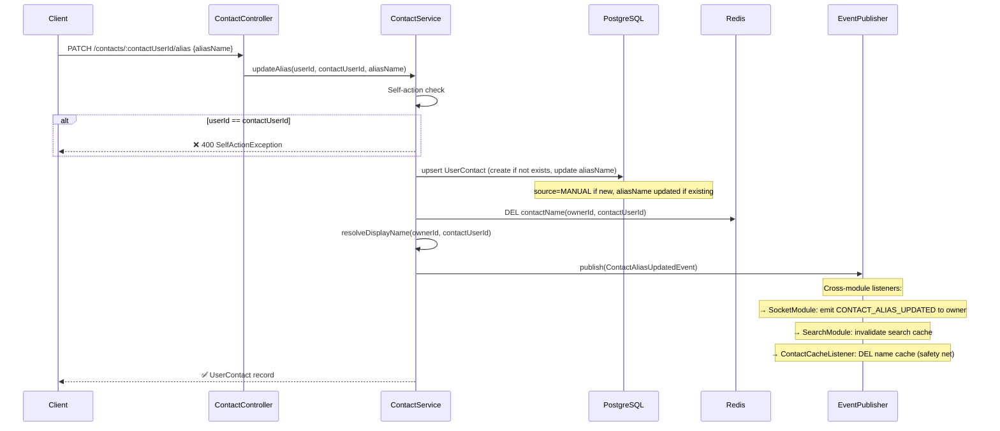
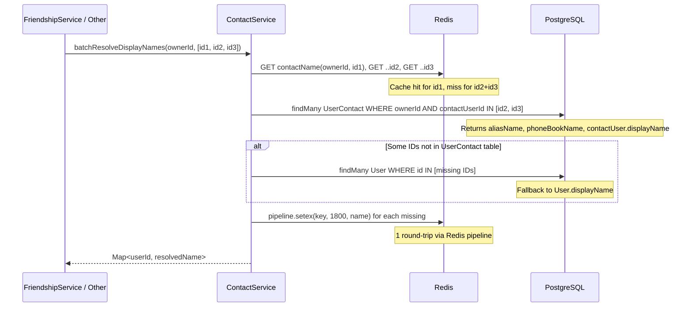
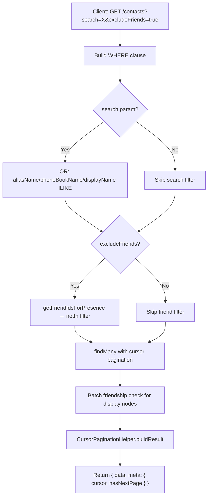

# Module: Contact

> **Cập nhật lần cuối:** 13/03/2026
> **Nguồn sự thật:** `backend/zalo_backend/src/modules/contact/` (8 files)
> **Swagger:** `/api/docs` (tag: `Social - Contacts`)

---

## 1. Tổng quan

### 1.1 Phạm vi sở hữu

Contact module quản lý **danh bạ cá nhân** (shadow graph) — bản đồ quan hệ riêng của mỗi user, tách biệt hoàn toàn với friendship graph:

- **Phone sync**: đồng bộ danh bạ điện thoại → hash-based matching → tạo `UserContact` records
- **Alias management**: user đặt tên gợi nhớ (aliasName) cho contacts, ưu tiên cao nhất khi hiển thị
- **Name resolution**: giải quyết tên hiển thị theo thứ tự `aliasName > phoneBookName > displayName`
- **Contact discovery**: tìm kiếm/lọc contacts, hỗ trợ `excludeFriends` để suggest bạn mới
- **Privacy-aware sync**: lọc matched users theo privacy settings + block status
- **Rate limiting**: giới hạn số lần sync/ngày (Redis counter, atomic INCR)

> ⚠️ **Lưu ý**: Phone sync flow chưa được test vì chưa có mobile app. Logic trong service là dự đoán.

**Không** sở hữu:
- Friendship graph → `FriendshipModule`
- Privacy settings → `PrivacyModule`
- Socket notifications → `SocketModule` (`ContactNotificationListener`)
- Search index → `SearchEngineModule`

### 1.2 Use cases

| Mã | Use case | Endpoint / Flow |
|---|---|---|
| UC-CT-01 | Sync danh bạ điện thoại | `POST /contacts/sync` |
| UC-CT-02 | Xem danh sách contacts | `GET /contacts` (cursor pagination + search + excludeFriends) |
| UC-CT-03 | Check contact status | `GET /contacts/check/:targetUserId` |
| UC-CT-04 | Đặt/xóa alias name | `PATCH /contacts/:contactUserId/alias` |
| UC-CT-05 | Xóa contact | `DELETE /contacts/:contactUserId` |
| UC-CT-06 | Resolve display name (internal) | `ContactService.resolveDisplayName()` |
| UC-CT-07 | Batch resolve names (internal) | `ContactService.batchResolveDisplayNames()` |

---

## 2. Phụ thuộc module

### 2.1 Module imports

| Module | Vai trò |
|---|---|
| `FriendshipModule` | `FriendshipService` — check `areFriends()`, `getFriendIdsForPresence()`, `getFriendIdsFromList()` |
| `PrivacyModule` | `PrivacyService.getManySettings()` — batch privacy check khi sync |

### 2.2 Providers

| Provider | Vai trò | Export? |
|---|---|---|
| `ContactService` | Core business logic: sync, alias, name resolution, CRUD | ✅ |
| `ContactCacheListener` | Invalidate Redis name cache on alias/remove events | ❌ |

### 2.3 Modules tiêu thụ ContactService

| Module | Sử dụng |
|---|---|
| `SharedModule` / `DisplayNameResolver` | Gọi `ContactService` để resolve alias → hiển thị tên |
| `FriendshipModule` / `FriendshipService` | Import `ContactService` → resolve display names cho friend list |

### 2.4 Domain Events phát ra

| Event | Trigger | Payload chính | fireAndForget? |
|---|---|---|---|
| `contacts.synced` | `syncContacts()` complete | `ownerId`, `totalContacts`, `matchedCount`, `durationMs` | ✅ |
| `contact.alias.updated` | `updateAlias()` | `ownerId`, `contactUserId`, `newAliasName`, `resolvedDisplayName` | ❌ |
| `contact.removed` | `removeContact()` | `ownerId`, `contactUserId` | ✅ |

### 2.5 Cross-module event consumers

| Event | Module / Listener | Hành vi |
|---|---|---|
| `contact.alias.updated` | Contact / `ContactCacheListener` | Invalidate name cache (safety net) |
| `contact.alias.updated` | Socket / `ContactNotificationListener` | Real-time emit `CONTACT_ALIAS_UPDATED` to owner only |
| `contact.alias.updated` | Search / `SearchEventListener` | Invalidate search cache |
| `contact.removed` | Contact / `ContactCacheListener` | Invalidate name cache |
| `contacts.synced` | Contact / `ContactCacheListener` | Log metrics (analytics) |

---

## 3. API REST

> Xem chi tiết Request/Response tại Swagger UI: `/api/docs`

### ContactController (`/contacts`)

| Method | Endpoint | Mô tả |
|---|---|---|
| POST | `/contacts/sync` | Sync danh bạ điện thoại |
| GET | `/contacts` | Danh sách contacts (cursor pagination + search + excludeFriends) |
| GET | `/contacts/check/:targetUserId` | Check contact status + alias info |
| PATCH | `/contacts/:contactUserId/alias` | Đặt/reset alias name |
| DELETE | `/contacts/:contactUserId` | Xóa contact record |

### 3.1 Business rules

1. **Self-action**: Không thể đặt alias cho chính mình → `SelfActionException` (400)
2. **Rate limit sync**: Max 3 lần sync/ngày (configurable), atomic Redis INCR, TTL 24h
3. **Max per request**: Max 500 contacts/lần sync (configurable)
4. **Phone hashing**: Server hash SHA-256 phone numbers (production nên hash client-side)
5. **Privacy filter**: Sync chỉ trả về users "visible" theo privacy settings + block check 2 chiều
6. **aliasName bảo toàn**: Phone sync KHÔNG BAO GIỜ ghi đè aliasName do user đặt
7. **Upsert alias**: `updateAlias` dùng Prisma `upsert` — tự tạo contact record nếu chưa có (source=MANUAL)
8. **Name resolution priority**: `aliasName > phoneBookName > displayName > "Unknown User"`
9. **Cache pipeline**: `batchResolveDisplayNames` dùng Redis pipeline (1 round-trip) để cache batch
10. **Hard delete**: `removeContact` dùng `deleteMany` (hard delete, không soft delete)

---

## 4. Kiến trúc kỹ thuật

### 4.1 Phone Sync Pipeline

```
Client → POST /contacts/sync { contacts: [{phoneNumber, phoneBookName}] }
  │
  ├─ 1. Rate limit check (Redis INCR atomic)
  ├─ 2. Max size validation (500/request)
  ├─ 3. Normalize + hash phone numbers (SHA-256)
  ├─ 4. Match users by phoneNumberHash (WHERE IN, exclude self, ACTIVE only)
  ├─ 5. Privacy filter:
  │     ├─ Block check 2 chiều (batch Prisma query)
  │     ├─ Get privacy settings (PrivacyService.getManySettings)
  │     └─ Friendship check for CONTACTS-level privacy
  ├─ 6. Bulk save:
  │     ├─ Diff: existing vs new
  │     ├─ createMany (new contacts, skipDuplicates)
  │     └─ Batch update phoneBookName (batch size 50, in transaction)
  ├─ 7. Build response (friendship status per contact)
  └─ 8. Emit contacts.synced event (fire-and-forget)
```

### 4.2 Name Resolution Cache

| Cache key | TTL | Dùng cho |
|---|---|---|
| `contactName(ownerId, targetUserId)` | 1800s (30m) | `resolveDisplayName()`, `batchResolveDisplayNames()` |
| `rateLimitContactSync(userId)` | 86400s (24h) | Atomic rate limit counter |

### 4.3 Config (social.config.ts)

| Config | Default | Env var |
|---|---|---|
| Sync max per request | 500 | `SOCIAL_CONTACT_SYNC_MAX_SIZE` |
| Sync max per day | 3 | `SOCIAL_CONTACT_SYNC_DAILY_LIMIT` |
| Sync window | 86400s | hardcoded |
| Name resolution cache TTL | 1800s | hardcoded |

---

## 5. Diagrams

### 5.1 Activity Diagram — Phone Sync (UC-CT-01)



### 5.2 Sequence Diagram — Update Alias (UC-CT-04)



### 5.3 Sequence Diagram — Name Resolution (UC-CT-06/07)



### 5.4 Activity Diagram — Get Contacts with Filters (UC-CT-02)



---

## 6. Lỗi và rủi ro phát hiện từ code

### [FIXED] CT-R1 — `buildContactResponse` gọi `areFriends()` per-user (N+1)

**Trạng thái:** Đã fix vào 13/03/2026. Thay thế `Promise.all` với các lời gọi `areFriends()` rời rạc bằng 1 batch query `getFriendIdsFromList(ownerId, userIds)`, sau đó lookup từ Set `friendSet.has(user.id)`. Giải quyết triệt để N+1 query.

**Vị trí:** `contact.service.ts` line 668-691

**Cũ (gây N+1):**
```typescript
return Promise.all(
  users.map(async (user) => ({
    ...
    isFriend: await this.friendshipService.areFriends(ownerId, user.id), // N queries!
  })),
);
```

---

### [LOW] CT-R2 — Server-side phone hashing nên chuyển sang client-side

**Vị trí:** `contact.service.ts` line 528-535

Server nhận raw phone numbers → hash SHA-256. Comment code đã ghi nhận:

```typescript
// Note: In production, client should do this to prevent sending raw numbers
```

Hiện tại client gửi raw phone, server nhận và hash. Với mobile app trong tương lai, nên chuyển sang client hash để server không bao giờ nhận raw numbers. Tuy nhiên đây là design decision cho mobile app, không phải bug backend.

---

### [INFO] CT-R3 — `removeContact` dùng hard delete

**Vị trí:** `contact.service.ts` line 237-255

`removeContact` dùng `deleteMany` (hard delete). Nếu user xóa contact rồi sync lại → contact sẽ được tạo lại với `source=PHONE_SYNC`, **mất aliasName cũ**.

Đây có thể là behavior đúng (xóa = xóa hoàn toàn), nhưng cần lưu ý khi thiết kế mobile UX.

---

## 7. Ghi chú kỹ thuật

### 7.1 Contact vs Friendship

| | Contact (UserContact) | Friendship |
|---|---|---|
| Quan hệ | 1 chiều (A lưu B, B không biết) | 2 chiều (cả 2 đồng ý) |
| Tạo bởi | Phone sync hoặc manual alias | Friend request accepted |
| Xóa | Hard delete | Soft delete |
| Tên hiển thị | aliasName > phoneBookName > displayName | aliasName > displayName |
| Scope | Private (chỉ owner thấy) | Public (cả 2 user) |

### 7.2 Schema key points

- **Unique constraint**: `@@unique([ownerId, contactUserId])` — 1 contact record duy nhất per pair
- **Index**: `@@index([ownerId, aliasName])` — fast search by alias
- **Index**: `@@index([ownerId, createdAt(sort: Desc)])` — cursor pagination
- **Source enum**: `MANUAL` (alias đặt tay) vs `PHONE_SYNC` (từ sync danh bạ)
- **Cascade**: `onDelete: Cascade` — xóa User → xóa tất cả UserContact liên quan

### 7.3 DisplayNameResolver integration

`ContactService` được inject vào `DisplayNameResolver` (SharedModule) — service trung tâm resolve tên cho toàn app. Flow:

```
Any module → DisplayNameResolver.resolve(viewerId, targetId)
  → ContactService.resolveDisplayName(viewerId, targetId)
    → Redis cache check → DB fallback → cache write
```

Tất cả messages, friend lists, conversations đều hiển thị tên thông qua pipeline này.
