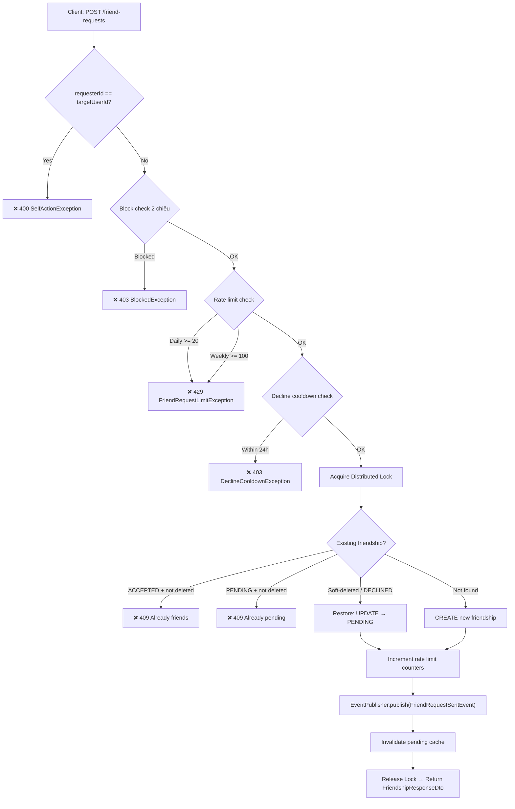
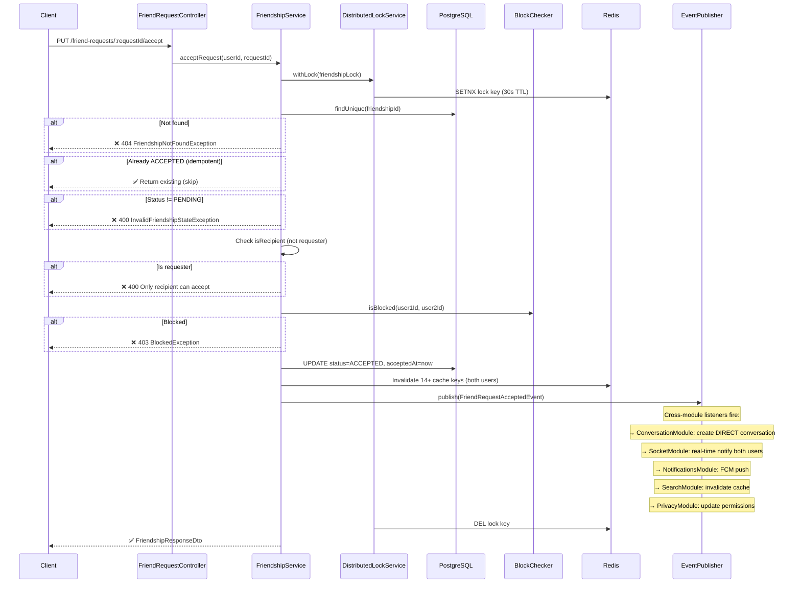
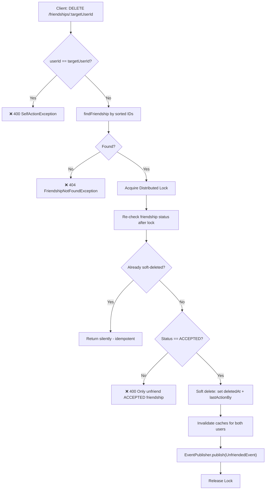
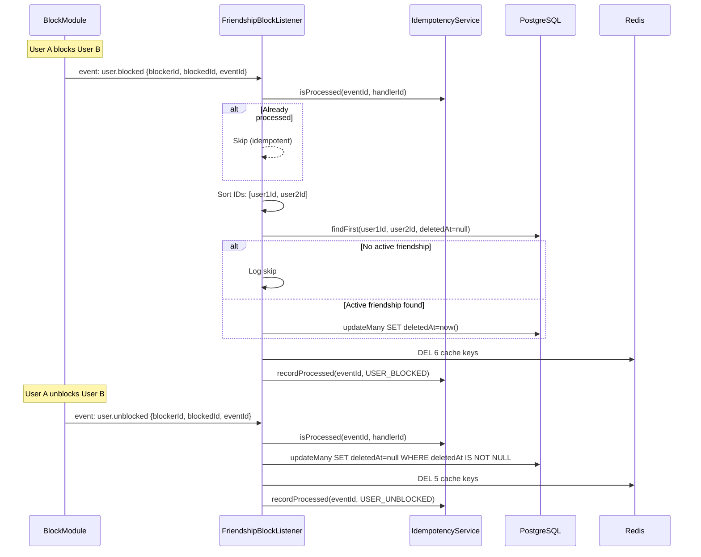
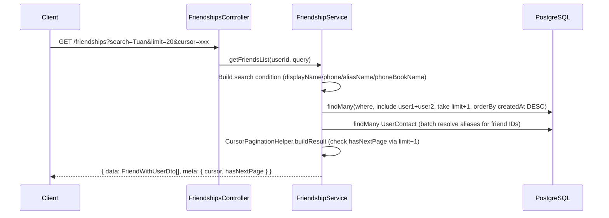

# Module: Friendship

> **Cập nhật lần cuối:** 13/03/2026
> **Nguồn sự thật:** `backend/zalo_backend/src/modules/friendship/` (16 files)
> **Swagger:** `/api/docs` (tags: `friend-requests`, `Social - Friendships`)

---

## 1. Tổng quan

### 1.1 Phạm vi sở hữu

Friendship module quản lý **vòng đời quan hệ bạn bè** giữa 2 users:

- **Friend request lifecycle**: gửi → chấp nhận / từ chối / hủy
- **Friendship management**: unfriend (soft delete), kiểm tra status, mutual friends
- **Rate limiting**: giới hạn số lượng friend request theo ngày/tuần (Redis counters)
- **Cooldown enforcement**: không gửi lại request đã bị từ chối trong 24h
- **Distributed locking**: ngăn race condition trên các state mutations đồng thời
- **Cache invalidation**: event-driven invalidation qua 14+ Redis keys
- **Block cascade**: lắng nghe `user.blocked` / `user.unblocked` → soft delete / restore friendship
- **Expiry**: request tự hết hạn sau 90 ngày (field `expiresAt`)

**Không** sở hữu:
- Socket notifications → `SocketModule` (`FriendshipNotificationListener`)
- Push notifications → `NotificationsModule`
- Search index → `SearchEngineModule`
- Privacy settings → `PrivacyModule`
- Conversation creation khi accept → `ConversationModule`

### 1.2 Use cases

| Mã | Use case | Endpoint / Flow |
|---|---|---|
| UC-FR-01 | Gửi friend request | `POST /friend-requests` |
| UC-FR-02 | Chấp nhận friend request | `PUT /friend-requests/:requestId/accept` |
| UC-FR-03 | Từ chối friend request | `PUT /friend-requests/:requestId/decline` |
| UC-FR-04 | Hủy friend request (requester) | `DELETE /friend-requests/:requestId` |
| UC-FR-05 | Unfriend | `DELETE /friendships/:targetUserId` |
| UC-FR-06 | Xem danh sách bạn bè | `GET /friendships` (cursor pagination + search) |
| UC-FR-07 | Xem friend request đã nhận | `GET /friend-requests/received` |
| UC-FR-08 | Xem friend request đã gửi | `GET /friend-requests/sent` |
| UC-FR-09 | Đếm số bạn bè | `GET /friendships/count` |
| UC-FR-10 | Xem mutual friends | `GET /friendships/mutual/:targetUserId` |
| UC-FR-11 | Check friendship status | `GET /friendships/check/:targetUserId` |
| UC-FR-12 | Block cascade | `user.blocked` event → soft delete friendship |
| UC-FR-13 | Unblock restore | `user.unblocked` event → restore friendship |

---

## 2. Phụ thuộc module

### 2.1 Module imports

| Module | Vai trò |
|---|---|
| `RedisModule` | Caching, rate limit counters, distributed lock |
| `EventsModule` | `EventPublisher` — domain event persistence + emit |
| `IdempotencyModule` | `IdempotencyService` — duplicate event prevention |
| `BlockModule` | `IBlockChecker` — kiểm tra block status trước mutations |
| `PrivacyModule` | Imported nhưng **chưa tích hợp** (TODO R12) |
| `SharedModule` | `DisplayNameResolver` — resolve alias per viewer |

### 2.2 Providers

| Provider | Vai trò | Export? |
|---|---|---|
| `FriendshipService` | Core business logic: request lifecycle, queries, cache | ✅ |
| `DistributedLockService` | Redis-based lock cho state mutations | ❌ |
| `FriendRequestSentListener` | Cache invalidation khi gửi request | ❌ |
| `FriendshipAcceptedListener` | Cache invalidation khi accept | ❌ |
| `FriendRequestDeclinedListener` | Cache invalidation khi decline | ❌ |
| `FriendRequestRemovedListener` | Cache invalidation khi cancel | ❌ |
| `UnfriendedListener` | Cache + call history invalidation khi unfriend | ❌ |
| `FriendshipBlockListener` | Soft delete/restore friendship khi block/unblock | ❌ |

### 2.3 Domain Events phát ra

| Event | Trigger | Payload chính |
|---|---|---|
| `friendship.request.sent` | `sendFriendRequest` | `requestId`, `fromUserId`, `toUserId` |
| `friendship.accepted` | `acceptRequest` | `friendshipId`, `acceptedBy`, `requesterId`, `user1Id`, `user2Id` |
| `friendship.request.declined` | `declineRequest` | `requestId`, `fromUserId`, `toUserId` |
| `friendship.request.cancelled` | `cancelRequest` | `friendshipId`, `cancelledBy`, `targetUserId` |
| `friendship.unfriended` | `removeFriendship` | `friendshipId`, `initiatedBy`, `user1Id`, `user2Id` |

### 2.4 Cross-module event consumers

| Event | Module / Listener | Hành vi |
|---|---|---|
| `friendship.request.sent` | Socket / `FriendshipNotificationListener` | Real-time notify recipient |
| `friendship.request.sent` | Notifications / `FriendshipNotificationListener` | FCM push notification |
| `friendship.accepted` | Socket / `FriendshipNotificationListener` | Real-time notify cả 2 |
| `friendship.accepted` | Notifications / `FriendshipNotificationListener` | FCM push notification |
| `friendship.accepted` | Conversation / `FriendshipConversationListener` | **Tạo DIRECT conversation** |
| `friendship.accepted` | Search / `SearchEventListener` | Invalidate search cache |
| `friendship.accepted` | Privacy / `PrivacyFriendshipListener` | Update permission cache |
| `friendship.request.cancelled` | Socket / `FriendshipNotificationListener` | Real-time notify target |
| `friendship.request.declined` | Socket / `FriendshipNotificationListener` | Real-time notify requester |
| `friendship.unfriended` | Socket / `FriendshipNotificationListener` | Real-time notify cả 2 |
| `friendship.unfriended` | Search / `SearchEventListener` | Invalidate search cache |
| `friendship.unfriended` | Privacy / `PrivacyFriendshipListener` | Invalidate permission cache |
| *Tất cả 5 events* | Common / `DomainEventPersistenceListener` | Persist vào `DomainEvent` table |

### 2.5 Events mà Friendship lắng nghe (từ module khác)

| Event | Listener | Hành vi |
|---|---|---|
| `user.blocked` | `FriendshipBlockListener` | Soft delete friendship (`deletedAt`) |
| `user.unblocked` | `FriendshipBlockListener` | Restore friendship (`deletedAt = null`) |

---

## 3. API REST

> Xem chi tiết Request/Response tại Swagger UI: `/api/docs`

### FriendRequestController (`/friend-requests`)

| Method | Endpoint | Mô tả |
|---|---|---|
| POST | `/friend-requests` | Gửi friend request (`targetUserId` in body) |
| GET | `/friend-requests/received` | Lấy danh sách lời mời đã nhận (PENDING) |
| GET | `/friend-requests/sent` | Lấy danh sách lời mời đã gửi (PENDING) |
| PUT | `/friend-requests/:requestId/accept` | Chấp nhận |
| PUT | `/friend-requests/:requestId/decline` | Từ chối |
| DELETE | `/friend-requests/:requestId` | Hủy lời mời (chỉ requester) |

### FriendshipsController (`/friendships`)

| Method | Endpoint | Mô tả |
|---|---|---|
| GET | `/friendships` | Danh sách bạn bè (cursor pagination + search by name/phone) |
| GET | `/friendships/count` | Đếm số bạn bè |
| GET | `/friendships/mutual/:targetUserId` | Xem bạn chung |
| GET | `/friendships/check/:targetUserId` | Check status (`PENDING`/`ACCEPTED`/`DECLINED`/`null`) |
| DELETE | `/friendships/:targetUserId` | Unfriend |

### 3.1 Rule nghiệp vụ

1. **Self-action**: Không thể gửi request / unfriend chính mình → `SelfActionException` (400)
2. **Block check**: Mọi state mutation đều check block 2 chiều → `BlockedException` (403)
3. **Recipient-only**: Chỉ recipient mới accept/decline → `InvalidFriendshipStateException` (400)
4. **Requester-only**: Chỉ requester mới cancel request
5. **Status check**: Accept/decline yêu cầu status = `PENDING` | Unfriend yêu cầu `ACCEPTED`
6. **Rate limit**: Daily (20) + Weekly (100) friend requests (configurable, có toggle disable)
7. **Decline cooldown**: 24h sau khi bị từ chối mới gửi lại
8. **Expiry**: Request tự hết hạn sau 90 ngày (field `expiresAt`) — queries filter `expiresAt` để ẩn expired requests
9. **Idempotency**: Accept/decline/unfriend đều check trạng thái hiện tại — nếu đã ở target state thì return silently
10. **Canonical ordering**: `user1Id < user2Id` (sorted) — đảm bảo 1 friendship record duy nhất

---

## 4. Kiến trúc kỹ thuật

### 4.1 Distributed Lock pattern

Tất cả state mutations dùng `DistributedLockService.withLock()`:

```
Lock key: friendship:lock:{sortedId1}:{sortedId2} (hoặc :friendshipId:userId)
TTL: 30s | Max retries: 10
Flow: acquire lock → validate state → update DB → invalidate cache → emit event → release lock
```

### 4.2 Cache strategy

| Cache key pattern | TTL | Dùng cho |
|---|---|---|
| `socialFriendship(u1, u2)` | 60s | `areFriends()` check |
| `socialFriendCount(userId, status)` | 300s | `getFriendCount()` |
| `friendshipStatus(u1, u2)` | — | Block cascade invalidation |
| `friendshipFriendsList(userId)` | — | Invalidation only |
| `friendshipPendingRequests(userId)` | — | Invalidation only |
| `friendshipSentRequests(userId)` | — | Invalidation only |
| `socialPermission(type, u1, u2)` | 300s | Permission cache (message/call/profile) |
| `rateLimitFriendRequest(userId, period)` | 24h/7d | Rate limit counters |

### 4.3 Soft delete pattern

Friendship dùng soft delete (`deletedAt` field):
- **Unfriend**: set `deletedAt` + `lastActionBy`, status giữ `ACCEPTED`
- **Block cascade**: set `deletedAt`, giữ nguyên status
- **Re-send request**: nếu tìm thấy soft-deleted record → restore + reset fields
- **Unblock**: restore `deletedAt = null`, giữ nguyên status cũ

### 4.4 Config (social.config.ts)

| Config | Default | Env var |
|---|---|---|
| Rate limit daily | 20 | `SOCIAL_FRIEND_REQUEST_DAILY_LIMIT` |
| Rate limit weekly | 100 | `SOCIAL_FRIEND_REQUEST_WEEKLY_LIMIT` |
| Rate limit disabled | `true` | `SOCIAL_FRIEND_REQUEST_LIMIT_DISABLED` |
| Decline cooldown | 24h | hardcoded |
| Request expiry | 90 days | hardcoded |
| Friendship cache TTL | 60s | hardcoded |
| Friend list cache TTL | 300s | hardcoded |

---

## 5. Diagrams

### 5.1 Activity Diagram — Send Friend Request (UC-FR-01)



### 5.2 Sequence Diagram — Accept Friend Request (UC-FR-02)



### 5.3 Activity Diagram — Unfriend (UC-FR-05)



### 5.4 Sequence Diagram — Block Cascade (UC-FR-12/13)



### 5.5 Sequence Diagram — Get Friends List with Search (UC-FR-06)



---

## 6. Lịch sử fix bugs

> Tất cả bugs dưới đây đã được fix vào 13/03/2026.

| Bug | Severity | Mô tả | Fix |
|---|---|---|---|
| FR-R1 | 🟡 MEDIUM | `cancelRequest` không dùng distributed lock → race condition với accept đồng thời | Wrap trong `withLock()` + thêm idempotency check |
| FR-R3 | ⚪ LOW | `getMutualFriends` dùng naive intersection: 2 full list queries + JS `filter` | Thay bằng single SQL query với `INNER JOIN` (subquery per user) |
| FR-R5 | ⚪ LOW | `getReceivedRequests` / `getSentRequests` không filter `expiresAt` → request hết hạn vẫn hiển thị | Thêm `OR: [{ expiresAt: null }, { expiresAt: { gt: new Date() } }]` vào Prisma where |

---

## 7. Ghi chú kỹ thuật

### 7.1 Listener architecture

Tất cả listeners (trừ `FriendshipBlockListener`) extend `IdempotentListener`:
- `withIdempotency(eventId, handler, listenerName)` → check `ProcessedEvent` table → execute → record
- `FriendshipBlockListener` dùng `IdempotencyService` trực tiếp (cùng pattern, khác implementation)

### 7.2 Cache invalidation scope

Mỗi friendship mutation invalidates **14+ Redis keys** qua `FriendshipCacheHelper.invalidateForUsers()`:
- Friendship status (2 directions)
- Friends list (2 users)
- Pending requests (2 users)
- Sent requests (2 users)
- Permission cache: message/call/profile × 2 directions = 6 keys
- Friend count patterns (wildcard delete)

### 7.3 Rate limit toggle

`SOCIAL_FRIEND_REQUEST_LIMIT_DISABLED` mặc định `true` (disabled) — development convenience. Cần set `false` trên production để enable rate limiting.

> ⚠️ Logic inverted: `disabled: process.env.SOCIAL_FRIEND_REQUEST_LIMIT_DISABLED !== 'false'` — mặc định disabled trừ khi env = `"false"` chính xác.
