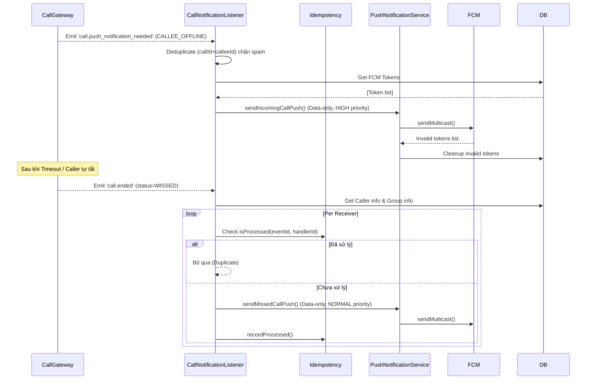

# Module: Notification

## 1. Tổng quan
- Chức năng chính: Quản lý device tokens (FCM/APNs) và điều phối việc push notifications qua Firebase Cloud Messaging (FCM).
- Thiết kế: Hoàn toàn phi tiếp xúc (decoupled) với các domain khác thông qua Event-Driven Architecture (`EventEmitter2`). Các module khác (Message, Call, Friendship) chỉ emit events, Notification module sẽ lắng nghe và gửi push.
- Danh sách Use Case:
  - Đăng ký/Xoá device token (FCM).
  - Gửi push notification khi có tin nhắn mới (có batching chống spam).
  - Gửi push notification khi có cuộc gọi đến / cuộc gọi nhỡ.
  - Gửi push notification cho các sự kiện social (kết bạn, group event).
- Phụ thuộc: `RedisService` (batching state), `PrismaService` (user_devices table).

## 2. API / Socket Events
> Xem chi tiết Request/Response tại Swagger UI: `/api/docs`

| Method | Endpoint / Event | Mô tả | Auth |
|---|---|---|---|
| POST | `/devices/token` | Đăng ký hoặc cập nhật FCM device token cho user hiện tại. | JWT Required |
| DELETE | `/devices/token` | Xóa FCM device token khỏi hệ thống (khi logout). | JWT Required |

## 3. Activity Diagram — Message Notification Batching
(Sử dụng Redis pipeline để gom nhóm các thông báo trong cùng 1 conversation nhằm tránh spam push liên tục)

```mermaid
flowchart TD
    A[Event: message.sent] --> B{FCM Available?}
    B -- No --> C[Log Warning & Ngừng]
    B -- Yes --> D[Lấy thông tin Conversation & Members]
    D --> E[Lọc Recipients]
    E -->|Bỏ qua| F[Người gửi, Muted, Archived]
    E -->|Hợp lệ| G[Vòng lặp từng recipient: addToBatch]
    
    subgraph Redis Batching [NotificationBatchService]
    G --> H[HINCRBY count + HSET data + EXPIRE]
    H --> I{isNewBatch? count == 1}
    I -- No --> J[Kết thúc (Chờ timer của tin nhắn đầu tiên)]
    I -- Yes --> K[SetTimeout delay window]
    K --> L[Flush Batch khỏi Redis]
    end
    
    L --> M[PushNotificationService.sendMessagePush]
    M --> N[FCM Send Multicast]
    N --> O[Cleanup Token bị lỗi / hết hạn]
```

## 4. Sequence Diagram — Incoming & Missed Call Flows
(Bao gồm xử lý idempotency cho missed call của group)



## 5. Các lưu ý kỹ thuật
- **Data-Only Push:** 100% các push FCM từ backend gửi đi dưới dạng `data-only` message (không dùng key `notification` của Firebase SDK payload). Điều này buộc Client/Service Worker phải chịu trách nhiệm tự render UI hoặc bỏ qua nếu app đang foreground, giúp kiểm soát trải nghiệm chuẩn xác hơn.
- **Batching cơ chế TTL:** Tính năng Redis batching (cho tin nhắn rác/spam) chống crash: vì trạng thái lưu ở Redis có TTL (expire), nếu process NestJS sập trong lúc `setTimeout` đang chạy, thì Redis data sẽ rơi vào timeout biến mất. Người nhận lỡ 1 batch push nhưng database gốc không hề sai lệch.
- **Device Token "Policy A":** Nếu cùng một browser profile sử dụng qua lại 2 tài khoản, backend sẽ đổi quyền sở hữu (ownership) của Token đó sang user đang login để không gửi lộn push notification.
- **Idempotency ở Missed Call**: Hàm xử lý call nhỡ được trang bị Idempotency, nhằm ngăn chặn lặp lại thông báo nếu sự kiện emit dư thừa do network retry từ các Node trong cluster.
