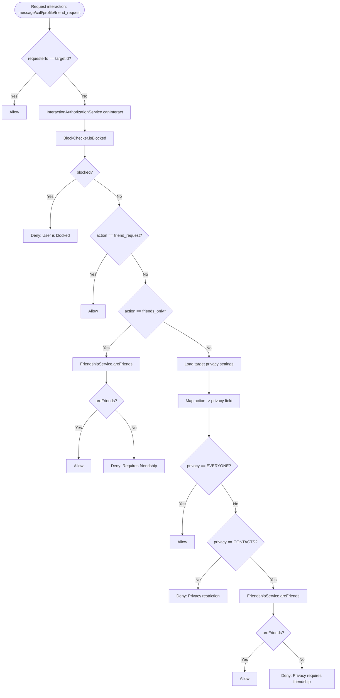
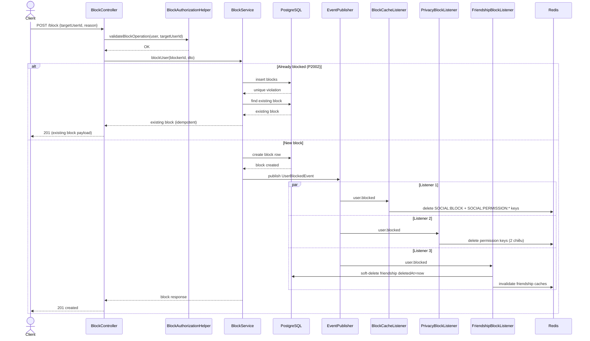
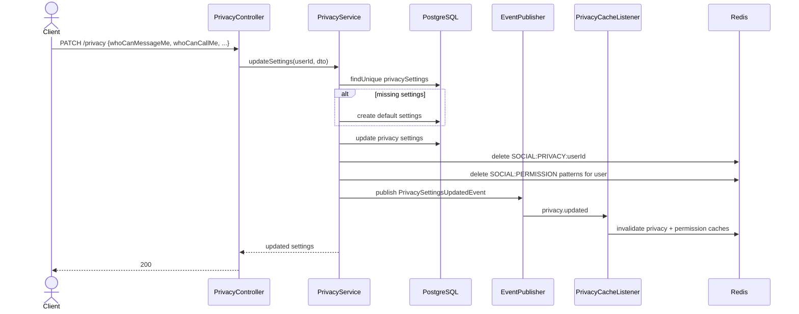

# Module: Privacy & Block

> **Cập nhật lần cuối:** 14/03/2026
> **Nguồn sự thật:** `backend/zalo_backend/src/modules/privacy`, `backend/zalo_backend/src/modules/block`, `backend/zalo_backend/src/modules/authorization`
> **Swagger:** `/api/docs` → tags `Privacy`, `Block Management`

---

## 1. Tổng quan

### Chức năng chính

Module Privacy + Block xử lý lớp kiểm soát tương tác giữa người dùng, gồm:

- Quản lý cài đặt quyền riêng tư theo user (`showProfile`, `whoCanMessageMe`, `whoCanCallMe`, `showOnlineStatus`, `showLastSeen`)
- Chặn/bỏ chặn người dùng (block relation 1 chiều)
- Cơ chế cache permission/block/privacy bằng Redis
- Invalidate cache theo kiến trúc event-driven
- Cấp dữ liệu đầu vào cho `InteractionAuthorizationService` để quyết định canInteract

### Use Case chính

| # | Use Case |
|---|---|
| UC-1 | User xem privacy settings của chính mình |
| UC-2 | User cập nhật privacy settings |
| UC-3 | User block một user khác |
| UC-4 | User unblock một user khác |
| UC-5 | User lấy danh sách người mình đã block (cursor pagination + search) |
| UC-6 | Hệ thống kiểm tra quyền tương tác message/call/profile/friend_request qua Authorization |

### Liên hệ trực tiếp với Authorization

`AuthorizationModule` import đồng thời `BlockModule` + `PrivacyModule` + `FriendshipModule`, rồi tập trung quyết định tại `InteractionAuthorizationService`:

- Block check: qua `IBlockChecker` (`BLOCK_CHECKER` token)
- Privacy check: qua `PrivacyService.getSettings(targetId)`
- Friendship check: qua `FriendshipService.areFriends(...)`

Nghĩa là Privacy và Block là 2 nguồn dữ liệu cốt lõi cho quyết định allow/deny ở lớp Authorization.

---

## 2. API / Event Interfaces

> Xem Request/Response chi tiết tại Swagger UI `/api/docs`.

### 2.1 Privacy REST

| Method | Endpoint | Mô tả | Auth |
|---|---|---|---|
| `GET` | `/privacy` | Lấy privacy settings của current user | `JwtAuthGuard` |
| `PATCH` | `/privacy` | Cập nhật privacy settings của current user | `JwtAuthGuard` |

### 2.2 Block REST

| Method | Endpoint | Mô tả | Auth |
|---|---|---|---|
| `POST` | `/block` | Block user (idempotent nếu đã block) | Global `JwtAuthGuard` + helper validation |
| `DELETE` | `/block/:targetUserId` | Unblock user (idempotent) | Global `JwtAuthGuard` + helper validation |
| `GET` | `/block/blocked` | Danh sách user bị tôi block (cursor pagination) | Global `JwtAuthGuard` |
| `GET` | `/block/blocked-by` | Danh sách user đã block tôi | Global `JwtAuthGuard` |

### 2.3 Event contracts và listeners

| Event | Emitter | Listener liên quan | Tác vụ |
|---|---|---|---|
| `privacy.updated` | PrivacyService | PrivacyCacheListener, SearchEventListener | Xóa cache privacy/permission/search liên quan |
| `user.blocked` | BlockService | BlockCacheListener, PrivacyBlockListener, FriendshipBlockListener, SearchEventListener, CallBlockListener | Invalidate cache + soft delete friendship + dừng call/search liên quan |
| `user.unblocked` | BlockService | BlockCacheListener, PrivacyBlockListener, FriendshipBlockListener, SearchEventListener, CallBlockListener | Invalidate cache + restore friendship (theo logic friendship listener) |
| `friendship.accepted` | FriendshipService | PrivacyFriendshipListener, Conversation listener, Search listener | Invalidate permission/search caches |
| `friendship.unfriended` | FriendshipService | PrivacyFriendshipListener, Search listener | Invalidate permission/search caches |
| `user.registered` | Auth/User flow | PrivacyUserRegisteredListener | Tạo bản ghi PrivacySettings mặc định |

---

## 3. Activity Diagram — Authorization Decision Flow

Use case trọng tâm: quyết định người A có được tương tác người B không.

---

## 4. Sequence Diagram — Block User Cascade

### 4.1 `POST /block` (happy path + idempotent path)

### 4.2 `PATCH /privacy` update settings (happy path + cache invalidation)

---

## 5. Cấu trúc dữ liệu & cache liên quan schema

### 5.1 Prisma models liên quan

- `PrivacySettings` (1-1 với `User`):
	- `showProfile`, `whoCanMessageMe`, `whoCanCallMe` kiểu `PrivacyLevel`
	- `showOnlineStatus`, `showLastSeen` kiểu boolean
- `Block`:
	- `blockerId`, `blockedId`, unique `(blockerId, blockedId)`
	- reverse lookup index theo `blockedId`
- `Friendship`:
	- được soft-delete khi block (qua `FriendshipBlockListener`)

### 5.2 Redis keys sử dụng trực tiếp

- `SOCIAL:PRIVACY:{userId}`
- `SOCIAL:BLOCK:{id1}:{id2}` (id sorted)
- `SOCIAL:PERMISSION:{action}:{id1}:{id2}` (id sorted)

### 5.3 Nguyên tắc quyết định quyền

Thứ tự kiểm tra thực tế ở authorization:

1. Self-action (`requester == target`) -> allow
2. Block relation -> deny ngay
3. Action-specific logic:
	 - `friend_request`: allow (sau block check)
	 - `friends_only`: bắt buộc friendship
	 - `message/call/profile`: theo PrivacyLevel của target (`EVERYONE` hoặc `CONTACTS`)

---

## 6. Lỗi / rủi ro phát hiện trong code

## 7. Gợi ý kiểm thử tối thiểu

- Privacy:
	- cập nhật `whoCanMessageMe = CONTACTS`, verify non-friend bị deny qua `InteractionAuthorizationService.canMessage()`.
	- cập nhật privacy và verify cache `SOCIAL:PRIVACY:*` + `SOCIAL:PERMISSION:*` bị invalidated.

- Block:
	- block user, verify `canInteract` trả deny cho message/call/profile.
	- unblock user, verify friendship restore/invalidation behavior đúng theo listener.
	- test idempotent `POST /block` khi gọi lặp.
- Cross-module Authorization:
	- `canInteract` cho 5 action: `message`, `call`, `profile`, `friend_request`, `friends_only`.
