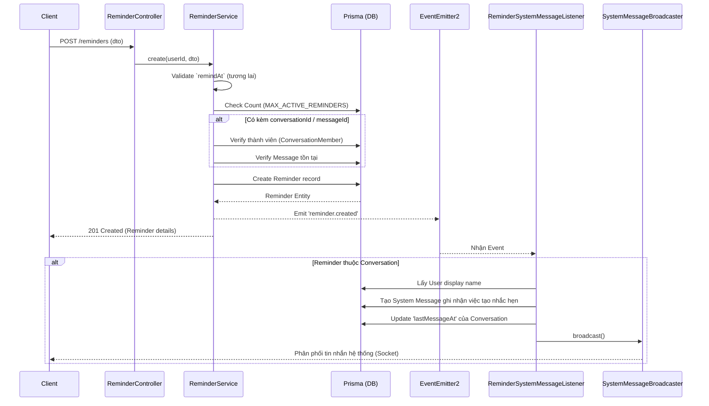

# Module: Reminder

## 1. Tổng quan
- Chức năng chính: Quản lý nhắc hẹn (tạo, cập nhật, xóa, danh sách) và tự động kích hoạt (trigger) báo thức khi đến giờ.
- Thiết kế: Dựa trên cơ chế DB Polling bằng `@Cron` (thay vì cài đặt message queue phức tạp như Bull), kết hợp với Optimistic Locking (`updateMany` với điều kiện `isTriggered: false`) để đảm bảo an toàn khi chạy nhiều node (multi-instance deployment). Việc gửi thông báo và tạo tin nhắn hệ thống được decouple hoàn toàn nhờ `EventEmitter2`.
- Danh sách Use Case:
  - Tạo, Sửa, Xóa nhắc hẹn (Personal hoặc gắn với Conversation).
  - Liệt kê nhắc hẹn đang active (hoặc tất cả).
  - Lấy danh sách nhắc hẹn của một conversation (để các thành viên cùng xem).
  - Kích hoạt nhắc hẹn khi đến giờ (DB Polling).
- Phụ thuộc: `PrismaService` (table `reminders`), `@nestjs/schedule` (Cron jobs).

## 2. API / Socket Events
> Xem chi tiết Request/Response tại Swagger UI: `/api/docs`

| Method | Endpoint / Event | Mô tả | Auth |
|---|---|---|---|
| POST | `/reminders` | Tạo nhắc hẹn mới (có thể đính kèm `conversationId`, `messageId`) | JWT Required |
| GET | `/reminders` | Lấy danh sách nhắc hẹn của user hiện tại (`?includeCompleted=true`) | JWT Required |
| GET | `/reminders/undelivered`| Lấy các nhắc hẹn đã trigger nhưng user chưa acknowledge | JWT Required |
| GET | `/reminders/conversation/:id`| Lấy các nhắc hẹn đang active của một nhóm chat | JWT Required |
| GET | `/reminders/:id` | Xem chi tiết 1 nhắc hẹn | JWT Required |
| PATCH | `/reminders/:id` | Cập nhật nội dung, thời gian hoặc đánh dấu hoàn tất (`isCompleted`) | JWT Required |
| DELETE| `/reminders/:id` | Xóa nhắc hẹn | JWT Required |
| Socket| `reminder:triggered` | Server emit cho client khi đến giờ nhắc hẹn | - |

## 3. Activity Diagram — Reminder Trigger Flow (Polling & Optimistic Lock)
(Quy trình quét database định kỳ để tìm nhắc hẹn đến hạn và trigger)

```mermaid
flowchart TD
    A[Cron Job: Mỗi 30s] --> B{Đang xử lý (isProcessing)?}
    B -- Yes --> C[Bỏ qua (Tránh Overlap)]
    B -- No --> D[Set isProcessing = true]
    D --> E[Query DB: isTriggered=false, remindAt <= Now_]
    E --> F{Có nhắc hẹn?}
    F -- No --> G[Set isProcessing = false & Kết thúc]
    
    F -- Yes --> H[Vòng lặp từng nhắc hẹn]
    
    subgraph Optimistic Lock
    H --> I[UpdateMany DB: set isTriggered=true WHERE id=X AND isTriggered=false]
    I --> J{Count == 0 ?}
    J -- Yes --> K[Instance khác đã xử lý chặn thành công -> Bỏ qua]
    end
    
    J -- No --> L[Emit 'reminder.triggered' Event]
    L --> M[ReminderSocketListener: Push Socket Event]
    
    M --> H
    
    H -- Xử lý xong --> G
```

## 4. Sequence Diagram — Reminder Creation Flow
(Bao gồm quy trình xác minh quyền hạn và tạo tin nhắn hệ thống qua Event)



## 5. Các lưu ý kỹ thuật
- **Kiến trúc DB Polling thay vì Message Queue:** Việc dùng cron job (`@Cron('*/30 * * * * *')`) quét DB thay vì dùng Redis/Bull queue mang lại hiệu quả về sự đơn giản hoá hạ tầng (giảm phụ thuộc vào state của queue manager). 
- **Optimistic Locking Guard:** Do backend có thể chạy nhiều instance trên Kubernetes/Docker Swarm, hàm chạy cron job sử dụng mệnh đề `updateMany` kết hợp với condition `isTriggered: false` để đảm bảo: dù có 2-3 instance quét trúng cùng một reminder ở đúng một giây, chỉ có 1 lệnh UPDATE duy nhất thành công, các instance khác update ra count = 0 và sẽ tự động skip, chống gửi trùng (duplicate firing).
- **Grace Period Auto-completion:** Nếu user không vào app để "Đã hiểu" (tức không set `isCompleted=true`), nhắc hẹn đã `isTriggered` sẽ dồn ứ lại. Có một cron job phụ chạy lúc 3h sáng quét các nhắc hẹn đã trigger quá 7 ngày để tự động đánh dấu completed (`isCompleted=true`) giúp giải phóng DB.
- **Two-phase completion:** Việc trigger báo chuông (`isTriggered: true`) hoàn toàn tách biệt khỏi việc xác nhận tắt nhắc hẹn của user (`isCompleted: true`).
- **Zero Coupling for Notifications:** Module sử dụng hoàn toàn `EventEmitter2` để trigger socket realtime cho người nhận và sinh tin nhắn `SYSTEM` trên giao diện nhóm chat. Core logic của C.R.U.D Reminder sạch bóng các dependency phụ.
