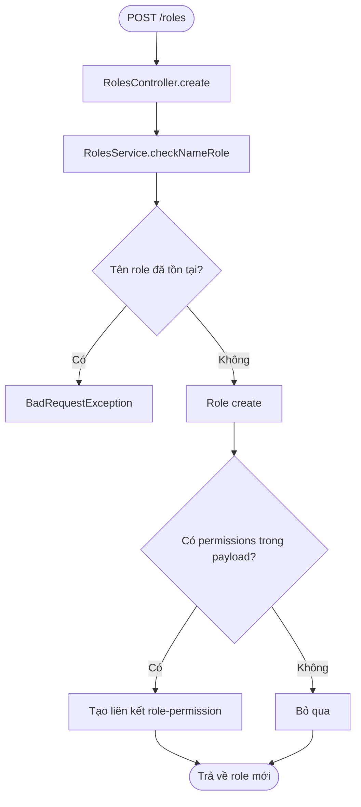
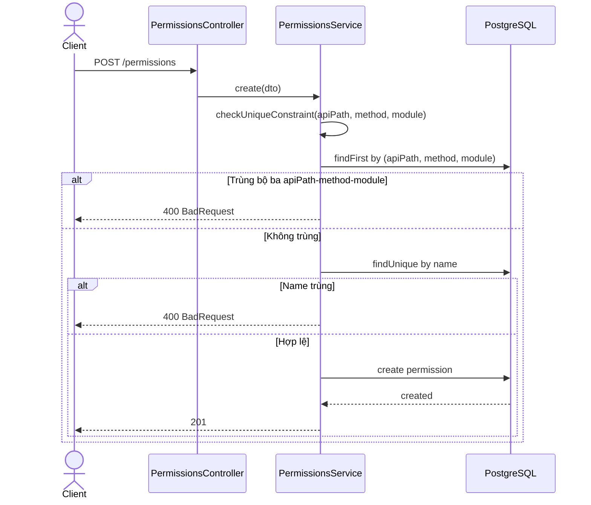

# Module: Role và Permission

> Cập nhật lần cuối: 14/03/2026
> Nguồn sự thật: backend/zalo_backend/src/modules/roles, backend/zalo_backend/src/modules/permissions, backend/zalo_backend/prisma/schema.prisma
> Swagger: /api/docs -> tags Roles, Permissions

---

## 1. Tổng quan

### Chức năng chính

Module Role và Permission hiện tại cung cấp CRUD dữ liệu RBAC cơ bản:

- Quản lý Role (tạo, sửa, xem, xóa)
- Quản lý Permission (tạo, sửa, xem, xóa)
- Gán danh sách permission vào role qua bảng role_permissions

### Phạm vi thực tế theo code hiện tại

- Role seed mặc định trong migration chỉ có 2 role:
  - USER
  - ADMIN
- Permission hiện là dữ liệu cấu hình CRUD, chưa được enforce theo apiPath + method ở mức toàn cục.
- Hệ thống đang enforce xác thực JWT toàn cục.
- Từ bản cập nhật này, endpoints roles/permissions đã được giới hạn role ADMIN.

### Prisma models liên quan

- Role
- Permission
- RolePermission
- User.roleId -> Role

---

## 2. API

> Xem request/response chi tiết tại Swagger UI /api/docs.

### 2.1 Roles REST

| Method | Endpoint | Mô tả |
|---|---|---|
| POST | /roles | Tạo role mới |
| GET | /roles | Lấy danh sách role (phân trang) |
| GET | /roles/:id | Lấy chi tiết role |
| PATCH | /roles/:id | Cập nhật role |
| DELETE | /roles/:id | Xóa role |

### 2.2 Permissions REST

| Method | Endpoint | Mô tả |
|---|---|---|
| POST | /permissions | Tạo permission mới |
| GET | /permissions | Lấy danh sách permission (phân trang) |
| GET | /permissions/:id | Lấy chi tiết permission |
| PATCH | /permissions/:id | Cập nhật permission |
| DELETE | /permissions/:id | Xóa permission |

---

## 3. Activity Diagram - Tạo role

---

## 4. Sequence Diagram - Tạo permission

---

## 5. Ghi chú kỹ thuật

- App đang đăng ký JwtAuthGuard là APP_GUARD, nên các endpoint roles/permissions yêu cầu user đã đăng nhập, trừ route có Public decorator.
- RolesGuard tồn tại trong codebase và hoạt động theo Roles decorator.
- RolesController và PermissionsController hiện đã gắn RolesGuard + Roles('ADMIN').
- Chưa thấy PermissionGuard runtime theo apiPath + method trong code hiện tại.
- JwtStrategy có include role và rolePermissions khi tải user, nghĩa là dữ liệu permission có được nạp vào request.user, nhưng chưa có lớp enforce tổng quát.

---

## 6. Lỗi và rủi ro phát hiện từ code

### ISSUE-RP-03 (Trung bình) - Permission chưa được enforce runtime theo route

Mô tả:
- Module permissions hiện chỉ quản lý dữ liệu (catalog).
- Chưa có cơ chế global guard đọc permission theo apiPath + method để chặn request.

Bằng chứng:
- backend/zalo_backend/src/modules/permissions/permissions.module.ts
- backend/zalo_backend/src/modules/permissions/permissions.controller.ts
- backend/zalo_backend/src/common/decorator/customize.ts (có SkipCheckPermission metadata nhưng không thấy guard tương ứng)

Tác động:
- Hệ thống đang nghiêng về role-based coarse-grained, chưa đạt được permission-based fine-grained access control như model thiết kế.

### ISSUE-RP-04 (Thông tin) - Seed role hiện tại chỉ có ADMIN và USER

Mô tả:
- Migration seed role hiện tại chỉ tạo 2 role ADMIN và USER.
- Phù hợp với trạng thái dự án hiện tại.

Bằng chứng:
- backend/zalo_backend/prisma/migrations/20260311000001_seed_roles/migration.sql

---

## 7. Gợi ý kiểm thử tối thiểu

- Tạo account USER và đăng nhập, thử gọi POST /roles và POST /permissions để xác nhận đã bị chặn 403.
- Đăng nhập bằng account ADMIN, kiểm tra CRUD roles/permissions hoạt động bình thường.
- Kiểm tra role ADMIN và USER trong bảng roles sau migrate mới.
- Kiểm tra tạo role có permissions[] và verify dữ liệu role_permissions được tạo đúng.
- Kiểm tra update permission khi đổi bộ ba apiPath-method-module bị trùng -> phải trả 400.
