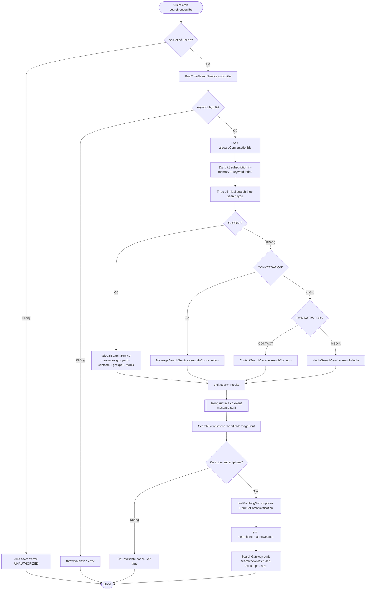
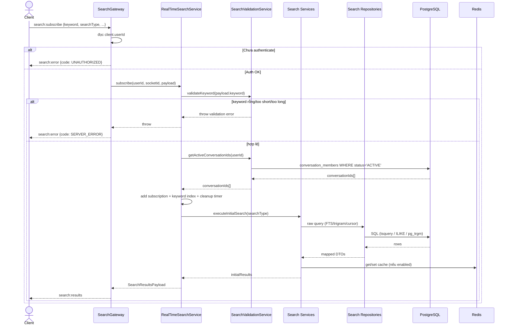
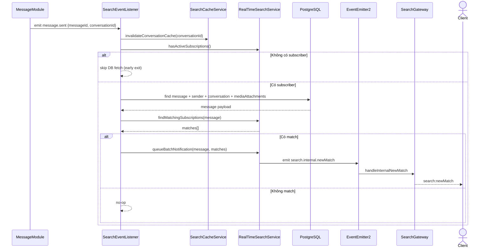
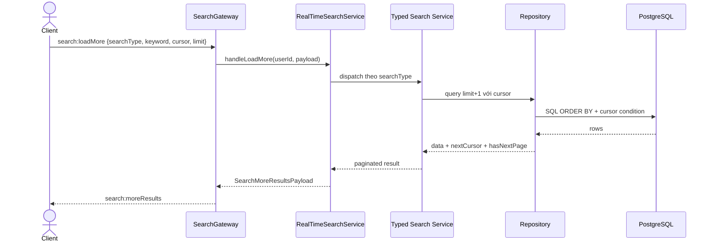

# Module: Search Engine

> **Cập nhật lần cuối:** 14/03/2026
> **Nguồn sự thật:** `backend/zalo_backend/src/modules/search_engine/`
> **Swagger:** `/api/docs` → tag `Search`

---

## 1. Tổng quan

### Chức năng chính

Search Engine là module tìm kiếm đa thực thể, gồm:

- Tìm kiếm tin nhắn theo hội thoại (full-text + filter + cursor pagination)
- Tìm kiếm global (contacts, groups, media, grouped messages)
- Tìm kiếm contact cho flow tạo nhóm (REST + WebSocket)
- Real-time search subscription qua Socket.IO
- Search analytics (trending, performance, history, suggestions, click tracking)
- Cache/invalidation theo event-driven architecture

### Use Case chính

| # | Use Case |
|---|---|
| UC-1 | User tìm tin nhắn trong 1 conversation (theo keyword + messageType + sender + date + hasMedia) |
| UC-2 | User subscribe search real-time và nhận kết quả mới khi có message phù hợp |
| UC-3 | User load-more kết quả tìm kiếm bằng cursor |
| UC-4 | User tìm contact để tạo nhóm, có áp privacy/block/friendship |
| UC-5 | User thực hiện global search (messages grouped + contacts + groups + media) |
| UC-6 | Hệ thống ghi nhận analytics khi user click kết quả |

### Phụ thuộc module khác

| Module | Vai trò |
|---|---|
| `DatabaseModule` (Prisma) | Query full-text/trigram và truy cập model SearchQuery |
| `RedisModule` / `RedisService` | Cache search results + Pub/Sub đồng bộ subscription scope đa instance |
| `AuthorizationModule` | Cấp `InteractionAuthorizationService` cho canView/canMessage |
| `BlockModule` | Cấp `IBlockChecker` cho block check có cache |
| `PrivacyModule` | Cấp `PrivacyService` để đọc privacy settings theo batch |
| `SharedModule` | `DisplayNameResolver` để resolve alias theo viewer khi emit real-time |
| `EventEmitterModule` | Lắng nghe domain events để invalidate cache và push realtime updates |

---

## 2. API / Socket Events

> Xem chi tiết Request/Response DTO tại Swagger UI: `/api/docs`.

### 2.1 REST Endpoints

| Method | Endpoint | Mô tả | Auth |
|---|---|---|---|
| `GET` | `/search/contacts` | Tìm contact (phục vụ create-group modal), có privacy/block/friendship context | `JwtAuthGuard` (global + class guard) |
| `GET` | `/search/analytics/trending` | Top keyword trong 7 ngày | `JwtAuthGuard` |
| `GET` | `/search/analytics/performance` | Metrics hiệu năng search | `JwtAuthGuard` |
| `GET` | `/search/analytics/history` | Search history của current user | `JwtAuthGuard` |
| `GET` | `/search/analytics/suggestions` | Gợi ý keyword theo history của current user | `JwtAuthGuard` |
| `POST` | `/search/analytics/track-click` | Ghi nhận click vào kết quả search | `JwtAuthGuard` |

### 2.2 WebSocket Events (namespace `/socket.io`)

Client → Server:

| Event | Payload chính | Mô tả |
|---|---|---|
| `search:subscribe` | `keyword`, `searchType`, `conversationId`, `filters` | Subscribe query và nhận initial results |
| `search:unsubscribe` | none | Huỷ subscription hiện tại trên socket |
| `search:updateQuery` | `keyword`, `conversationId` | Đổi keyword (client nên debounce) |
| `search:loadMore` | `searchType`, `keyword`, `cursor`, `limit`, filters | Lấy trang kế tiếp theo cursor |

Server → Client:

| Event | Payload chính | Mô tả |
|---|---|---|
| `search:results` | `SearchResultsPayload` | Initial results sau khi subscribe/updateQuery |
| `search:moreResults` | `SearchMoreResultsPayload` | Kết quả load-more |
| `search:newMatch` | `SearchNewMatchPayload` | Message mới khớp query đang subscribe |
| `search:resultRemoved` | `messageId`, `conversationId` | Loại bỏ result khi message bị xóa |
| `search:error` | `error`, `code` | Báo lỗi runtime/validation |

---

## 3. Activity Diagram — Realtime Search End-to-End

---

## 4. Sequence Diagram

### 4.1 `search:subscribe` (Happy path + critical errors)

### 4.2 Real-time update khi có `message.sent`

### 4.3 `search:loadMore` (cursor pagination)

---

## 5. Dữ liệu & Cơ chế kỹ thuật quan trọng

### 5.1 Liên kết với schema Prisma

- `messages.searchVector` (`tsvector`) được dùng cho full-text query (`phraseto_tsquery('simple', unaccent(keyword))`).
- `messages.directReceipts`, `deliveredCount`, `seenCount` không trực tiếp phục vụ ranking hiện tại, nhưng có thể mở rộng tín hiệu ranking trong tương lai.
- `search_queries` là bảng analytics chính:
	- `keyword`, `searchType`, `resultCount`, `executionTimeMs`
	- `clickedResultId`, `clickedAt` cho click-tracking.
- `conversation_members` quyết định search scope theo membership `ACTIVE`.
- `user_contacts` cung cấp alias resolution theo viewer (`COALESCE(alias, phoneBookName, displayName)`).

### 5.2 Chiến lược tìm kiếm

- Message search:
	- Full-text bằng `search_vector @@ phraseto_tsquery(...)`
	- Fallback substring: `ILIKE` accent-insensitive với `unaccent`.
	- Highlight snippet dùng placeholder `[[HL]]...[[/HL]]` để tránh double-marking ở frontend.
- Contact search:
	- Ưu tiên alias/phone-book/friendship theo `relevance_score`.
	- Tách nhánh phone search và name search, chặn kết quả khi có block.
- Group search:
	- Scope vào group user là member `ACTIVE`.
	- Matching: `ILIKE` + trigram `%`.
- Media search:
	- Search theo `media_attachments.original_name`, scope conversation membership.

### 5.3 Caching & invalidation

- `SearchCacheService` dùng Redis (`setex`, `deletePattern`) với TTL theo category.
- Invalidation chạy theo event listener:
	- `message.sent`, `message.deleted`, `message.updated|edited`
	- `conversation.member.added|left`, `conversation.updated`
	- `user.blocked|unblocked`, `friendship.accepted|unfriended`
	- `privacy.updated`, `media.uploaded|deleted`, `user.profile.updated`, `contact.alias.updated`
- `RealTimeSearchService` có Redis Pub/Sub channel `search:events` để sync scope update đa instance.

### 5.4 Guardrails hiệu năng

- Subscription limit: max 100/user, max 1000/instance.
- Auto-cleanup subscription sau 5 phút inactivity.
- Batch notify cửa sổ 100ms để giảm socket fanout.
- Early-exit khi không có active subscribers để tránh DB query không cần thiết.

---

## 6. Vấn đề phát hiện khi phân tích code
---

## 7. Gợi ý kiểm thử tối thiểu cho module này

- REST:
	- `GET /search/contacts`: check privacy, block, pending request, existingConversationId.
	- `GET /search/analytics/*`: xác thực phân quyền đúng role.
- Socket:
	- subscribe/unsubscribe/updateQuery/loadMore với keyword hợp lệ và invalid.
	- real-time new-match khi gửi message text, group name match, media filename match.
	- resultRemoved khi soft-delete message.
- Cache:
	- verify invalidation theo `message.sent`, `contact.alias.updated`, `privacy.updated`.
	- verify cache key có tách bạch filter/cursor.
