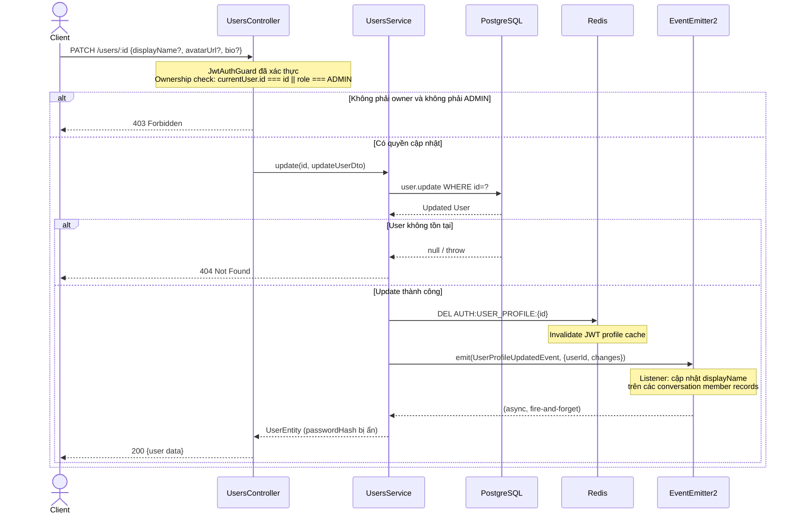

# Module: User Management

> **Cập nhật lần cuối:** 12/03/2026 (fix B1–B3)
> **Nguồn sự thật:** `src/modules/users/`
> **Swagger:** `/api/docs` → tag `users`

---

## 1. Tổng quan

### Chức năng chính

Module Users cung cấp:

- Đăng ký tài khoản mới (được gọi qua `POST /auth/register`)
- CRUD người dùng cho admin (tạo, xem, cập nhật, xoá)
- Cập nhật hồ sơ (displayName, avatarUrl, bio, ...)
- Cung cấp `findByPhoneNumber`, `getProfile` cho `AuthModule`

### Danh sách Use Case

| # | Use Case | Endpoint |
|---|---|---|
| UC-1 | Đăng ký tài khoản | `POST /auth/register` → delegates sang `UsersService.register()` |
| UC-2 | Xem danh sách users (admin) | `GET /users` |
| UC-3 | Xem thông tin một user | `GET /users/:id` |
| UC-4 | Tạo user mới (admin) | `POST /users` |
| UC-5 | Cập nhật hồ sơ | `PATCH /users/:id` |
| UC-6 | Cập nhật user nâng cao (admin) | `PATCH /users/:id/admin-update` |
| UC-7 | Xoá user | `DELETE /users/:id` |

### Phụ thuộc vào module khác

| Module | Vai trò |
|---|---|
| `AuthModule` | Import `UsersModule` để dùng `UsersService` từ `AuthController` |
| `PrismaService` | Lưu trữ `User`, `Role` |
| `EventEmitterModule` | Emit `user.registered`, `user.profile.updated` |

---

## 2. API

> Xem chi tiết Request/Response tại Swagger UI: `/api/docs` → tag `users`

| Method | Endpoint | Mô tả | Auth |
|--------|----------|-------|------|
| `POST` | `/users` | Tạo user mới (admin) | `JwtAuthGuard` + `RolesGuard` + `@Roles('ADMIN')` |
| `GET` | `/users` | Danh sách user có phân trang | `JwtAuthGuard` + `RolesGuard` + `@Roles('ADMIN')` |
| `GET` | `/users/:id` | Xem thông tin user theo ID | `JwtAuthGuard` |
| `PATCH` | `/users/:id` | Cập nhật profile | `JwtAuthGuard` + ownership check (owner hoặc ADMIN) |
| `PATCH` | `/users/:id/admin-update` | Cập nhật nâng cao (đổi role, status, password) | `JwtAuthGuard` + `RolesGuard` + `@Roles('ADMIN')` |
| `DELETE` | `/users/:id` | Xoá user (soft-delete) | `JwtAuthGuard` + `RolesGuard` + `@Roles('ADMIN')` |

**DTOs chính:**

| DTO | Fields |
|-----|--------|
| `CreateUserDto` | `displayName`, `phoneNumber`\* (@IsPhoneNumber('VN')), `password` (min 6), `gender?`, `dateOfBirth?` |
| `UpdateUserDto` | Partial của `CreateUserDto` (không có `password`/`phoneNumber`), thêm `avatarUrl?`, `bio?` |
| `UpdateUserAdminDto` | Partial của `CreateUserDto` + `roleId?`, `status?: UserStatus` |

> \* `CreateUserDto.phoneNumber` dùng validator `@IsPhoneNumber('VN')`. `LoginDto.phoneNumber` trong `AuthModule` cũng dùng `@Matches` VN (đã fix B2).

---

## 3. Activity Diagram — Luồng đăng ký tài khoản

```mermaid
flowchart TD
    A([POST /auth/register\n{displayName, phoneNumber, password}]) --> B[UsersService.register]
    B --> C[Prisma: findUnique\ntheo phoneNumber]
    C --> D{Số điện thoại\nđã tồn tại?}
    D -- Có --> ERR[409 Conflict\nPhone number already exists]
    D -- Không --> E[Prisma: findFirst Role\nWHERE name='USER']
    E --> F{Role USER\ntồn tại?}
    F -- Không --> ERR2[500 Internal Error\nDefault role not configured]
    F -- Có --> G[getHashPassword\nbcrypt.hash async, cost=10]
    G --> H[Prisma: create User\ndisplayName, phoneNumber, passwordHash, roleId]
    H --> I[EventEmitter2.emit\nUserRegisteredEvent]
    I --> J([201 UserEntity\npasswordHash bị ẩn])

    ERR --> Z([Kết thúc])
    ERR2 --> Z
    J --> Z
```

---

## 4. Sequence Diagram — Cập nhật hồ sơ người dùng



---

## 5. Các lưu ý kỹ thuật

### Entity serialization

`UserEntity` implements Prisma `User` và dùng `@Exclude()` để ẩn các field nhạy cảm:
- `passwordHash`
- `passwordVersion`
- `phoneNumberHash`

`ClassSerializerInterceptor` được áp dụng ở controller level (`@UseInterceptors(ClassSerializerInterceptor)`).

`UserProfileEntity extends UserEntity` — thêm `role: string` và `permissions: PermissionEntity[]`, dùng cho `GET /auth/me`.

### Events được emit ra ngoài

| Event | Trigger | Listener (module khác) |
|-------|---------|----------------------|
| `user.registered` (`UserRegisteredEvent`) | `UsersService.register()` | Chưa xác định listener cụ thể |
| `user.profile.updated` (`UserProfileUpdatedEvent`) | `UsersService.update()` | Cập nhật `displayName` trên `ConversationMember` |

### Soft-delete

`UsersService.remove()` gọi `BaseService.remove()` — thực hiện **soft-delete** (set `deletedAt`, không xoá record). User bị xoá sẽ không thể đăng nhập (status check trong JWT strategy).

### Password hashing

`bcrypt.hash(password, 10)` (async) — salt rounds là 10. `bcrypt.compare()` (async) cho `isValidPassword`. Cả `register()` và `updateByAdmin()` đều dùng `await` để không block event loop.

---

## 6. Bugs & Issues phát hiện khi phân tích

| # | File | Mức độ | Mô tả |
|---|------|--------|-------|
| **B1** ✅ | `users/users.controller.ts` | 🔴 Critical | **Đã fix:** `@UseGuards(RolesGuard)` + `@Roles('ADMIN')` trên `POST /users`, `GET /users`, `PATCH /users/:id/admin-update`, `DELETE /users/:id`. |
| **B2** ✅ | `users/users.service.ts` | 🟠 Low | **Đã fix:** `getHashPassword` dùng `bcrypt.hash()` async; `isValidPassword` dùng `bcrypt.compare()` async. |
| **B3** ✅ | `users/users.controller.ts` | 🟡 Medium | **Đã fix:** `PATCH /users/:id` kiểm tra `currentUser.id === id` hoặc `role === ADMIN`, ném `403 ForbiddenException` nếu không thoả. |

