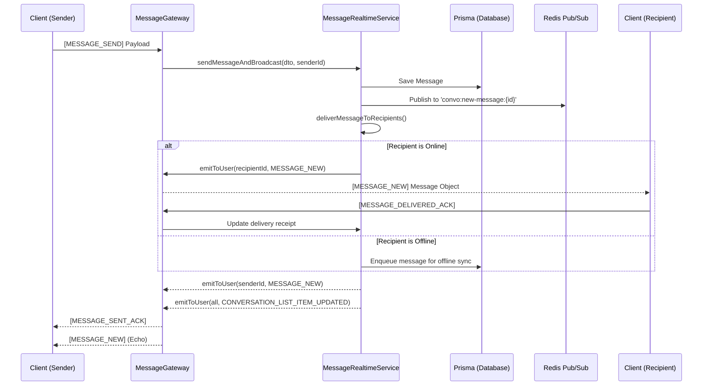

# Real-time Message Flow Documentation

This document describes the end-to-end flow of how a message is sent, persisted, and distributed to recipients in real-time within the Zalo Clone backend.

## 1. High-Level Architecture

The system uses **NestJS WebSockets (Socket.io)** for real-time communication and **Redis Pub/Sub** for cross-instance message broadcasting.

---

## 2. Detailed Step-by-Step Flow

### Step 1: Client Initiation
- Use case: A user types a message and hits "Send".
- Event: `message:send`
- Payload: `SendMessageDto` (contains `conversationId`, `content`, `type`, `clientMessageId`, etc.)

### Step 2: Gateway Receipt & Guarding
- `MessageGateway.handleSendMessage` receives the event.
- `WsJwtGuard` ensures the user is authenticated.
- `senderId` is extracted from the `AuthenticatedSocket`.

### Step 3: Message Persistence
- `MessageRealtimeService` calls `messageService.sendMessage(dto, senderId)`.
- The message is saved to the PostgreSQL database via Prisma.
- Attachments (if any) are processed.

### Step 4: Internal Broadcasting (Cross-Server)
- `MessageBroadcasterService.broadcastNewMessage` is called.
- It publishes the message to:
  - `convo:new-message:{conversationId}`: For other instances to pick up.
  - `global:new-message`: For system-wide tracking or multi-server synchronization.

### Step 5: Real-time Distribution (`deliverMessageToRecipients`)
For every active member of the conversation (excluding the sender):

1. **Check Connection Status**: `socketState.isUserOnline(userId)` checks if the user has an active socket connection.
2. **If Online**:
   - **Send Event**: Emits `message:new` directly to the user's socket IDs.
   - **Update Receipt**: Automatically marks the message as `delivered` (for DIRECT conversations).
   - **Notify Sender**: Broadcasts a `message:receipt-update` back to the sender so they see the "Delivered" tick.
   - **Update Unread**: Increments the `unreadCount` for the recipient in the database.
3. **If Offline**:
   - **Queueing**: The message is added to `MessageQueueService` (Redis/BullMQ).
   - **Sync on Reconnect**: When the user reconnects, `syncOfflineMessages` will push these missed messages and update their unread count.

### Step 6: Side Effects & UI Sync
- **Sender Ack**: The sender receives `message:sent-ack` immediately after the message is saved to confirm "Server Received".
- **Echo**: The sender also receives `message:new` (or relies on local state update) to unify the message object with the server-generated ID.
- **Conversation List**: All members (sender & recipients) receive `conversation:list-item-updated`. This ensures the latest message preview and unread counts are updated in the sidebar in real-time.

---

## 3. Key Socket Events

| Event Name | Direction | Description |
| :--- | :--- | :--- |
| `message:send` | Client -> Server | Sending a new message. |
| `message:sent-ack` | Server -> Client | Ack with server-side message ID and timestamp. |
| `message:new` | Server -> Client | Actual message payload delivered to recipients. |
| `message:delivered-ack` | Client -> Server | Client confirms they received the message. |
| `message:receipt-update` | Server -> Client | Notifies sender of delivered/seen status change. |
| `conversation:list-item-updated` | Server -> Client | Triggers sidebar update (preview text, time, unread dot). |

---

## 4. Resilience & Edge Cases

- **Multiple Devices**: `emitToUser` fetches all socket IDs associated with a `userId` from Redis (`SocketStateService`), ensuring the message arrives on both Web and Mobile simultaneously.
- **Offline Sync**: If a user is disconnected, messages are buffered. Upon `USER_SOCKET_CONNECTED`, the system automatically flushes the queue via `MESSAGES_SYNC`.
- **Latency**: Receipts are processed asynchronously and debounced/buffered where possible to minimize database load.
